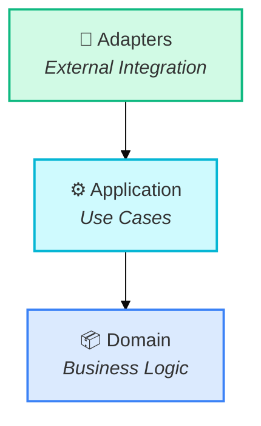

# Stricture Documentation Site

Official documentation website for Stricture at **stricture.dev**.

## Tech Stack

- **Astro** (^4.15.0) - Modern static site framework
- **Starlight** (^0.28.0) - Documentation theme built for Astro
- **TypeScript** - Type-safe development
- **React** - Interactive components (islands architecture)
- **MDX** - Markdown with components
- **Mermaid** - Architecture diagrams

## Why Starlight?

Starlight provides everything needed for excellent documentation out-of-the-box:

- ✅ **Pure Static** - Ships zero JavaScript by default, ~10KB for interactive features
- ✅ **Built-in Search** - Pagefind search with Cmd+K shortcut
- ✅ **Dark Mode** - Automatic dark/light theme switching
- ✅ **Mobile Responsive** - Works perfectly on all devices
- ✅ **Syntax Highlighting** - Beautiful code blocks with copy button
- ✅ **SEO Optimized** - Perfect Lighthouse scores
- ✅ **Fast Builds** - Vite-powered development and builds
- ✅ **React Islands** - Add interactivity where needed

## Development

```bash
# Install dependencies
pnpm install

# Start dev server
pnpm dev

# Visit http://localhost:4321
```

## Content Structure

```
src/
├── content/
│   └── docs/                    # MDX documentation files
│       ├── index.mdx           # Docs home
│       ├── getting-started/
│       │   ├── installation.mdx
│       │   ├── quick-start.mdx
│       │   └── concepts.mdx
│       ├── presets/
│       │   ├── index.mdx       # Presets overview
│       │   ├── hexagonal.mdx
│       │   ├── layered.mdx
│       │   ├── clean.mdx
│       │   ├── modular.mdx
│       │   ├── nextjs.mdx
│       │   └── nestjs.mdx
│       ├── configuration/
│       │   ├── config-file.mdx
│       │   ├── boundaries.mdx
│       │   ├── rules.mdx
│       │   └── presets.mdx
│       ├── guides/
│       │   ├── custom-presets.mdx
│       │   ├── migration.mdx
│       │   ├── monorepos.mdx
│       │   └── troubleshooting.mdx
│       ├── api/
│       │   ├── core.mdx
│       │   ├── eslint-plugin.mdx
│       │   └── cli.mdx
│       └── examples/
│           ├── hexagonal-express.mdx
│           ├── nextjs-app.mdx
│           └── nestjs-api.mdx
├── components/                  # Custom components
│   ├── PresetSelector.tsx      # React island (interactive)
│   ├── DiagramViewer.tsx       # React island (zoom/pan)
│   ├── CodeTabs.astro          # Static tabbed code blocks
│   ├── ArchitectureDiagram.astro # Mermaid diagram wrapper
│   └── FeatureGrid.astro       # Feature showcase grid
├── pages/
│   └── index.astro             # Homepage (outside /docs)
└── styles/
    └── custom.css              # Theme customization
```

## Key Pages

### Homepage (/)
- Hero section with value proposition
- Quick start code example
- Preset comparison
- Feature highlights
- Links to docs and GitHub

### Documentation (/docs)
- **Getting Started** - Installation, quick start, core concepts
- **Presets** - Detailed guides for each architecture preset
- **Configuration** - Config file, boundaries, rules reference
- **Guides** - Custom presets, migration, monorepos, troubleshooting
- **API Reference** - Documentation for all packages
- **Examples** - Real-world usage examples

## Writing Documentation

### Adding a New Page

1. Create MDX file in `src/content/docs/`:

```mdx
---
title: Your Page Title
description: Brief description for SEO
---

# Your Page Title

Your content here with **markdown** and _formatting_.

## Code Examples

\`\`\`typescript
// Code with syntax highlighting
const config = { preset: "@stricture/hexagonal" };
\`\`\`

## Diagrams

\`\`\`mermaid
graph TB
    A[Domain] --> B[Application]
    B --> C[Adapters]
\`\`\`
```

2. Add link to sidebar in `astro.config.mjs`
3. Preview at `http://localhost:4321/docs/your-page`

### Using Components

**Callouts**:
```mdx
:::note
This is an informational callout.
:::

:::tip
This is a helpful tip.
:::

:::caution
This is a warning.
:::

:::danger
This is a critical warning.
:::
```

**Code Tabs** (install commands):
```mdx
import { Tabs, TabItem } from '@astrojs/starlight/components';

<Tabs>
  <TabItem label="npm">
    ```bash
    npm install @stricture/core
    ```
  </TabItem>
  <TabItem label="pnpm">
    ```bash
    pnpm add @stricture/core
    ```
  </TabItem>
  <TabItem label="yarn">
    ```bash
    yarn add @stricture/core
    ```
  </TabItem>
</Tabs>
```

**Interactive Components**:
```mdx
import PresetSelector from '../../components/PresetSelector.tsx';

<PresetSelector client:load />
```

### Mermaid Diagrams

Use consistent theming for all architecture diagrams:



## Build

```bash
# Build static site
pnpm build

# Output in dist/
```

## Preview Production Build

```bash
# Build first
pnpm build

# Preview
pnpm preview

# Visit http://localhost:4321
```

## Deploy

### Cloudflare Pages (Recommended)

The site is configured for Cloudflare Pages deployment with `wrangler.toml`.

**Option 1: Deploy from CLI**

```bash
# Build the site
pnpm build

# Deploy to Cloudflare Pages
pnpm deploy
```

**Option 2: Connect Git Repository**

1. Go to Cloudflare Pages dashboard
2. Connect your GitHub repository
3. Configure build settings:
   - **Build command**: `pnpm run build`
   - **Deploy command**: `npx wrangler pages deploy dist`
   - **Build output directory**: `/apps/docs`
   - **Root directory**: `/apps/docs`
4. Deploy!

The `wrangler.toml` configuration tells Cloudflare to deploy the `dist/` directory as a static site.

### Vercel

```bash
vercel
```

### Netlify

```bash
netlify deploy --prod
```

### GitHub Pages

See Astro's [GitHub Pages deployment guide](https://docs.astro.build/en/guides/deploy/github/).

## Features

- 🔍 **Search** - Built-in Pagefind search (Cmd+K)
- 🌙 **Dark Mode** - Automatic theme switching
- 📱 **Mobile Responsive** - Perfect on all screen sizes
- 🎨 **Syntax Highlighting** - Shiki-powered code blocks
- 📊 **Mermaid Diagrams** - Interactive architecture diagrams
- 🎯 **Preset Selector** - Interactive tool to find the right preset
- 📚 **API Docs** - Complete API reference
- 🔗 **Deep Linking** - Direct links to any heading
- ⚡ **Fast** - Pure static HTML, minimal JS
- ♿ **Accessible** - WCAG 2.1 AA compliant

## Performance

### Lighthouse Scores (Target)

- **Performance**: 100/100
- **Accessibility**: 100/100
- **Best Practices**: 100/100
- **SEO**: 100/100

### Bundle Size

- **HTML**: ~50KB per page (static)
- **CSS**: ~20KB (scoped, critical inline)
- **JS**: ~10KB (search + theme toggle)
- **Interactive Islands**: ~15-30KB each (loaded on demand)

## Project Architecture

This site follows the **islands architecture**:

- **Static by default** - All pages rendered to HTML at build time
- **Interactive islands** - React components hydrate only where needed
- **Zero JS for content** - Documentation loads with no JavaScript
- **Progressive enhancement** - Search and interactive features load after content

## Development Tips

### Fast Refresh

Save any file and see changes instantly. Astro supports:

- Hot Module Reloading (HMR) for components
- Full page reload for content changes
- TypeScript checking in watch mode

### TypeScript

All components and content are type-checked:

```bash
# Check types
pnpm astro check
```

### Formatting

```bash
# Format with Prettier
pnpm format
```

### Link Checking

Before deploying, check for broken links:

```bash
pnpm build
# Use a link checker tool on dist/
```

## Troubleshooting

### Port already in use

```bash
# Kill process on port 4321
lsof -ti:4321 | xargs kill -9

# Or use different port
pnpm dev --port 3000
```

### Build fails

```bash
# Clear cache and rebuild
rm -rf node_modules/.astro
pnpm build
```

### Search not working

Search is generated at build time. After adding new content:

```bash
pnpm build
pnpm preview  # Test search in production build
```

## Contributing

### Content Guidelines

1. **Use Mermaid for diagrams** - No ASCII art
2. **Include code examples** - Show, don't just tell
3. **Add callouts** - Highlight important information
4. **Test code snippets** - Ensure examples work
5. **Write for beginners** - Explain concepts clearly
6. **Use consistent terminology** - Follow existing docs
7. **Add frontmatter** - Title and description for SEO

### Diagram Guidelines

- Use consistent colors across diagrams
- Keep diagrams simple and focused
- Add labels and descriptions
- Use hex colors in style declarations (not HSL)
- Follow the theme variables from SPEC.md

## License

MIT
