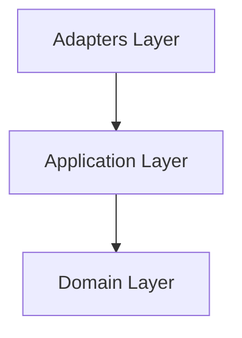

import { Aside } from '@astrojs/starlight/components';

The `@stricture/cli` package provides an interactive command-line interface for managing Stricture in your projects. It helps you initialize configurations, validate architecture, check for violations, generate diagrams, and scaffold directory structures.

## Overview

**Package**: `@stricture/cli`

**Command**: `stricture` or `npx stricture`

**Purpose**: Interactive CLI for managing architecture enforcement

**Key Features**:
- Interactive project initialization
- Real-time violation checking
- Configuration validation
- Architecture diagram generation
- Directory scaffolding
- Auto-fix capabilities (planned)

## Installation

### Global

```bash
npm install -g @stricture/cli
```

```bash
pnpm add -g @stricture/cli
```

### Project-specific

```bash
npm install -D @stricture/cli
```

```bash
pnpm add -D @stricture/cli
```

Then use via `npx`:

```bash
npx stricture <command>
```

## Commands

### init

Initialize Stricture in your project with interactive preset selection.

**Usage**:
```bash
stricture init [options]
```

**Options**:
- `--preset <preset>` - Architecture preset to use (skips interactive selection)
- `--yes` - Accept all defaults without prompting
- `--no-install` - Don't install dependencies

**Interactive Flow**:
1. Analyzes project structure (package.json, tsconfig.json, framework detection)
2. Recommends appropriate presets
3. Guides you through preset selection
4. Customizes boundaries based on your project
5. Creates `.stricture/config.json`
6. Updates ESLint configuration
7. Installs required dependencies

**Examples**:

```bash
# Interactive mode (recommended for first-time setup)
stricture init
```

```bash
# Non-interactive with specific preset
stricture init --preset @stricture/hexagonal --yes
```

```bash
# Skip dependency installation
stricture init --no-install
```

**What it creates**:
- `.stricture/config.json` - Stricture configuration
- Updates `eslint.config.js` or `.eslintrc.js` - Adds Stricture plugin

**Output**:
```
🏗️  Stricture Initialization

✓ Project analyzed
✓ Loaded preset: Hexagonal Architecture
✓ Created .stricture/config.json
✓ Updated ESLint configuration
✓ Dependencies installed

Next Steps:

1. Run linting to check architecture:
   npm run lint

2. Or use the Stricture CLI to check:
   npx stricture check

3. Customize your configuration:
   Edit .stricture/config.json

Learn more: https://stricture.dev/docs
```

<Aside type="tip">
Use `stricture init --yes` for CI/CD or automated setup scripts.
</Aside>

---

### check

Check your project for architecture violations.

**Usage**:
```bash
stricture check [options]
```

**Options**:
- `--config <path>` - Path to config file (default: `.stricture/config.json`)
- `--fix` - Auto-fix violations where possible (experimental)
- `--format <format>` - Output format: `text`, `json`, `checkstyle` (default: `text`)
- `--verbose` - Verbose output with detailed progress

**Behavior**:
1. Loads `.stricture/config.json`
2. Scans all TypeScript/JavaScript files
3. Checks each import against architectural rules
4. Reports violations with helpful messages
5. Exits with code 1 if violations found, 0 if clean

**Examples**:

```bash
# Check with default config
stricture check
```

```bash
# Check with custom config
stricture check --config .stricture/api-config.json
```

```bash
# Verbose output
stricture check --verbose
```

```bash
# JSON output for CI/CD
stricture check --format json > violations.json
```

**Output (text format)**:
```
Loading configuration...
✓ Configuration loaded

Scanning files...
✓ Scanned 147 files

Checking imports...

Found 3 violations:

src/core/domain/user.ts
  12:1  error  Domain layer must be pure - no external dependencies
               Import: ../../adapters/driven/memory-repository
               Fix: Remove this import or move logic to application layer

src/core/application/create-user.ts
  5:1   error  Application should depend on interfaces, not implementations
               Import: ../../adapters/driven/memory-repository
               Fix: Import from ports: import { UserRepository } from '../ports/user-repository'

src/adapters/driving/cli.ts
  8:1   error  Driving adapter should not import driven adapter
               Import: ../driven/memory-repository
               Fix: Use dependency injection in composition root

Summary:
  Files checked: 147
  Violations: 3
  Boundaries: 5
  Rules: 12
```

**Output (JSON format)**:
```json
{
  "valid": false,
  "violations": [
    {
      "file": "src/core/domain/user.ts",
      "line": 12,
      "column": 1,
      "message": "Domain layer must be pure...",
      "rule": "domain-isolation",
      "severity": "error"
    }
  ],
  "summary": {
    "totalFiles": 147,
    "filesChecked": 147,
    "violationsFound": 3,
    "boundariesDefined": 5,
    "rulesLoaded": 12
  }
}
```

**Exit Codes**:
- `0` - No violations found
- `1` - Violations found or error occurred

<Aside type="note">
Use `stricture check` in CI/CD to enforce architecture in pull requests.
</Aside>

---

### validate

Validate your Stricture configuration file.

**Usage**:
```bash
stricture validate [options]
```

**Options**:
- `--config <path>` - Path to config file (default: `.stricture/config.json`)
- `--verbose` - Show detailed validation info

**Checks**:
- JSON syntax is valid
- Required fields are present
- Boundary patterns are valid glob patterns
- Rules reference existing boundaries
- Rule structure is correct
- Preset exists (if specified)

**Examples**:

```bash
# Validate default config
stricture validate
```

```bash
# Validate with details
stricture validate --verbose
```

**Output (valid config)**:
```
Validating configuration...

✓ Configuration is valid

Preset: @stricture/hexagonal
Boundaries: 5
Rules: 12
```

**Output (invalid config)**:
```
Validating configuration...

✗ Configuration validation failed

Errors:
  - Rule 'domain-to-adapters' references unknown boundary 'adaptors' (typo?)
  - Boundary 'domain' missing required field 'pattern'
  - Rule 'invalid-rule' has invalid severity 'critical' (must be 'error', 'warn', or 'off')
```

**Exit Codes**:
- `0` - Configuration is valid
- `1` - Configuration is invalid

<Aside type="tip">
Run `stricture validate` before committing config changes to catch errors early.
</Aside>

---

### diagram

Generate a visual diagram of your architecture.

**Usage**:
```bash
stricture diagram [options]
```

**Options**:
- `--config <path>` - Path to config file (default: `.stricture/config.json`)
- `--output <file>` - Output file path (prints to stdout if not specified)
- `--format <format>` - Diagram format: `mermaid`, `ascii`, `svg` (default: `mermaid`)

**Formats**:

**Mermaid** - GitHub-compatible diagram markup:


**ASCII** - Terminal-friendly text diagram:
```
┌─────────────────┐
│   Domain Layer  │
└────────┬────────┘
         │
    ┌────▼────┐
    │   App   │
    └────┬────┘
         │
    ┌────▼────┐
    │Adapters │
    └─────────┘
```

**SVG** - Scalable vector graphics (planned)

**Examples**:

```bash
# Print Mermaid diagram to stdout
stricture diagram
```

```bash
# Save to file
stricture diagram --output architecture.mmd
```

```bash
# ASCII diagram
stricture diagram --format ascii
```

```bash
# For README
stricture diagram --format mermaid --output docs/architecture.mmd
```

**Use Cases**:
- 📝 Include in README.md (Mermaid renders on GitHub)
- 📊 Generate documentation
- 🎨 Visualize architecture decisions
- 🔍 Onboard new team members

<Aside type="tip">
GitHub, GitLab, and many documentation tools support Mermaid diagrams natively.
</Aside>

---

### scaffold

Generate directory structure based on your configuration.

**Usage**:
```bash
stricture scaffold [options]
```

**Options**:
- `--config <path>` - Path to config file (default: `.stricture/config.json`)
- `--force` - Create directories without confirmation
- `--examples` - Include example README files in each directory

**Behavior**:
1. Reads boundary patterns from config
2. Extracts directory paths (e.g., `src/domain/**` → `src/domain/`)
3. Shows preview of directories to create
4. Prompts for confirmation (unless `--force`)
5. Creates directories
6. Optionally creates README.md in each directory

**Examples**:

```bash
# Interactive scaffold
stricture scaffold
```

```bash
# With example READMEs
stricture scaffold --examples
```

```bash
# No confirmation (for scripts)
stricture scaffold --force
```

**Output**:
```
Scaffolding directory structure...

Directories to create:
  - src/core/domain
  - src/core/ports
  - src/core/application
  - src/adapters/driving
  - src/adapters/driven

? Create these directories? (Y/n) y

✓ Created src/core/domain
✓ Created src/core/ports
✓ Created src/core/application
✓ Created src/adapters/driving
✓ Created src/adapters/driven

Created 5 directories
```

**Generated README** (with `--examples`):
```markdown
# domain

This directory represents the **domain** boundary.

**Pattern**: `src/core/domain/**`

## Purpose

Add a description of this boundary's purpose and responsibilities.

## Dependencies

Document which other boundaries this layer can depend on.

## Examples

Add example files and usage patterns here.
```

<Aside type="note">
Scaffold is useful when starting a new project with a preset to create the expected folder structure.
</Aside>

---

### fix

Auto-fix architecture violations where possible (experimental).

**Usage**:
```bash
stricture fix [options]
```

**Options**:
- `--config <path>` - Path to config file (default: `.stricture/config.json`)
- `--verbose` - Show detailed fix operations

**Capabilities** (planned):
- Remove forbidden imports
- Suggest alternative imports
- Add missing layer indirection
- Generate adapter stubs

**Example**:

```bash
stricture fix --verbose
```

<Aside type="caution">
The `fix` command is experimental. Always review changes before committing.
</Aside>

---

## Global Options

These options work with all commands:

- `--help, -h` - Show help for a command
- `--version, -v` - Show CLI version

**Examples**:

```bash
# Show general help
stricture --help

# Show help for specific command
stricture check --help

# Show version
stricture --version
```

---

## Configuration

The CLI reads configuration from `.stricture/config.json` by default. You can specify a custom path with `--config`.

**Example config**:
```json
{
  "preset": "@stricture/hexagonal",
  "boundaries": [
    {
      "name": "domain",
      "pattern": "src/core/domain/**",
      "mode": "file",
      "tags": ["core", "domain"]
    }
  ],
  "rules": [
    {
      "id": "domain-isolation",
      "from": { "tag": "domain" },
      "to": { "tag": "*" },
      "allowed": false
    }
  ]
}
```

See [Configuration Guide](/configuration/config-file) for details.

---

## CI/CD Integration

### GitHub Actions

```yaml
name: Architecture Check

on: [push, pull_request]

jobs:
  architecture:
    runs-on: ubuntu-latest
    steps:
      - uses: actions/checkout@v3
      - uses: actions/setup-node@v3
        with:
          node-version: 20
      - run: npm install
      - run: npx stricture check --format json
```

### GitLab CI

```yaml
architecture-check:
  image: node:20
  script:
    - npm install
    - npx stricture check
  only:
    - merge_requests
```

### Pre-commit Hook

```json
{
  "husky": {
    "hooks": {
      "pre-commit": "npx stricture check"
    }
  }
}
```

---

## Output Formats

### Text (default)

Human-readable output with colors and formatting.

**Best for**: Terminal, interactive use

### JSON

Machine-readable structured output.

**Best for**: CI/CD integration, custom tooling, reports

**Example**:
```bash
stricture check --format json | jq '.violations | length'
```

### Checkstyle

XML format compatible with Jenkins and other CI tools.

**Best for**: Jenkins, SonarQube, legacy CI systems

**Example**:
```bash
stricture check --format checkstyle > checkstyle-result.xml
```

---

## Exit Codes

All commands follow standard Unix conventions:

- `0` - Success
- `1` - Error or violations found

**Use in scripts**:
```bash
#!/bin/bash
if npx stricture check; then
  echo "Architecture is clean!"
else
  echo "Architecture violations found!"
  exit 1
fi
```

---

## Troubleshooting

### Config Not Found

**Error**: `Could not find .stricture/config.json`

**Solution**: Run `stricture init` to create configuration

### Invalid Config

**Error**: `Configuration validation failed`

**Solution**: Run `stricture validate --verbose` to see specific errors

### No Violations But ESLint Shows Errors

**Problem**: CLI reports clean but ESLint shows violations

**Solution**:
1. Check ESLint is using same config: `--config` option
2. Verify ESLint cache is cleared: `eslint --cache-location .eslintcache`
3. Ensure both tools use same TypeScript config

### Performance Issues

**Problem**: `check` command is slow on large projects

**Solutions**:
1. Add ignore patterns in config
2. Use ESLint integration instead (incremental checking)
3. Run on specific directories: check only changed files in CI

---

## Environment Variables

The CLI respects these environment variables:

- `STRICTURE_CONFIG` - Default config path
- `NO_COLOR` - Disable colored output
- `CI` - Automatically detected, disables interactive prompts

**Example**:
```bash
export STRICTURE_CONFIG=.stricture/api-config.json
stricture check  # Uses api-config.json
```

---

## See Also

- [@stricture/core API](/api/core) - Core validation engine
- [@stricture/eslint-plugin API](/api/eslint-plugin) - ESLint integration
- [Configuration Guide](/configuration/config-file)
- [Presets Guide](/presets/overview)
