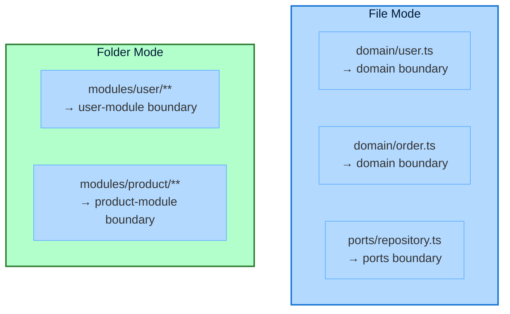

import { Tabs, TabItem, Card, CardGrid, Aside } from '@astrojs/starlight/components';

**Boundaries** are the foundation of Stricture's architecture enforcement. They define the logical layers, modules, or regions in your codebase.

## What is a Boundary?

A boundary represents a group of files with a specific architectural role. For example:
- **Domain layer** - Pure business logic
- **Adapters** - Infrastructure implementations
- **Controllers** - HTTP request handlers
- **Repositories** - Data access layer

Each boundary is defined by a **glob pattern** that matches files, plus **tags** that are referenced in rules.

## Boundary Schema

```typescript
interface BoundaryDefinition {
  name: string                  // Unique boundary name
  pattern: string               // Glob pattern matching files
  mode: 'file' | 'folder'       // How to match files
  tags?: string[]               // Tags for rule matching
  exclude?: string[]            // Patterns to exclude
  metadata?: {
    description?: string
    layer?: number              // For layered architectures
    [key: string]: unknown
  }
}
```

## Basic Examples

### Simple Boundary

```json
{
  "name": "domain",
  "pattern": "src/domain/**",
  "mode": "file",
  "tags": ["domain"]
}
```

This matches all files under `src/domain/` recursively.

### Boundary with Multiple Tags

```json
{
  "name": "driving-adapters",
  "pattern": "src/adapters/driving/**",
  "mode": "file",
  "tags": ["adapters", "driving"]
}
```

Multiple tags allow rules at different specificity levels:
- Rules targeting `"adapters"` match ALL adapters
- Rules targeting `"driving"` match ONLY driving adapters

### Boundary with Exclusions

```json
{
  "name": "domain",
  "pattern": "src/domain/**",
  "mode": "file",
  "tags": ["domain"],
  "exclude": [
    "**/*.test.ts",
    "**/__mocks__/**"
  ]
}
```

Exclude test files and mocks from the domain boundary.

## Pattern Matching

Stricture uses [micromatch](https://github.com/micromatch/micromatch) for glob patterns.

### Common Patterns

| Pattern | Matches | Example Files |
|---------|---------|---------------|
| `src/domain/**` | All files under `src/domain/` recursively | `src/domain/user.ts`<br/>`src/domain/orders/order.ts` |
| `src/domain/*.ts` | Only top-level files in `src/domain/` | `src/domain/user.ts`<br/>NOT `src/domain/orders/order.ts` |
| `**/*.test.ts` | All test files anywhere | `src/domain/user.test.ts`<br/>`tests/integration.test.ts` |
| `src/{domain,ports}/**` | Files in multiple directories | `src/domain/user.ts`<br/>`src/ports/repository.ts` |
| `app/**/page.tsx` | All Next.js page files | `app/page.tsx`<br/>`app/users/page.tsx` |
| `src/*/index.ts` | All index files one level deep | `src/domain/index.ts`<br/>NOT `src/domain/orders/index.ts` |

### Pattern Examples

<Tabs>
<TabItem label="Single Directory">
```json
{
  "name": "controllers",
  "pattern": "src/controllers/**",
  "mode": "file",
  "tags": ["presentation"]
}
```

Matches:
- ✅ `src/controllers/user.controller.ts`
- ✅ `src/controllers/api/product.controller.ts`
- ❌ `src/services/user.service.ts`
</TabItem>

<TabItem label="Multiple Directories">
```json
{
  "name": "core",
  "pattern": "src/{domain,ports,application}/**",
  "mode": "file",
  "tags": ["core"]
}
```

Matches:
- ✅ `src/domain/user.ts`
- ✅ `src/ports/repository.ts`
- ✅ `src/application/use-case.ts`
- ❌ `src/adapters/postgres.ts`
</TabItem>

<TabItem label="File Extension">
```json
{
  "name": "config-files",
  "pattern": "**/*.config.{ts,js}",
  "mode": "file",
  "tags": ["config"]
}
```

Matches:
- ✅ `vite.config.ts`
- ✅ `jest.config.js`
- ✅ `src/module.config.ts`
- ❌ `src/user.ts`
</TabItem>

<TabItem label="Negation">
```json
{
  "name": "domain",
  "pattern": "src/domain/**",
  "mode": "file",
  "tags": ["domain"],
  "exclude": [
    "**/*.test.ts",
    "**/*.spec.ts"
  ]
}
```

Matches:
- ✅ `src/domain/user.ts`
- ✅ `src/domain/orders/order.ts`
- ❌ `src/domain/user.test.ts`
- ❌ `src/domain/user.spec.ts`
</TabItem>
</Tabs>

### Pattern Tips

<Aside type="tip" title="Use ** for Recursive Matching">
- `src/domain/**` matches ALL files under `domain/` at any depth
- `src/domain/*` matches ONLY immediate children
</Aside>

<Aside type="caution" title="Avoid Overlapping Patterns">
If multiple boundaries match the same file, the first matching boundary wins. Be specific!
</Aside>

## Mode: File vs Folder

The `mode` property determines how files are matched and grouped.

### File Mode

**File mode** (`"mode": "file"`) matches individual files:

```json
{
  "name": "domain",
  "pattern": "src/domain/**",
  "mode": "file",
  "tags": ["domain"]
}
```

**Use when:**
- Files have individual architectural roles
- You want granular control
- Standard layered or hexagonal architecture
- **Most common mode - use this by default**

**Example:**
```
src/domain/
├── user.ts          → domain boundary
├── order.ts         → domain boundary
└── product.ts       → domain boundary
```

Each file is independently in the `domain` boundary.

### Folder Mode

**Folder mode** (`"mode": "folder"`) matches entire directories:

```json
{
  "name": "user-module",
  "pattern": "src/modules/user/**",
  "mode": "folder",
  "tags": ["module", "user"]
}
```

**Use when:**
- Enforcing vertical slice architecture
- Feature modules that should be isolated
- Entire directories have the same role
- **Less common - only for modular architectures**

**Example:**
```
src/modules/
├── user/            → user-module boundary (entire folder)
│   ├── controller.ts
│   ├── service.ts
│   └── repository.ts
└── product/         → product-module boundary (entire folder)
    ├── controller.ts
    ├── service.ts
    └── repository.ts
```

All files in `user/` are treated as one unit.

### File vs Folder Comparison



## Tags

Tags are labels attached to boundaries for use in rules.

### Single Tag

```json
{
  "name": "domain",
  "pattern": "src/domain/**",
  "mode": "file",
  "tags": ["domain"]
}
```

Rule can target with: `{ "tag": "domain" }`

### Multiple Tags

```json
{
  "name": "driving-adapters",
  "pattern": "src/adapters/driving/**",
  "mode": "file",
  "tags": ["adapters", "driving", "primary"]
}
```

Rules can target at different levels:
- `{ "tag": "adapters" }` - Matches all adapters (driving + driven)
- `{ "tag": "driving" }` - Matches only driving adapters
- `{ "tag": "primary" }` - Alternative name for driving adapters

### Tag Hierarchy Example

```json
{
  "boundaries": [
    {
      "name": "driving-adapters",
      "pattern": "src/adapters/driving/**",
      "tags": ["adapters", "driving"]
    },
    {
      "name": "driven-adapters",
      "pattern": "src/adapters/driven/**",
      "tags": ["adapters", "driven"]
    }
  ],
  "rules": [
    {
      "id": "adapters-to-core",
      "from": { "tag": "adapters" },      // Matches BOTH driving and driven
      "to": { "tag": "core" },
      "allowed": true
    },
    {
      "id": "driving-to-driven",
      "from": { "tag": "driving" },       // Matches ONLY driving adapters
      "to": { "tag": "driven" },
      "allowed": false
    }
  ]
}
```

<Aside type="tip" title="Tag Strategy">
Use broad tags for general rules, specific tags for precise rules. This keeps configuration maintainable.
</Aside>

## Metadata

Add descriptive metadata for documentation:

```json
{
  "name": "domain",
  "pattern": "src/core/domain/**",
  "mode": "file",
  "tags": ["core", "domain"],
  "metadata": {
    "description": "Pure business logic - entities, value objects, domain services",
    "layer": 0,
    "documentation": "https://wiki.company.com/architecture/domain",
    "owner": "domain-modeling-team"
  }
}
```

Metadata is ignored by validation but useful for:
- Documentation generation
- IDE tooltips
- Architecture diagrams
- Team communication

## Complete Examples

### Hexagonal Architecture Boundaries

```json
{
  "boundaries": [
    {
      "name": "domain",
      "pattern": "src/core/domain/**",
      "mode": "file",
      "tags": ["core", "domain"],
      "metadata": {
        "description": "Pure business logic",
        "layer": 0
      }
    },
    {
      "name": "ports",
      "pattern": "src/core/ports/**",
      "mode": "file",
      "tags": ["core", "ports"],
      "metadata": {
        "description": "Interface definitions",
        "layer": 1
      }
    },
    {
      "name": "application",
      "pattern": "src/core/application/**",
      "mode": "file",
      "tags": ["core", "application"],
      "metadata": {
        "description": "Use cases",
        "layer": 2
      }
    },
    {
      "name": "driving-adapters",
      "pattern": "src/adapters/driving/**",
      "mode": "file",
      "tags": ["adapters", "driving"],
      "metadata": {
        "description": "Entry points (CLI, HTTP, GraphQL)",
        "layer": 3
      }
    },
    {
      "name": "driven-adapters",
      "pattern": "src/adapters/driven/**",
      "mode": "file",
      "tags": ["adapters", "driven"],
      "metadata": {
        "description": "Implementations (Repositories, APIs)",
        "layer": 3
      }
    }
  ]
}
```

### Layered Architecture Boundaries

```json
{
  "boundaries": [
    {
      "name": "presentation",
      "pattern": "src/presentation/**",
      "mode": "file",
      "tags": ["presentation"],
      "metadata": {
        "description": "Controllers, views, DTOs",
        "layer": 3
      }
    },
    {
      "name": "business",
      "pattern": "src/business/**",
      "mode": "file",
      "tags": ["business"],
      "metadata": {
        "description": "Business logic, services",
        "layer": 2
      }
    },
    {
      "name": "data",
      "pattern": "src/data/**",
      "mode": "file",
      "tags": ["data"],
      "metadata": {
        "description": "Data access, repositories",
        "layer": 1
      }
    },
    {
      "name": "infrastructure",
      "pattern": "src/infrastructure/**",
      "mode": "file",
      "tags": ["infrastructure"],
      "metadata": {
        "description": "Cross-cutting concerns",
        "layer": 0
      }
    }
  ]
}
```

### Modular Architecture Boundaries

```json
{
  "boundaries": [
    {
      "name": "user-module",
      "pattern": "src/modules/user/**",
      "mode": "folder",
      "tags": ["module", "user"],
      "metadata": {
        "description": "User management feature module"
      }
    },
    {
      "name": "product-module",
      "pattern": "src/modules/product/**",
      "mode": "folder",
      "tags": ["module", "product"],
      "metadata": {
        "description": "Product catalog feature module"
      }
    },
    {
      "name": "order-module",
      "pattern": "src/modules/order/**",
      "mode": "folder",
      "tags": ["module", "order"],
      "metadata": {
        "description": "Order processing feature module"
      }
    },
    {
      "name": "shared",
      "pattern": "src/shared/**",
      "mode": "file",
      "tags": ["shared"],
      "metadata": {
        "description": "Shared utilities and types"
      }
    }
  ]
}
```

### Next.js App Router Boundaries

```json
{
  "boundaries": [
    {
      "name": "server-components",
      "pattern": "app/**/{page,layout,loading,error}.tsx",
      "mode": "file",
      "tags": ["server", "react"],
      "exclude": ["**/*.client.tsx"]
    },
    {
      "name": "client-components",
      "pattern": "app/**/*.client.tsx",
      "mode": "file",
      "tags": ["client", "react"]
    },
    {
      "name": "server-actions",
      "pattern": "app/**/actions.ts",
      "mode": "file",
      "tags": ["server", "actions"]
    },
    {
      "name": "api-routes",
      "pattern": "app/api/**/route.ts",
      "mode": "file",
      "tags": ["server", "api"]
    },
    {
      "name": "components",
      "pattern": "components/**",
      "mode": "file",
      "tags": ["components"]
    },
    {
      "name": "lib",
      "pattern": "lib/**",
      "mode": "file",
      "tags": ["utils"]
    }
  ]
}
```

## Advanced Patterns

### Negative Lookbehind (Exclude Pattern)

Match files EXCEPT certain ones:

```json
{
  "name": "production-code",
  "pattern": "src/**",
  "mode": "file",
  "tags": ["production"],
  "exclude": [
    "**/*.test.ts",
    "**/*.spec.ts",
    "**/__tests__/**",
    "**/__mocks__/**"
  ]
}
```

### Specific File Names

Match only specific filenames:

```json
{
  "name": "composition-root",
  "pattern": "src/index.ts",
  "mode": "file",
  "tags": ["composition-root"]
}
```

### Multiple File Extensions

```json
{
  "name": "react-components",
  "pattern": "src/components/**/*.{tsx,jsx}",
  "mode": "file",
  "tags": ["react", "components"]
}
```

### Monorepo Packages

```json
{
  "boundaries": [
    {
      "name": "shared-kernel",
      "pattern": "packages/shared/**",
      "mode": "file",
      "tags": ["shared"]
    },
    {
      "name": "package-a",
      "pattern": "packages/package-a/src/**",
      "mode": "file",
      "tags": ["package-a"]
    },
    {
      "name": "package-b",
      "pattern": "packages/package-b/src/**",
      "mode": "file",
      "tags": ["package-b"]
    }
  ]
}
```

## Best Practices

### Be Specific with Patterns

```json
// ✅ GOOD - Specific directory
{
  "name": "domain",
  "pattern": "src/core/domain/**"
}

// ❌ BAD - Too broad
{
  "name": "domain",
  "pattern": "**/domain/**"  // Matches test/domain/, docs/domain/, etc.
}
```

### Use Consistent Naming

```json
// ✅ GOOD - Clear, consistent names
{
  "boundaries": [
    { "name": "domain", "tags": ["domain"] },
    { "name": "ports", "tags": ["ports"] },
    { "name": "application", "tags": ["application"] }
  ]
}

// ❌ BAD - Inconsistent naming
{
  "boundaries": [
    { "name": "dom", "tags": ["business-logic"] },
    { "name": "interfaces", "tags": ["ports"] },
    { "name": "useCases", "tags": ["app"] }
  ]
}
```

### Document with Metadata

```json
{
  "name": "domain",
  "pattern": "src/domain/**",
  "mode": "file",
  "tags": ["domain"],
  "metadata": {
    "description": "Pure business logic - NO infrastructure, NO I/O, NO external dependencies",
    "examples": ["User.ts", "Order.ts", "Money.ts"],
    "rules": ["Must be testable without mocks", "Immutable where possible"]
  }
}
```

### Avoid Overlapping Boundaries

```json
// ❌ PROBLEMATIC - Overlapping patterns
{
  "boundaries": [
    {
      "name": "adapters",
      "pattern": "src/adapters/**"  // Matches EVERYTHING under adapters/
    },
    {
      "name": "driving-adapters",
      "pattern": "src/adapters/driving/**"  // Also matches driving, overlap!
    }
  ]
}

// ✅ GOOD - Non-overlapping
{
  "boundaries": [
    {
      "name": "driving-adapters",
      "pattern": "src/adapters/driving/**",
      "tags": ["adapters", "driving"]
    },
    {
      "name": "driven-adapters",
      "pattern": "src/adapters/driven/**",
      "tags": ["adapters", "driven"]
    }
  ]
}
```

Use **tags** to create logical groupings, not overlapping patterns.

## Troubleshooting

### Boundary Not Matching Files

**Problem:** Rule not triggering for expected files

**Debug:**
1. Check pattern syntax (use a glob tester)
2. Verify file path relative to project root
3. Check `exclude` patterns aren't filtering it out
4. Verify `mode` is correct (`file` vs `folder`)

**Test your pattern:**
```bash
# Using glob command line tool
npx glob "src/domain/**" --cwd /path/to/project
```

### Multiple Boundaries Matching Same File

**Problem:** File matches multiple boundaries

**Solution:** First matching boundary wins. Order matters!

```json
{
  "boundaries": [
    {
      "name": "domain-entities",
      "pattern": "src/domain/entities/**"  // More specific, put first
    },
    {
      "name": "domain",
      "pattern": "src/domain/**"  // More general, put second
    }
  ]
}
```

### Tags Not Working in Rules

**Problem:** Rule with tag doesn't match expected boundary

**Debug:**
1. Check tag spelling (case-sensitive!)
2. Verify boundary has the tag in `tags` array
3. Check if rule uses `tag` (not `pattern`)

```json
// ✅ CORRECT
{
  "boundaries": [
    { "name": "domain", "tags": ["domain"] }
  ],
  "rules": [
    { "from": { "tag": "domain" } }  // Matches boundary tag
  ]
}
```

## Next Steps

<CardGrid>
  <Card title="Rules Reference" icon="star">
    Learn how to use boundaries in rules.

    [Read guide →](/configuration/rules/)
  </Card>
  <Card title="Presets Reference" icon="open-book">
    See how presets define boundaries.

    [Read guide →](/configuration/presets/)
  </Card>
  <Card title="Pattern Matching" icon="magnifier">
    Deep dive into glob patterns.

    [Learn more →](https://github.com/micromatch/micromatch#matching-features)
  </Card>
</CardGrid>
