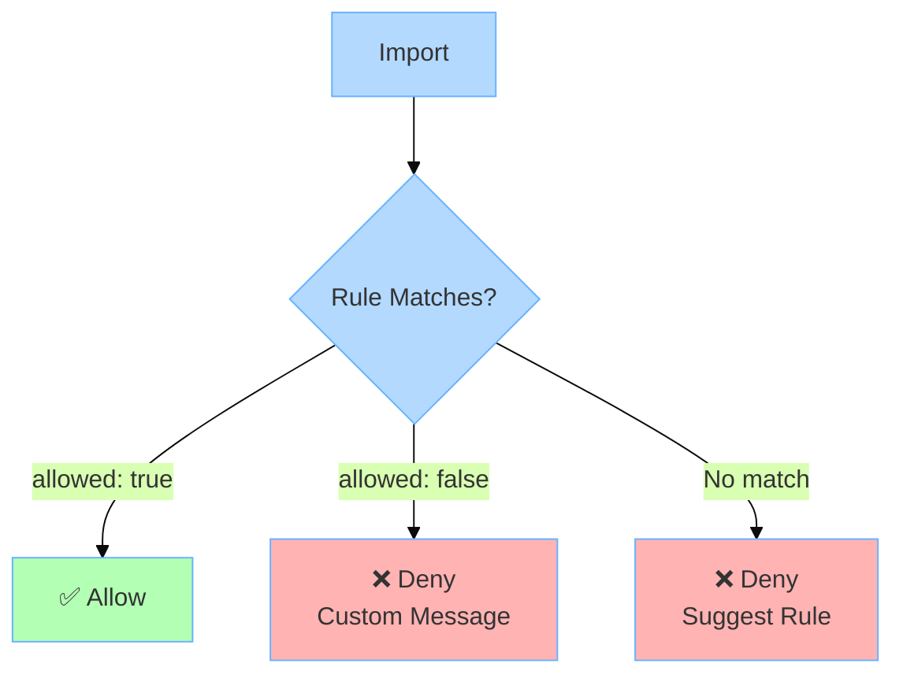

import { Tabs, TabItem, Card, CardGrid, Aside } from '@astrojs/starlight/components';

**Rules** define which boundaries can import from which. They are the enforcement mechanism that makes Stricture powerful.

## What is a Rule?

A rule specifies:
- **From:** Which boundary is importing
- **To:** Which boundary is being imported
- **Allowed:** Whether the import is permitted or forbidden

When code violates a rule, ESLint reports an error with a helpful message.

## Rule Schema

```typescript
interface ArchRule {
  id: string                    // Unique identifier (kebab-case)
  name: string                  // Display name
  description: string           // What this rule enforces
  severity: 'error' | 'warn' | 'off'  // How to report violations
  from: BoundaryPattern         // Source boundary
  to: BoundaryPattern           // Target boundary
  allowed: boolean              // true = permit, false = forbid
  message?: string              // Custom error message
  examples?: {
    good: string[]              // Valid import examples
    bad: string[]               // Invalid import examples
  }
  metadata?: Record<string, unknown>
}

interface BoundaryPattern {
  pattern?: string              // Glob pattern (e.g., 'src/domain/**')
  tag?: string                  // Tag reference (e.g., 'domain')
  mode: 'file' | 'folder'       // Match mode
}
```

## Basic Rules

### Allow Rule

Permit imports from one boundary to another:

```json
{
  "id": "application-to-domain",
  "name": "Application Uses Domain",
  "description": "Application layer can import domain entities",
  "severity": "error",
  "from": { "tag": "application", "mode": "file" },
  "to": { "tag": "domain", "mode": "file" },
  "allowed": true
}
```

**Result:** Application can import domain ✅

### Deny Rule

Forbid imports with a helpful error message:

```json
{
  "id": "domain-isolation",
  "name": "Domain Isolation",
  "description": "Domain layer must remain pure",
  "severity": "error",
  "from": { "tag": "domain", "mode": "file" },
  "to": { "tag": "*", "mode": "file" },
  "allowed": false,
  "message": "Domain cannot import from other layers or external libraries. Keep domain pure."
}
```

**Result:** Domain importing anything else triggers error ❌

## Rule Anatomy

### Required Fields

Every rule must have these fields:

```json
{
  "id": "domain-to-ports",              // Unique ID (kebab-case)
  "name": "Domain to Ports Forbidden",  // Human-readable name
  "description": "Domain defines entities, ports define interfaces",
  "severity": "error",                  // error, warn, or off
  "from": { "tag": "domain", "mode": "file" },
  "to": { "tag": "ports", "mode": "file" },
  "allowed": false
}
```

### Optional Fields

Enhance rules with optional fields:

```json
{
  "id": "driving-not-driven",
  "name": "Driving Adapters Independent from Driven",
  "description": "Driving adapters should not import driven adapters",
  "severity": "error",
  "from": { "tag": "driving", "mode": "file" },
  "to": { "tag": "driven", "mode": "file" },
  "allowed": false,
  "message": "Driving adapters should not directly import driven adapters. Use dependency injection via composition root.",
  "examples": {
    "bad": [
      "import { PostgresRepository } from '../driven/postgres-repository'"
    ],
    "good": [
      "// In index.ts (composition root):",
      "const repo = new PostgresRepository()",
      "const useCase = new CreateUserUseCase(repo)",
      "const cli = new CLI(useCase)"
    ]
  },
  "metadata": {
    "documentation": "https://wiki.company.com/architecture/dependency-injection"
  }
}
```

## Pattern-Based Rules

### Match by File Pattern

Use `pattern` to match specific file paths:

```json
{
  "id": "no-test-imports",
  "name": "No Test Imports in Production",
  "description": "Production code cannot import test files",
  "severity": "error",
  "from": { "pattern": "src/**", "mode": "file" },
  "to": { "pattern": "**/*.test.ts", "mode": "file" },
  "allowed": false,
  "message": "Don't import test files in production code"
}
```

**Matches:**
- From: Any file in `src/`
- To: Any `.test.ts` file
- Result: Import denied ❌

### Specific File Patterns

Target specific files or directories:

```json
{
  "id": "composition-root-wires-everything",
  "name": "Composition Root Can Import Everything",
  "description": "DI container can import any layer to wire dependencies",
  "severity": "error",
  "from": { "pattern": "src/index.ts", "mode": "file" },
  "to": { "pattern": "**", "mode": "file" },
  "allowed": true
}
```

The composition root (`src/index.ts`) can import from anywhere.

### External Dependencies

Use special pattern for `node_modules`:

```json
{
  "id": "domain-no-externals",
  "name": "Domain Cannot Use External Libraries",
  "description": "Keep domain pure - no npm packages",
  "severity": "error",
  "from": { "tag": "domain", "mode": "file" },
  "to": { "pattern": "node_modules/**", "mode": "file" },
  "allowed": false,
  "message": "Domain must be pure - no external dependencies"
}
```

## Tag-Based Rules

### Match by Boundary Tag

Use `tag` to match boundaries by their tags:

```json
{
  "id": "application-to-domain",
  "name": "Application Uses Domain",
  "description": "Use cases orchestrate domain entities",
  "severity": "error",
  "from": { "tag": "application", "mode": "file" },
  "to": { "tag": "domain", "mode": "file" },
  "allowed": true
}
```

**Matches:**
- From: Any boundary with `"application"` tag
- To: Any boundary with `"domain"` tag
- Result: Import allowed ✅

### Hierarchical Tags

Use broad and specific tags for flexible rules:

```json
{
  "boundaries": [
    {
      "name": "driving-adapters",
      "pattern": "src/adapters/driving/**",
      "tags": ["adapters", "driving"]
    },
    {
      "name": "driven-adapters",
      "pattern": "src/adapters/driven/**",
      "tags": ["adapters", "driven"]
    }
  ],
  "rules": [
    {
      "id": "adapters-to-domain",
      "from": { "tag": "adapters", "mode": "file" },  // Matches BOTH adapters
      "to": { "tag": "domain", "mode": "file" },
      "allowed": true
    },
    {
      "id": "driving-not-driven",
      "from": { "tag": "driving", "mode": "file" },   // Matches ONLY driving
      "to": { "tag": "driven", "mode": "file" },
      "allowed": false
    }
  ]
}
```

## Wildcards

### Wildcard Tag (`*`)

Match **any boundary**:

```json
{
  "id": "domain-isolation",
  "name": "Domain Isolation",
  "description": "Domain cannot import anything",
  "severity": "error",
  "from": { "tag": "domain", "mode": "file" },
  "to": { "tag": "*", "mode": "file" },        // Matches ANY boundary
  "allowed": false
}
```

Use `*` to create blanket rules, then override with specific rules.

### Wildcard Pattern (`**`)

Match **any file**:

```json
{
  "id": "shared-accessible-everywhere",
  "name": "Shared Utilities Accessible",
  "description": "All code can import shared utilities",
  "severity": "error",
  "from": { "pattern": "**", "mode": "file" },      // From anywhere
  "to": { "tag": "shared", "mode": "file" },
  "allowed": true
}
```

### External Tag

Special tag for `node_modules`:

```json
{
  "id": "domain-no-externals",
  "from": { "tag": "domain", "mode": "file" },
  "to": { "tag": "external", "mode": "file" },     // Matches node_modules
  "allowed": false
}
```

Stricture automatically creates a virtual `external` boundary for imports from `node_modules`.

## Rule Specificity

When multiple rules could match an import, **the most specific rule wins** - regardless of order in the config.

### How Specificity Works

Stricture calculates a numeric score for each rule. Higher score = more specific.

**Specificity hierarchy** (highest to lowest):

1. **Specific node_modules pattern** (10,000 points)
   ```json
   { "pattern": "node_modules/@types/node/**" }
   ```

2. **Regular pattern** (1,000 points)
   ```json
   { "pattern": "src/domain/**" }
   ```

3. **Specific tag** (100 points)
   ```json
   { "tag": "domain" }
   ```

4. **Wildcard** (1 point)
   ```json
   { "tag": "*" }  or  { "pattern": "**" }
   ```

**Total score** = `from_score + to_score`

### Specificity Example

```json
{
  "rules": [
    {
      "id": "domain-isolation",
      "from": { "tag": "domain" },      // 100 points
      "to": { "tag": "*" },             // 1 point
      "allowed": false                  // Total: 101
    },
    {
      "id": "domain-self-imports",
      "from": { "tag": "domain" },      // 100 points
      "to": { "tag": "domain" },        // 100 points
      "allowed": true                   // Total: 200 ✅ MORE SPECIFIC
    },
    {
      "id": "domain-types-ok",
      "from": { "tag": "domain" },      // 100 points
      "to": { "pattern": "node_modules/@types/**" },  // 10,000 points
      "allowed": true                   // Total: 10,100 ✅✅ MOST SPECIFIC
    }
  ]
}
```

**For import:**
```typescript
// src/domain/user.ts
import { User } from './order'  // domain → domain
```

**Evaluation:**
1. All three rules match (from = domain)
2. `domain-self-imports` has highest specificity (200 > 101)
3. Result: **Allowed** ✅

**For import:**
```typescript
// src/domain/user.ts
import type { Request } from '@types/node'  // domain → @types
```

**Evaluation:**
1. All three rules match (from = domain)
2. `domain-types-ok` has highest specificity (10,100)
3. Result: **Allowed** ✅

### Why Order Doesn't Matter

```json
// These produce IDENTICAL behavior:

// Version A
{
  "rules": [
    { "id": "general-rule", "from": { "tag": "domain" }, "to": { "tag": "*" }, "allowed": false },
    { "id": "specific-rule", "from": { "tag": "domain" }, "to": { "tag": "domain" }, "allowed": true }
  ]
}

// Version B
{
  "rules": [
    { "id": "specific-rule", "from": { "tag": "domain" }, "to": { "tag": "domain" }, "allowed": true },
    { "id": "general-rule", "from": { "tag": "domain" }, "to": { "tag": "*" }, "allowed": false }
  ]
}
```

Specificity determines precedence, not array order. This makes configs easier to maintain!

<Aside type="tip" title="Write Rules in Logical Order">
While order doesn't affect behavior, organize rules logically for readability:
1. Self-import rules
2. Allowed dependencies
3. Forbidden dependencies (with explanations)
</Aside>

## Severity Levels

### Error

Block the import - CI/CD fails:

```json
{
  "id": "domain-isolation",
  "severity": "error",
  "from": { "tag": "domain" },
  "to": { "tag": "*" },
  "allowed": false
}
```

**Result:** ESLint error, build fails ❌

### Warning

Alert but don't block:

```json
{
  "id": "legacy-code-usage",
  "severity": "warn",
  "from": { "pattern": "src/**" },
  "to": { "pattern": "src/legacy/**" },
  "allowed": false,
  "message": "Avoid using legacy code. See migration guide."
}
```

**Result:** ESLint warning, build succeeds ⚠️

**Use for:**
- Gradual adoption
- Soft deprecations
- Non-critical violations

### Off

Disable the rule:

```json
{
  "id": "strict-isolation",
  "severity": "off",
  "from": { "tag": "domain" },
  "to": { "tag": "*" },
  "allowed": false
}
```

**Result:** Rule ignored completely

**Use for:**
- Temporarily disabling rules
- A/B testing architectures
- Gradual rollout

## Deny by Default

Stricture uses **deny-by-default** for safety.

### How It Works

For every import:

1. ✅ **If explicit `allowed: true` rule matches** → Allow
2. ❌ **If explicit `allowed: false` rule matches** → Deny with custom message
3. ❌ **If NO rule matches** → Deny with generic message



### Example: No Rule Matches

```typescript
// src/application/use-case.ts
import axios from 'axios'  // No rule for application → external
```

**Error:**
```
No architectural rule defined for this import.

From: application (src/application/use-case.ts)
To:   external dependency (node_modules/axios/index.js)

Stricture uses deny-by-default policy for safety. Add an explicit rule to allow this import:

{
  "rules": [{
    "id": "allow-application-to-external",
    "from": { "tag": "application" },
    "to": { "tag": "external" },
    "allowed": true
  }]
}
```

### Why Deny by Default?

**Safety:** Better to error than allow unintended dependencies.

**Explicit architecture:** Every cross-boundary import must be intentional.

**Clear contracts:** Rules document your architecture decisions.

## When to Use `allowed: false`

Only use `allowed: false` when:

1. **Providing custom error message with guidance**
2. **Overriding a more general allowed rule** (rare)

Otherwise, rely on deny-by-default!

```json
// ❌ REDUNDANT - deny-by-default handles this
{
  "id": "no-data-to-presentation",
  "from": { "tag": "data" },
  "to": { "tag": "presentation" },
  "allowed": false
}

// ✅ GOOD - provides valuable guidance
{
  "id": "domain-isolation",
  "from": { "tag": "domain" },
  "to": { "tag": "*" },
  "allowed": false,
  "message": "Domain must remain pure. Move infrastructure logic to adapters and use dependency injection.",
  "examples": {
    "bad": ["import { Database } from '../infrastructure'"],
    "good": ["// Domain stays pure, adapters handle I/O"]
  }
}
```

<Aside type="tip" title="When to Add allowed: false">
Only add `allowed: false` rules when the error message provides architectural guidance beyond the generic deny-by-default message.
</Aside>

## Complete Rule Examples

### Hexagonal Architecture Rules

```json
{
  "rules": [
    // Domain isolation
    {
      "id": "domain-self-imports",
      "name": "Domain Can Import Itself",
      "severity": "error",
      "from": { "tag": "domain", "mode": "file" },
      "to": { "tag": "domain", "mode": "file" },
      "allowed": true
    },
    {
      "id": "domain-isolation",
      "name": "Domain Isolation",
      "description": "Domain layer must remain pure",
      "severity": "error",
      "from": { "tag": "domain", "mode": "file" },
      "to": { "tag": "*", "mode": "file" },
      "allowed": false,
      "message": "Domain must be pure - no dependencies on other layers or external libraries"
    },

    // Application layer
    {
      "id": "application-to-domain",
      "name": "Application Uses Domain",
      "severity": "error",
      "from": { "tag": "application", "mode": "file" },
      "to": { "tag": "domain", "mode": "file" },
      "allowed": true
    },
    {
      "id": "application-to-ports",
      "name": "Application Uses Ports",
      "severity": "error",
      "from": { "tag": "application", "mode": "file" },
      "to": { "tag": "ports", "mode": "file" },
      "allowed": true
    },

    // Adapters
    {
      "id": "driving-to-application",
      "name": "Driving Adapters Call Use Cases",
      "severity": "error",
      "from": { "tag": "driving", "mode": "file" },
      "to": { "tag": "application", "mode": "file" },
      "allowed": true
    },
    {
      "id": "driven-implements-ports",
      "name": "Driven Adapters Implement Ports",
      "severity": "error",
      "from": { "tag": "driven", "mode": "file" },
      "to": { "tag": "ports", "mode": "file" },
      "allowed": true
    },
    {
      "id": "driven-to-domain",
      "name": "Driven Can Import Domain Types",
      "severity": "error",
      "from": { "tag": "driven", "mode": "file" },
      "to": { "tag": "domain", "mode": "file" },
      "allowed": true
    }
  ]
}
```

### Layered Architecture Rules

```json
{
  "rules": [
    // Downward dependencies only
    {
      "id": "presentation-to-business",
      "name": "Presentation → Business",
      "severity": "error",
      "from": { "tag": "presentation", "mode": "file" },
      "to": { "tag": "business", "mode": "file" },
      "allowed": true
    },
    {
      "id": "business-to-data",
      "name": "Business → Data",
      "severity": "error",
      "from": { "tag": "business", "mode": "file" },
      "to": { "tag": "data", "mode": "file" },
      "allowed": true
    },

    // No upward dependencies
    {
      "id": "no-data-to-business",
      "name": "Data Cannot Call Business",
      "description": "Violates layered architecture",
      "severity": "error",
      "from": { "tag": "data", "mode": "file" },
      "to": { "tag": "business", "mode": "file" },
      "allowed": false,
      "message": "Data layer cannot depend on business layer - this creates circular dependencies"
    },
    {
      "id": "no-data-to-presentation",
      "name": "Data Cannot Call Presentation",
      "severity": "error",
      "from": { "tag": "data", "mode": "file" },
      "to": { "tag": "presentation", "mode": "file" },
      "allowed": false,
      "message": "Data layer is the foundation - it cannot depend on higher layers"
    }
  ]
}
```

### Modular Architecture Rules

```json
{
  "rules": [
    // Modules are independent
    {
      "id": "user-not-product",
      "name": "User Module Independent from Product",
      "severity": "error",
      "from": { "tag": "user", "mode": "folder" },
      "to": { "tag": "product", "mode": "folder" },
      "allowed": false,
      "message": "Modules must be independent. Use shared kernel for common code."
    },
    {
      "id": "product-not-order",
      "name": "Product Module Independent from Order",
      "severity": "error",
      "from": { "tag": "product", "mode": "folder" },
      "to": { "tag": "order", "mode": "folder" },
      "allowed": false
    },

    // All modules can use shared
    {
      "id": "modules-to-shared",
      "name": "Modules Can Use Shared Kernel",
      "severity": "error",
      "from": { "tag": "module", "mode": "folder" },
      "to": { "tag": "shared", "mode": "file" },
      "allowed": true
    }
  ]
}
```

## Advanced Rules

### External Dependencies by Package

Allow specific npm packages:

```json
{
  "rules": [
    {
      "id": "domain-no-externals",
      "from": { "tag": "domain", "mode": "file" },
      "to": { "tag": "external", "mode": "file" },
      "allowed": false
    },
    {
      "id": "domain-can-use-types",
      "from": { "tag": "domain", "mode": "file" },
      "to": { "pattern": "node_modules/@types/**", "mode": "file" },
      "allowed": true,
      "message": "Domain can use TypeScript type definitions"
    },
    {
      "id": "application-limited-utils",
      "from": { "tag": "application", "mode": "file" },
      "to": { "pattern": "node_modules/{lodash,date-fns}/**", "mode": "file" },
      "allowed": true,
      "message": "Application can use approved utility libraries"
    }
  ]
}
```

Pattern rule (10,000 points) overrides tag rule (100 points) via specificity.

### Self-Imports

Allow files to import from same boundary:

```json
{
  "id": "domain-self-imports",
  "name": "Domain Can Import Itself",
  "severity": "error",
  "from": { "tag": "domain", "mode": "file" },
  "to": { "tag": "domain", "mode": "file" },
  "allowed": true
}
```

Every boundary typically needs a self-import rule.

### Composition Root Exception

Composition root can import everything:

```json
{
  "id": "composition-root-wires-all",
  "name": "Composition Root Wires Dependencies",
  "description": "index.ts can import from any layer",
  "severity": "error",
  "from": { "pattern": "src/index.ts", "mode": "file" },
  "to": { "pattern": "**", "mode": "file" },
  "allowed": true
}
```

### Progressive Enhancement

Start loose, tighten over time:

```json
{
  "rules": [
    {
      "id": "legacy-isolation",
      "name": "Isolate Legacy Code",
      "description": "TEMPORARY - removing in Q3 2024",
      "severity": "warn",  // Start with warning
      "from": { "pattern": "src/**", "exclude": ["src/legacy/**"] },
      "to": { "pattern": "src/legacy/**" },
      "allowed": false,
      "message": "Don't depend on legacy code. Refactor or duplicate needed logic.",
      "metadata": {
        "deadline": "2024-09-30",
        "ticket": "ARCH-123"
      }
    }
  ]
}
```

Later change `severity: "warn"` → `"error"` when legacy code is removed.

## Best Practices

### Be Explicit

```json
// ✅ GOOD - Clear intent
{
  "id": "application-to-domain",
  "name": "Application Uses Domain",
  "description": "Use cases orchestrate domain entities",
  "severity": "error",
  "from": { "tag": "application" },
  "to": { "tag": "domain" },
  "allowed": true
}

// ❌ BAD - Unclear
{
  "id": "rule-1",
  "name": "Rule 1",
  "description": "A rule",
  "severity": "error",
  "from": { "tag": "app" },
  "to": { "tag": "dom" },
  "allowed": true
}
```

### Provide Helpful Messages

```json
{
  "id": "driving-not-driven",
  "from": { "tag": "driving" },
  "to": { "tag": "driven" },
  "allowed": false,
  "message": "Driving adapters should not directly import driven adapters. Use dependency injection via composition root.",
  "examples": {
    "bad": [
      "import { PostgresRepository } from '../driven/postgres'"
    ],
    "good": [
      "// In index.ts:",
      "const repo = new PostgresRepository()",
      "const cli = new CLI(createUseCase(repo))"
    ]
  }
}
```

### Document Exceptions

```json
{
  "id": "temporary-exception",
  "name": "TEMPORARY: Allow Direct DB Access",
  "description": "Will be removed after migration to repository pattern (Q2 2024)",
  "severity": "warn",
  "from": { "tag": "services" },
  "to": { "pattern": "node_modules/pg/**" },
  "allowed": true,
  "metadata": {
    "ticket": "ARCH-456",
    "deadline": "2024-06-30",
    "reason": "Migration in progress"
  }
}
```

## Troubleshooting

### Rule Not Triggering

**Problem:** Expected violation not reported

**Debug:**
1. Verify boundary matches the file (check pattern)
2. Check rule severity isn't `"off"`
3. Verify specificity - more specific rule might override
4. Check if file is in `ignorePatterns`

**Test specificity:**
```json
// Add temporary rule with higher specificity
{
  "id": "debug-rule",
  "from": { "pattern": "src/exact/file.ts" },  // Very specific
  "to": { "pattern": "**" },
  "allowed": false,
  "message": "DEBUG: This rule should always trigger"
}
```

### Wrong Rule Applying

**Problem:** Unexpected rule is matching

**Solution:** Check specificity scores. More specific rules override general ones.

```bash
# Enable debug logging
DEBUG=stricture:* eslint src/
```

### Circular Dependencies

**Problem:** Two rules seem contradictory

**Solution:** Check specificity and rule direction:

```json
// These don't conflict due to specificity:
{
  "rules": [
    {
      "id": "general-deny",
      "from": { "tag": "domain" },
      "to": { "tag": "*" },        // Low specificity (101)
      "allowed": false
    },
    {
      "id": "specific-allow",
      "from": { "tag": "domain" },
      "to": { "tag": "domain" },   // High specificity (200)
      "allowed": true              // This wins!
    }
  ]
}
```

## Next Steps

<CardGrid>
  <Card title="Configuration File" icon="setting">
    Learn about the complete config file structure.

    [Read guide →](/configuration/config-file/)
  </Card>
  <Card title="Boundaries Reference" icon="puzzle">
    Master boundary definitions.

    [Read guide →](/configuration/boundaries/)
  </Card>
  <Card title="Presets Reference" icon="open-book">
    See how presets define rules.

    [Read guide →](/configuration/presets/)
  </Card>
</CardGrid>
