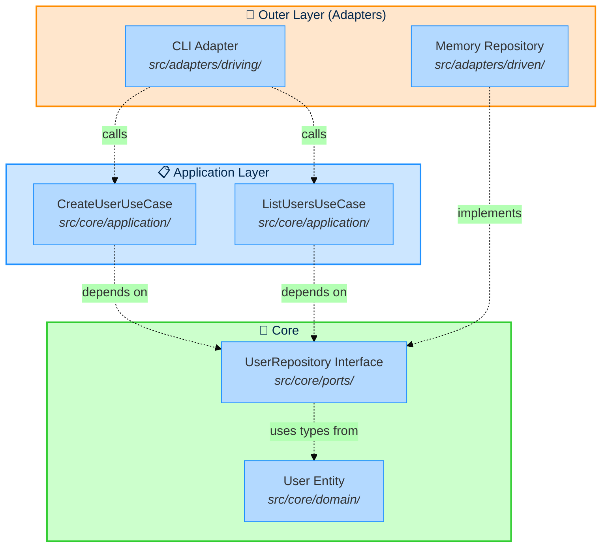

import { Aside, Code, Tabs, TabItem } from '@astrojs/starlight/components';

This example demonstrates **hexagonal architecture** (also known as ports & adapters pattern) with Stricture enforcement. It's a minimal, runnable terminal application that creates and lists users—perfect for understanding the core concepts.

## What You'll Learn

- How to structure a hexagonal architecture project from scratch
- The difference between driving and driven adapters
- How to implement dependency injection with composition root pattern
- How Stricture prevents common architectural violations
- The dependency flow from adapters → application → ports → domain

## Architecture Overview



**Key Principle**: Dependencies flow **inward** (toward domain). The domain has zero dependencies.

## File Structure

```
examples/simple-hexagonal/
├── .stricture/
│   └── config.json              # { "preset": "@stricture/hexagonal" }
├── src/
│   ├── core/                    # Business logic (no external dependencies)
│   │   ├── domain/
│   │   │   └── user.ts          # User entity with validation
│   │   ├── ports/
│   │   │   └── user-repository.ts  # Repository interface
│   │   └── application/
│   │       ├── create-user.ts   # Create user use case
│   │       └── list-users.ts    # List users use case
│   └── adapters/
│       ├── driving/             # Primary/Active adapters
│       │   └── cli.ts           # CLI entry point
│       └── driven/              # Secondary/Passive adapters
│           └── memory-repository.ts  # In-memory storage
├── index.ts                     # Composition root
└── package.json
```

## The Four Layers

### 1. Domain Layer (Core Business Logic)

**Location**: `src/core/domain/`

**Purpose**: Pure business logic with absolutely no dependencies.

**File**: `src/core/domain/user.ts`

```typescript
export class User {
  constructor(
    public readonly id: string,
    public readonly name: string,
    public readonly email: string
  ) {
    // Business rule: Email must be valid
    if (!this.isValidEmail(email)) {
      throw new Error('Invalid email format')
    }

    // Business rule: Name cannot be empty
    if (!name || name.trim().length === 0) {
      throw new Error('Name cannot be empty')
    }
  }

  private isValidEmail(email: string): boolean {
    return email.includes('@') && email.includes('.')
  }

  getDisplayName(): string {
    return `${this.name} (${this.email})`
  }
}
```

**Key Points**:
- ✅ Zero external dependencies (no imports from other layers)
- ✅ Pure business validation logic
- ❌ No knowledge of databases, HTTP, CLI, or any infrastructure

<Aside type="tip">
The domain layer is the heart of hexagonal architecture. It must remain completely isolated.
</Aside>

---

### 2. Ports Layer (Interfaces)

**Location**: `src/core/ports/`

**Purpose**: Define interfaces (contracts) for external interactions.

**File**: `src/core/ports/user-repository.ts`

```typescript
import type { User } from '../domain/user.js'

export interface UserRepository {
  save(user: User): Promise<void>
  findById(id: string): Promise<User | null>
  findAll(): Promise<User[]>
}
```

**Key Points**:
- ✅ Can import from domain (to use domain types in interfaces)
- ✅ Defines **WHAT** operations are needed (not **HOW**)
- ❌ Cannot import from application or adapters

The port defines the contract. Adapters provide implementations.

---

### 3. Application Layer (Use Cases)

**Location**: `src/core/application/`

**Purpose**: Orchestrate domain entities and port interfaces.

**File**: `src/core/application/create-user.ts`

```typescript
import { User } from '../domain/user.js'
import { UserRepository } from '../ports/user-repository.js'

export class CreateUserUseCase {
  constructor(private readonly userRepository: UserRepository) {}

  async execute(name: string, email: string): Promise<User> {
    // Generate unique ID
    const id = this.generateId()

    // Create domain entity (validation happens in constructor)
    const user = new User(id, name, email)

    // Persist using the port interface
    await this.userRepository.save(user)

    return user
  }

  private generateId(): string {
    return `user_${Math.random().toString(36).substr(2, 9)}`
  }
}
```

**Key Points**:
- ✅ Can import from domain and ports
- ✅ Depends on **interfaces** (UserRepository), not implementations
- ❌ Cannot import from adapters (maintains dependency inversion)

**Why this matters**: You can swap `MemoryRepository` with `PostgresRepository` without changing this use case.

---

### 4. Adapters Layer

The adapters layer is split into **driving** (active) and **driven** (passive) adapters.

#### Driving Adapters (Primary/Active)

**Location**: `src/adapters/driving/`

**Purpose**: Entry points that receive external input and call the application.

**File**: `src/adapters/driving/cli.ts`

```typescript
import { CreateUserUseCase } from '../../core/application/create-user.js'
import { ListUsersUseCase } from '../../core/application/list-users.js'

export class CliAdapter {
  constructor(
    private readonly createUserUseCase: CreateUserUseCase,
    private readonly listUsersUseCase: ListUsersUseCase
  ) {}

  async run(args: string[]): Promise<void> {
    const command = args[0]

    switch (command) {
      case 'create':
        await this.handleCreate(args[1], args[2])
        break
      case 'list':
        await this.handleList()
        break
      default:
        this.showHelp()
    }
  }

  private async handleCreate(name: string, email: string): Promise<void> {
    const user = await this.createUserUseCase.execute(name, email)

    console.log('✅ User created successfully!')
    console.log(`ID: ${user.id}`)
    console.log(`Name: ${user.name}`)
    console.log(`Email: ${user.email}`)
  }

  private async handleList(): Promise<void> {
    const users = await this.listUsersUseCase.execute()

    console.log(`📋 Users (${users.length}):`)
    users.forEach(user => {
      console.log(`- ${user.getDisplayName()}`)
    })
  }

  private showHelp(): void {
    console.log('Usage:')
    console.log('  create <name> <email>')
    console.log('  list')
  }
}
```

**Key Points**:
- ✅ Can import from application (to call use cases)
- ✅ Receives use cases via **dependency injection** (constructor)
- ❌ Should not import from domain directly (use application layer instead)
- ❌ Must NOT import driven adapters (repositories, etc.)

**Why no driven adapter imports?** The CLI doesn't need to know about `MemoryRepository`. It only calls use cases. The composition root handles wiring.

#### Driven Adapters (Secondary/Passive)

**Location**: `src/adapters/driven/`

**Purpose**: Implementations of port interfaces that the application calls.

**File**: `src/adapters/driven/memory-repository.ts`

```typescript
import type { User } from '../../core/domain/user.js'
import type { UserRepository } from '../../core/ports/user-repository.js'

export class MemoryUserRepository implements UserRepository {
  private users: Map<string, User> = new Map()

  async save(user: User): Promise<void> {
    this.users.set(user.id, user)
  }

  async findById(id: string): Promise<User | null> {
    return this.users.get(id) || null
  }

  async findAll(): Promise<User[]> {
    return Array.from(this.users.values())
  }
}
```

**Key Points**:
- ✅ Can import from ports (implements interfaces)
- ✅ Can import from domain (to work with domain types like `User`)
- ❌ Cannot import from application (passive, doesn't call use cases)

**Why can it import domain?** The port interface (`UserRepository`) uses `User` in its method signatures. The implementation must import `User` to implement the interface. This is correct and necessary!

<Aside type="note">
**Driving vs Driven**: Think of it as "who calls whom?"
- **Driving**: External world → Application (CLI **calls** use cases)
- **Driven**: Application → Infrastructure (Use case **calls** repository)
</Aside>

---

## Composition Root Pattern

The `index.ts` file is the **composition root** - the only place that knows about concrete implementations.

**File**: `index.ts`

```typescript
import { MemoryUserRepository } from './src/adapters/driven/memory-repository.js'
import { CreateUserUseCase } from './src/core/application/create-user.js'
import { ListUsersUseCase } from './src/core/application/list-users.js'
import { CliAdapter } from './src/adapters/driving/cli.js'

// 1. Create driven adapters (infrastructure)
const userRepository = new MemoryUserRepository()

// 2. Create use cases with their dependencies
const createUserUseCase = new CreateUserUseCase(userRepository)
const listUsersUseCase = new ListUsersUseCase(userRepository)

// 3. Create driving adapter (entry point) with use cases
const cli = new CliAdapter(createUserUseCase, listUsersUseCase)

// 4. Run the application
const args = process.argv.slice(2)
cli.run(args)
```

**Why this matters**:

1. **CLI** only knows about use cases, not repositories
2. **Use cases** only know about port interfaces, not concrete implementations
3. **Only index.ts** knows about concrete classes

This means you can:
- ✅ Swap `MemoryRepository` for `PostgresRepository` without changing CLI
- ✅ Swap `CLI` for `HTTPController` without changing use cases
- ✅ Test use cases with mock repositories
- ✅ Test CLI with mock use cases

**Dependency flow (composition root creates):**
```
Driven Adapter (MemoryRepository)
    ↓
Use Cases (CreateUserUseCase, ListUsersUseCase)
    ↓
Driving Adapter (CLI)
    ↓
Run Application
```

---

## Stricture Configuration

The example uses the `@stricture/hexagonal` preset with **zero overrides**.

**File**: `.stricture/config.json`

```json
{
  "preset": "@stricture/hexagonal"
}
```

That's it! The preset provides:
- Boundary definitions (domain, ports, application, driving-adapters, driven-adapters)
- Architectural rules (domain isolation, dependency inversion, etc.)

### What Stricture Enforces

**Domain Layer**:
- ❌ Cannot import from ports, application, or adapters
- ❌ Cannot import external dependencies
- ✅ Can only import other domain entities

**Ports Layer**:
- ✅ Can import from domain (for type definitions)
- ❌ Cannot import from application or adapters

**Application Layer**:
- ✅ Can import from domain and ports
- ❌ Cannot import from adapters

**Driving Adapters**:
- ✅ Can import from application
- ✅ Can import from ports (for dependency injection types)
- ❌ Cannot import from domain (use application instead)
- ❌ Cannot import driven adapters

**Driven Adapters**:
- ✅ Can import from ports (to implement interfaces)
- ✅ Can import from domain (necessary for implementation)
- ❌ Cannot import from application (passive, doesn't call use cases)

---

## Running the Example

### Installation

```bash
cd examples/simple-hexagonal
npm install
npm run build
```

### Create a User

```bash
node dist/index.js create "John Doe" "john@example.com"
```

**Output**:
```
✅ User created successfully!
ID: user_abc123def
Name: John Doe
Email: john@example.com
```

### List All Users

```bash
node dist/index.js list
```

**Output**:
```
📋 Users (2):
- John Doe (john@example.com)
- Jane Smith (jane@example.com)
```

### Validate Architecture

```bash
npm run lint
```

**Output (if clean)**:
```
✅ All files pass architectural boundaries!
```

---

## Try Breaking the Architecture

Want to see Stricture in action? Let's introduce some violations!

### Violation 1: Domain Importing Adapter

**Try this** in `src/core/domain/user.ts`:

```typescript
// ❌ BAD - Domain importing adapter
import { MemoryUserRepository } from '../../adapters/driven/memory-repository'

export class User {
  // Domain should never know about infrastructure!
  private repo = new MemoryUserRepository()  // ❌ VIOLATION!
  // ...
}
```

**Run** `npm run lint`:

```
src/core/domain/user.ts
  3:1  error  Domain layer must be pure - no external dependencies or infrastructure imports.

Why: Domain is the core of your application and must remain independent.

Allowed: Other domain entities only
Forbidden: Ports, Application, Adapters, External dependencies

Fix: Remove this import or move the logic to the application layer.

  @stricture/enforce-boundaries

❌ 1 error
```

<Aside type="caution">
Stricture prevents the domain from becoming coupled to infrastructure!
</Aside>

---

### Violation 2: Application Importing Concrete Adapter

**Try this** in `src/core/application/create-user.ts`:

```typescript
// ❌ BAD - Application importing concrete implementation
import { MemoryUserRepository } from '../../adapters/driven/memory-repository'

export class CreateUserUseCase {
  // Should depend on interface, not implementation!
  private repo = new MemoryUserRepository()  // ❌ VIOLATION!
  // ...
}
```

**Run** `npm run lint`:

```
src/core/application/create-user.ts
  3:1  error  Application layer should depend on port interfaces, not concrete adapter implementations.

Why: This maintains dependency inversion and allows you to swap implementations.

Fix: Import from ports instead:
  import { UserRepository } from '../ports/user-repository'

Then use dependency injection to receive the concrete implementation.

  @stricture/enforce-boundaries

❌ 1 error
```

**The correct way**:

```typescript
// ✅ GOOD - Application depends on interface
import { UserRepository } from '../ports/user-repository'

export class CreateUserUseCase {
  // Dependency injection - receives interface
  constructor(private readonly repository: UserRepository) {}
  // ...
}
```

---

### Violation 3: Driving Adapter Importing Driven Adapter

**Try this** in `src/adapters/driving/cli.ts`:

```typescript
// ❌ BAD - Driving adapter knows about driven adapter
import { MemoryUserRepository } from '../driven/memory-repository'

export class CliAdapter {
  private repo = new MemoryUserRepository()  // ❌ VIOLATION!
  // ...
}
```

**Run** `npm run lint`:

```
src/adapters/driving/cli.ts
  3:1  error  Driving adapter should not import driven adapter.

Why: This couples adapters together. Use dependency injection instead.

Fix: Import use cases from application layer:
  import { CreateUserUseCase } from '../../core/application/create-user'

Wire dependencies in the composition root (index.ts).

  @stricture/enforce-boundaries

❌ 1 error
```

**The correct way**: Use composition root pattern (see `index.ts` above).

---

## What Makes This Hexagonal?

### 1. Dependency Inversion

The application depends on the `UserRepository` **interface**, not the `MemoryUserRepository` **implementation**.

```typescript
// Application layer depends on abstraction
constructor(private readonly userRepository: UserRepository) {}
```

This is the **Dependency Inversion Principle** in action.

### 2. Domain Isolation

The domain has **zero external dependencies**. It's pure business logic.

```typescript
// Domain layer - completely isolated
export class User {
  // No imports from infrastructure!
  // Pure business logic
}
```

### 3. Testability

You can easily swap `MemoryUserRepository` with a `MockUserRepository` for testing:

```typescript
// In tests
const mockRepo = new MockUserRepository()
const useCase = new CreateUserUseCase(mockRepo)
```

### 4. Flexibility

Want to replace in-memory storage with PostgreSQL? Just create a `PostgresUserRepository` that implements `UserRepository`:

```typescript
// New adapter - no changes to domain/application!
export class PostgresUserRepository implements UserRepository {
  async save(user: User): Promise<void> {
    // PostgreSQL implementation
  }
  // ...
}

// In index.ts
const userRepository = new PostgresUserRepository()  // ← Only change needed
```

---

## Common Questions

### Q: Why can driven adapters import domain types?

**A**: Driven adapters (repositories) **must** import domain types to implement the port interfaces correctly.

```typescript
// Port interface uses User in its signature
interface UserRepository {
  save(user: User): Promise<void>  // ← Uses User type
}

// Repository must import User to implement this
class MemoryUserRepository implements UserRepository {
  async save(user: User): Promise<void> {  // ← Must match signature
    // Implementation
  }
}
```

This is standard practice in hexagonal architecture. The key is:
- ✅ Driven adapters CAN import domain (necessary for implementation)
- ❌ Driving adapters CANNOT import domain (should use application)

### Q: Where do side effects (logging, audit, notifications) go?

**A**: In the **application layer**, not the domain.

**Wrong** (domain has side effects):
```typescript
// ❌ BAD - Domain calling ports
export class User {
  constructor(auditLog: AuditLog) {
    auditLog.log('User created')  // ❌ Side effect in domain!
  }
}
```

**Correct** (application orchestrates):
```typescript
// ✅ GOOD - Application orchestrates domain + side effects
export class CreateUserUseCase {
  constructor(
    private readonly userRepository: UserRepository,
    private readonly auditLog: AuditLog
  ) {}

  async execute(name: string, email: string): Promise<User> {
    const user = new User(id, name, email)  // Pure domain logic
    await this.userRepository.save(user)
    await this.auditLog.log(`User created: ${user.id}`)  // Side effect
    return user
  }
}
```

**Alternative**: Use Domain Events (advanced pattern).

### Q: Should I put Express.js routes in driving adapters?

**A**: Yes! Express routes are driving adapters (entry points).

```typescript
// src/adapters/driving/http/user-routes.ts
import { CreateUserUseCase } from '../../../core/application/create-user'

export function createUserRoutes(createUseCase: CreateUserUseCase) {
  return express.Router()
    .post('/users', async (req, res) => {
      const user = await createUseCase.execute(req.body.name, req.body.email)
      res.json(user)
    })
}
```

---

## Next Steps

1. **Extend the example**: Add update/delete user use cases
2. **Add a new adapter**: Create a PostgreSQL repository
3. **Add Express.js**: Create HTTP routes alongside the CLI
4. **Explore other patterns**: Check out [Next.js example](/examples/nextjs-app) and [NestJS example](/examples/nestjs-api)

---

## See Also

- [Hexagonal Architecture Preset](/presets/hexagonal)
- [Creating Custom Presets](/guides/custom-presets)
- [Next.js Example](/examples/nextjs-app)
- [NestJS Example](/examples/nestjs-api)
- [Original Hexagonal Architecture Article](https://alistair.cockburn.us/hexagonal-architecture/) by Alistair Cockburn
