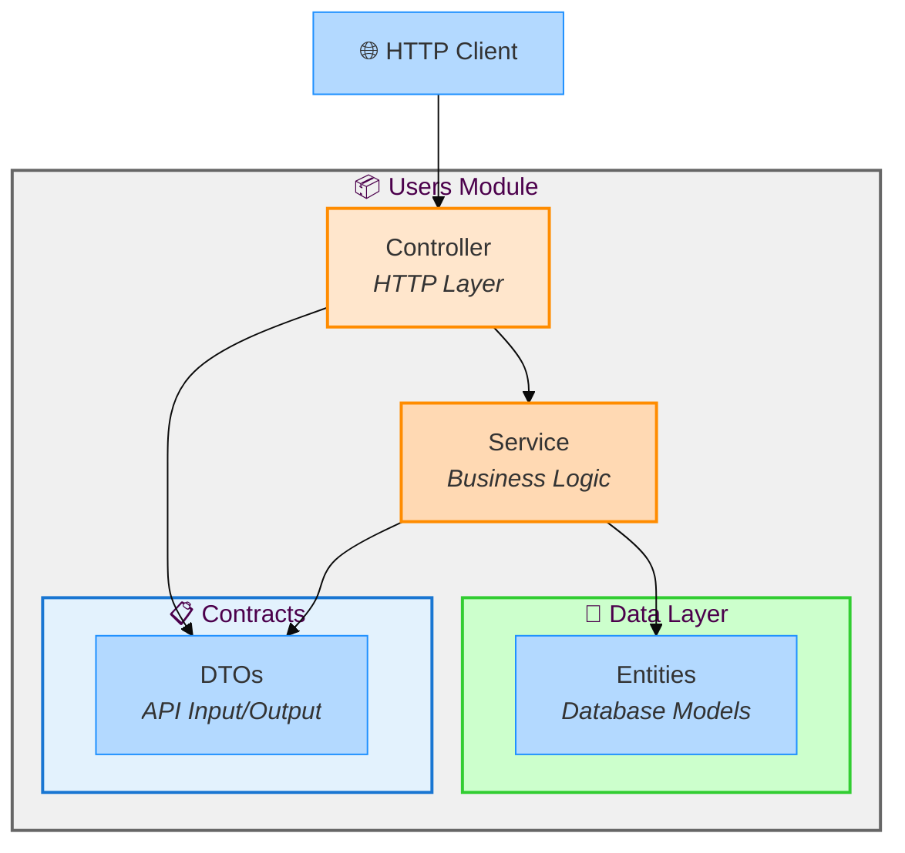

import { Aside } from '@astrojs/starlight/components';

This example demonstrates **NestJS layered architecture** with Stricture enforcement. It's a simple users API that shows proper separation between DTOs (API contracts), Entities (database models), Services (business logic), and Controllers (HTTP handling).

## What You'll Learn

- The critical difference between DTOs and Entities
- Why controllers should never expose entities directly
- How to structure a NestJS module properly
- How Stricture prevents common NestJS security issues
- The proper data flow: HTTP → Controller → Service → Repository

## Architecture Overview



**Key Principle**: Controllers use **DTOs** for API contracts. Services convert between **Entities** (internal) and **DTOs** (external).

## File Structure

```
examples/nestjs-basic/
├── .stricture/
│   └── config.json              # { "preset": "@stricture/nestjs" }
├── src/
│   ├── users/
│   │   ├── dto/                 # API contracts
│   │   │   ├── create-user.dto.ts  # Input
│   │   │   └── user.dto.ts      # Output
│   │   ├── entities/            # Database models
│   │   │   └── user.entity.ts   # Internal representation
│   │   ├── users.controller.ts  # HTTP handling
│   │   ├── users.service.ts     # Business logic
│   │   └── users.module.ts      # Module definition
│   ├── app.module.ts
│   └── main.ts
└── package.json
```

## The Critical DTO/Entity Separation

This is the **most important concept** in NestJS architecture:

### Why DTOs and Entities Must Be Separate

**Problem**: Exposing entities directly in your API

```typescript
// ❌ DANGEROUS - Exposing entity directly
@Controller('users')
export class UsersController {
  @Get()
  findAll(): Promise<User[]> {  // ← Entity exposed!
    return this.usersService.findAll()
  }
}

// Entity with sensitive field
export class User {
  id: number
  email: string
  passwordHash: string  // ⚠️ LEAKED TO API!
}
```

**API Response**:
```json
[
  {
    "id": 1,
    "email": "user@example.com",
    "passwordHash": "hashed_secret123"  // 🚨 SECURITY ISSUE!
  }
]
```

<Aside type="danger">
**Security vulnerability**: Accidentally exposing `passwordHash` or other sensitive fields!
</Aside>

---

**Solution**: Separate DTOs from Entities

```typescript
// ✅ SAFE - Using DTO
@Controller('users')
export class UsersController {
  @Get()
  findAll(): Promise<UserDto[]> {  // ← DTO for API
    return this.usersService.findAll()
  }
}

// Entity (internal database model)
export class User {
  id: number
  email: string
  passwordHash: string  // Internal detail
  createdAt: Date
}

// DTO (API contract)
export class UserDto {
  id: number
  email: string
  name: string
  createdAt: Date
  // passwordHash is NOT included!
}
```

**API Response** (safe):
```json
[
  {
    "id": 1,
    "email": "user@example.com",
    "name": "John Doe",
    "createdAt": "2024-01-01T00:00:00.000Z"
  }
]
```

**Benefits**:
- 🔒 **Security**: Sensitive fields never exposed
- 📜 **API Evolution**: Change database schema without breaking API
- ✅ **Type Safety**: DTOs provide compile-time validation
- 🎯 **Clarity**: Clear API contracts

---

## The Four Layers

### 1. DTOs (API Contracts)

**Location**: `src/users/dto/`

**Purpose**: Define API input and output shapes

**Output DTO**: `src/users/dto/user.dto.ts`

```typescript
/**
 * UserDto - Output for API responses
 * Does NOT include sensitive fields like passwordHash
 */
export class UserDto {
  id: number
  email: string
  name: string
  createdAt: Date
  // Note: passwordHash is NOT included!
}
```

**Input DTO**: `src/users/dto/create-user.dto.ts`

```typescript
import { IsEmail, IsString, MinLength } from 'class-validator'

/**
 * CreateUserDto - Input for user creation
 * Uses validation decorators
 */
export class CreateUserDto {
  @IsEmail()
  email: string

  @IsString()
  @MinLength(2)
  name: string

  @IsString()
  @MinLength(8)
  password: string  // ← Plain password (will be hashed)
}
```

**Key Points**:
- ✅ Use `class-validator` decorators for validation
- ✅ Separate input DTOs from output DTOs
- ✅ Never include sensitive computed fields (like `passwordHash`)

---

### 2. Entities (Database Models)

**Location**: `src/users/entities/`

**Purpose**: Internal database representation

**File**: `src/users/entities/user.entity.ts`

```typescript
/**
 * User entity - Database model
 * Contains internal database fields like passwordHash
 */
export class User {
  id: number
  email: string
  name: string
  passwordHash: string  // ← Internal detail, NOT exposed in API
  createdAt: Date
}
```

**Key Points**:
- ✅ Internal representation only
- ✅ Can include sensitive fields
- ✅ Used by services and repositories
- ❌ Should NEVER be exposed in controller methods

<Aside type="note">
In real apps, use `@Entity()` decorator with TypeORM/Prisma/etc. This example uses a plain class for simplicity.
</Aside>

---

### 3. Services (Business Logic)

**Location**: `src/users/users.service.ts`

**Purpose**: Orchestrate business logic, convert entities to DTOs

**File**: `src/users/users.service.ts`

```typescript
import { Injectable } from '@nestjs/common'
import { User } from './entities/user.entity'
import { CreateUserDto } from './dto/create-user.dto'
import { UserDto } from './dto/user.dto'

@Injectable()
export class UsersService {
  private users: User[] = []
  private nextId = 1

  async create(dto: CreateUserDto): Promise<UserDto> {
    // Create entity from DTO
    const user: User = {
      id: this.nextId++,
      email: dto.email,
      name: dto.name,
      passwordHash: `hashed_${dto.password}`,  // Hash the password
      createdAt: new Date()
    }

    this.users.push(user)

    // ✅ Convert entity to DTO before returning
    return this.toDto(user)
  }

  async findAll(): Promise<UserDto[]> {
    // ✅ Map entities to DTOs
    return this.users.map(u => this.toDto(u))
  }

  async findOne(id: number): Promise<UserDto | null> {
    const user = this.users.find(u => u.id === id)
    return user ? this.toDto(user) : null
  }

  /**
   * Convert entity to DTO
   * ✅ Excludes sensitive fields like passwordHash
   */
  private toDto(user: User): UserDto {
    return {
      id: user.id,
      email: user.email,
      name: user.name,
      createdAt: user.createdAt
      // passwordHash is NOT included in DTO
    }
  }
}
```

**Key Points**:
- ✅ Works with **entities** internally
- ✅ Returns **DTOs** to controllers
- ✅ Private `toDto()` method for conversion
- ✅ Business logic and validation
- ❌ Never returns entities directly

**The toDto() Pattern**:

This pattern is crucial:
1. Service methods work with entities internally
2. Before returning, convert to DTO
3. This ensures sensitive fields are never exposed

---

### 4. Controllers (HTTP Layer)

**Location**: `src/users/users.controller.ts`

**Purpose**: Handle HTTP requests, use DTOs exclusively

**File**: `src/users/users.controller.ts`

```typescript
import { Controller, Get, Post, Body, Param } from '@nestjs/common'
import { UsersService } from './users.service'
import { CreateUserDto } from './dto/create-user.dto'
import { UserDto } from './dto/user.dto'

/**
 * UsersController - HTTP layer
 * Uses DTOs for all API input/output (never entities!)
 */
@Controller('users')
export class UsersController {
  constructor(private readonly usersService: UsersService) {}

  @Post()
  create(@Body() createUserDto: CreateUserDto): Promise<UserDto> {
    return this.usersService.create(createUserDto)
  }

  @Get()
  findAll(): Promise<UserDto[]> {
    return this.usersService.findAll()
  }

  @Get(':id')
  findOne(@Param('id') id: string): Promise<UserDto | null> {
    return this.usersService.findOne(+id)
  }
}
```

**Key Points**:
- ✅ All method parameters and return types use **DTOs**
- ✅ Never imports entities
- ✅ Delegates to service layer
- ✅ Focused on HTTP concerns only

**Type Safety**:
```typescript
@Post()
create(@Body() dto: CreateUserDto): Promise<UserDto> {
  //           ↑ Input DTO            ↑ Output DTO
  //           Validated by class-validator
}
```

---

## Stricture Configuration

The example uses the `@stricture/nestjs` preset.

**File**: `.stricture/config.json`

```json
{
  "preset": "@stricture/nestjs"
}
```

### What Stricture Enforces

**Controllers**:
- ✅ Can import services
- ✅ Can import DTOs
- ❌ Cannot import entities (prevents accidental exposure)
- ❌ Cannot import repositories

**Services**:
- ✅ Can import DTOs
- ✅ Can import entities
- ✅ Can import repositories
- ✅ Can import other services

**DTOs**:
- ✅ Can import validators (`class-validator`)
- ❌ Cannot import entities (keeps API contracts independent)
- ❌ Cannot import services

**Entities**:
- ✅ Can import ORM decorators
- ❌ Cannot import DTOs (entities are internal)
- ❌ Cannot import services

---

## Running the Example

### Installation

```bash
cd examples/nestjs-basic
npm install
```

### Development

```bash
npm run start:dev
```

Server starts on [http://localhost:3000](http://localhost:3000)

### Production Build

```bash
npm run build
npm run start:prod
```

### Linting

```bash
npm run lint
```

---

## API Endpoints

### Create a User

```bash
curl -X POST http://localhost:3000/users \
  -H "Content-Type: application/json" \
  -d '{
    "email": "john@example.com",
    "name": "John Doe",
    "password": "secret123"
  }'
```

**Response**:
```json
{
  "id": 1,
  "email": "john@example.com",
  "name": "John Doe",
  "createdAt": "2024-01-01T00:00:00.000Z"
}
```

Note: `passwordHash` is NOT in the response!

### Get All Users

```bash
curl http://localhost:3000/users
```

**Response**:
```json
[
  {
    "id": 1,
    "email": "john@example.com",
    "name": "John Doe",
    "createdAt": "2024-01-01T00:00:00.000Z"
  },
  {
    "id": 2,
    "email": "jane@example.com",
    "name": "Jane Smith",
    "createdAt": "2024-01-02T00:00:00.000Z"
  }
]
```

### Get One User

```bash
curl http://localhost:3000/users/1
```

**Response**:
```json
{
  "id": 1,
  "email": "john@example.com",
  "name": "John Doe",
  "createdAt": "2024-01-01T00:00:00.000Z"
}
```

---

## Try Breaking the Architecture

Want to see Stricture in action?

### Violation 1: Controller Exposing Entity

**Try this** in `users.controller.ts`:

```typescript
// ❌ BAD - Controller exposing entity
import { User } from './entities/user.entity'

@Controller('users')
export class UsersController {
  @Get()
  findAll(): Promise<User[]> {  // ❌ VIOLATION!
    return this.usersService.findAll()
  }
}
```

**Run** `npm run lint`:

```
src/users/users.controller.ts
  2:1  error  Controllers cannot import entities

Why: Exposing entities in your API is a security risk. Entities often contain
     sensitive fields (passwordHash, internalStatus, etc.) that should never
     be exposed to API consumers.

Fix: Use DTOs instead:
  1. Create a DTO in dto/user.dto.ts
  2. Service should return UserDto, not User
  3. Controller method returns Promise<UserDto[]>

Example:
  // users.service.ts
  private toDto(user: User): UserDto {
    return {
      id: user.id,
      email: user.email,
      name: user.name
      // passwordHash NOT included
    }
  }

  @stricture/enforce-boundaries

❌ 1 error
```

<Aside type="danger">
This violation could expose password hashes or other sensitive data to your API!
</Aside>

---

### Violation 2: DTO Importing Entity

**Try this** in `dto/user.dto.ts`:

```typescript
// ❌ BAD - DTO importing entity
import { User } from '../entities/user.entity'

export class UserDto extends User {  // ❌ VIOLATION!
  // This would include all entity fields, including passwordHash!
}
```

**Run** `npm run lint`:

```
src/users/dto/user.dto.ts
  2:1  error  DTOs cannot import entities

Why: DTOs are API contracts and should be independent of internal database models.
     This separation allows you to:
     - Change database schema without breaking API
     - Control exactly what's exposed in your API
     - Add/remove entity fields without affecting API consumers

Fix: Define DTO independently:
  export class UserDto {
    id: number
    email: string
    name: string
    // Only fields you want to expose
  }

  @stricture/enforce-boundaries

❌ 1 error
```

---

### Violation 3: Controller Importing Repository

**Try this** in `users.controller.ts`:

```typescript
// ❌ BAD - Controller directly accessing repository
import { UserRepository } from './users.repository'

@Controller('users')
export class UsersController {
  constructor(
    private readonly repository: UserRepository  // ❌ VIOLATION!
  ) {}

  @Get()
  findAll() {
    return this.repository.findAll()  // ❌ Bypassing service layer!
  }
}
```

**Run** `npm run lint`:

```
src/users/users.controller.ts
  2:1  error  Controllers cannot import repositories

Why: Controllers should delegate to services, not access repositories directly.
     This maintains proper layering and separation of concerns.

Layers:
  Controller → Service → Repository

Fix: Import and use the service:
  import { UsersService } from './users.service'

  constructor(private readonly usersService: UsersService) {}

  @stricture/enforce-boundaries

❌ 1 error
```

---

## Common Patterns

### Pattern 1: Pagination DTO

```typescript
// dto/paginated-users.dto.ts
export class PaginatedUsersDto {
  data: UserDto[]
  total: number
  page: number
  pageSize: number
}

// users.service.ts
async findPaginated(page: number, pageSize: number): Promise<PaginatedUsersDto> {
  const start = (page - 1) * pageSize
  const end = start + pageSize
  const paginatedUsers = this.users.slice(start, end)

  return {
    data: paginatedUsers.map(u => this.toDto(u)),
    total: this.users.length,
    page,
    pageSize
  }
}

// users.controller.ts
@Get()
findAll(
  @Query('page') page = '1',
  @Query('pageSize') pageSize = '10'
): Promise<PaginatedUsersDto> {
  return this.usersService.findPaginated(+page, +pageSize)
}
```

### Pattern 2: Partial Update DTO

```typescript
// dto/update-user.dto.ts
import { PartialType } from '@nestjs/mapped-types'
import { CreateUserDto } from './create-user.dto'

export class UpdateUserDto extends PartialType(CreateUserDto) {
  // All fields from CreateUserDto, but optional
}

// users.service.ts
async update(id: number, dto: UpdateUserDto): Promise<UserDto> {
  const user = this.users.find(u => u.id === id)
  if (!user) throw new Error('User not found')

  Object.assign(user, dto)
  return this.toDto(user)
}
```

### Pattern 3: Custom Validation

```typescript
// dto/create-user.dto.ts
import { IsEmail, IsString, MinLength, Matches } from 'class-validator'

export class CreateUserDto {
  @IsEmail()
  email: string

  @IsString()
  @MinLength(2)
  name: string

  @IsString()
  @MinLength(8)
  @Matches(/^(?=.*[A-Z])(?=.*[0-9])/, {
    message: 'Password must contain at least one uppercase letter and one number'
  })
  password: string
}
```

---

## Benefits of This Architecture

### 1. Security

```typescript
// ✅ Service ensures sensitive fields never leak
private toDto(user: User): UserDto {
  return {
    id: user.id,
    email: user.email,
    name: user.name
    // passwordHash, internalNotes, etc. NOT included
  }
}
```

### 2. API Evolution

Change database schema without breaking API:

```typescript
// Add new entity field (internal only)
export class User {
  id: number
  email: string
  name: string
  passwordHash: string
  internalStatus: string  // ← New field
  lastLoginAt: Date       // ← New field
  createdAt: Date
}

// DTO stays the same (API unchanged)
export class UserDto {
  id: number
  email: string
  name: string
  createdAt: Date
}
```

### 3. Type Safety

```typescript
// TypeScript catches type errors at compile time
@Get()
findAll(): Promise<UserDto[]> {  // ← Compiler enforces this
  // Returning User[] would be a type error!
  return this.usersService.findAll()
}
```

### 4. Clear Contracts

```typescript
// API consumers know exactly what to expect
interface UserApiResponse {
  id: number
  email: string
  name: string
  createdAt: string
}

// Entity can change without breaking this contract
```

---

## Common Questions

### Q: Why not use TypeORM's `exclude` feature?

**A**: It's error-prone and easy to forget:

```typescript
// ❌ Risky - One mistake exposes password
@Entity()
export class User {
  @Column()
  email: string

  @Column({ select: false })  // ← Easy to forget
  passwordHash: string
}
```

**Better**: Explicit DTOs that only include what you want:

```typescript
// ✅ Safe - Only includes what you define
export class UserDto {
  id: number
  email: string
  // passwordHash can't possibly be here
}
```

### Q: Can I use the same DTO for input and output?

**A**: Generally no. Input and output often differ:

```typescript
// Input - includes password
export class CreateUserDto {
  email: string
  password: string  // ← Plain password
}

// Output - includes computed fields
export class UserDto {
  id: number          // ← Generated by server
  email: string
  createdAt: Date     // ← Generated by server
  // password is NOT included
}
```

### Q: How do I handle nested relationships?

**A**: Create DTOs for each entity:

```typescript
// entities/post.entity.ts
export class Post {
  id: number
  title: string
  author: User  // ← Entity relation
}

// dto/post.dto.ts
export class PostDto {
  id: number
  title: string
  author: UserDto  // ← DTO relation
}

// posts.service.ts
private toDto(post: Post): PostDto {
  return {
    id: post.id,
    title: post.title,
    author: this.usersService.toDto(post.author)  // ← Nested conversion
  }
}
```

---

## Next Steps

1. **Add authentication**: Use Passport.js with JWT
2. **Real database**: Add TypeORM or Prisma
3. **Validation**: Add more class-validator decorators
4. **Error handling**: Create custom exception filters
5. **Testing**: Write unit tests for services

---

## See Also

- [NestJS Preset](/presets/nestjs)
- [Hexagonal Architecture Example](/examples/hexagonal-express)
- [Next.js Example](/examples/nextjs-app)
- [NestJS Documentation](https://docs.nestjs.com/)
- [Class Validator](https://github.com/typestack/class-validator)
