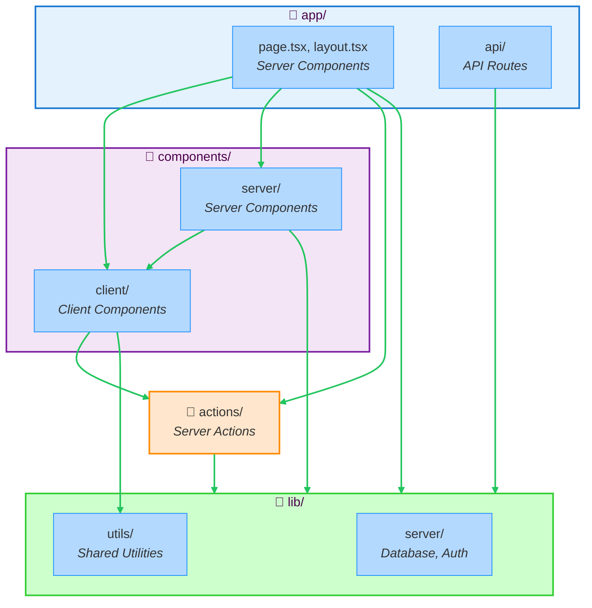

import { Aside } from '@astrojs/starlight/components';

This example demonstrates **Next.js App Router architecture** with Stricture enforcement. It's a simple todo application that shows proper separation between Server Components, Client Components, API routes, and server-only code.

## What You'll Learn

- The difference between Server Components and Client Components
- When to use Server Actions vs API Routes
- How to prevent Client Components from importing server-only code
- How Stricture enforces Next.js architectural best practices
- The proper dependency flow in Next.js applications

## Architecture Overview



**Key Principle**: Client Components **cannot** import server-only code. Server Components can import anything.

## File Structure

```
examples/simple-nextjs/
├── .stricture/
│   └── config.json              # { "preset": "@stricture/nextjs" }
├── app/                         # App Router
│   ├── page.tsx                 # Homepage (Server Component)
│   ├── layout.tsx               # Root layout
│   └── api/
│       └── todos/
│           └── route.ts         # API route handler
├── components/
│   ├── server/                  # Server Components
│   │   ├── todo-list.tsx       # Fetches data directly
│   │   └── stats.tsx           # Server-side calculations
│   └── client/                  # Client Components
│       ├── todo-item.tsx       # Interactive todo item
│       └── add-todo-form.tsx   # Form with hooks
├── actions/
│   └── todos.ts                 # Server Actions ('use server')
└── lib/
    ├── server/                  # Server-only code
    │   └── database.ts         # Database access
    └── utils/                   # Shared utilities
        └── format.ts           # Pure functions
```

## Component Types

### Server Components

**Location**: `components/server/` and `app/` (by default)

**Capabilities**:
- ✅ Direct database access
- ✅ Import server-only code
- ✅ Import Client Components
- ✅ Use `async/await` for data fetching
- ❌ Cannot use React hooks
- ❌ Cannot handle user interactions

**File**: `components/server/todo-list.tsx`

```typescript
import { db } from '@/lib/server/database'
import { formatDate } from '@/lib/utils/format'
import { TodoItem } from '@/components/client/todo-item'

export async function TodoList() {
  // ✅ Server Components can directly access the database
  const todos = await db.todos.findAll()

  if (todos.length === 0) {
    return <div>No todos yet. Add one above!</div>
  }

  return (
    <div className="space-y-3">
      {todos.map((todo) => (
        <div key={todo.id}>
          {/* ✅ Server Component rendering Client Component */}
          <TodoItem
            id={todo.id}
            title={todo.title}
            completed={todo.completed}
          />
          <p className="text-xs text-gray-500">
            Created: {formatDate(todo.createdAt)}
          </p>
        </div>
      ))}
    </div>
  )
}
```

**Key Points**:
- Can fetch data directly without API routes
- No loading states or client-side data fetching needed
- Automatically rendered on the server
- Great for SEO and initial page load performance

---

### Client Components

**Location**: `components/client/`

**Must start with**: `'use client'` directive

**Capabilities**:
- ✅ Use React hooks (`useState`, `useEffect`, etc.)
- ✅ Handle user interactions
- ✅ Call Server Actions
- ✅ Import shared utilities
- ❌ Cannot import server-only code
- ❌ Cannot directly access database

**File**: `components/client/todo-item.tsx`

```typescript
'use client'

import { useState } from 'react'
import { toggleTodo, deleteTodo } from '@/actions/todos'
import { classNames } from '@/lib/utils/format'

interface TodoItemProps {
  id: string
  title: string
  completed: boolean
}

export function TodoItem({ id, title, completed }: TodoItemProps) {
  // ✅ Client Components can use hooks
  const [isLoading, setIsLoading] = useState(false)

  const handleToggle = async () => {
    setIsLoading(true)
    try {
      // ✅ Calling Server Action
      await toggleTodo(id)
    } catch (error) {
      console.error('Failed to toggle todo:', error)
    } finally {
      setIsLoading(false)
    }
  }

  const handleDelete = async () => {
    setIsLoading(true)
    try {
      await deleteTodo(id)
    } finally {
      setIsLoading(false)
    }
  }

  return (
    <div className={classNames(
      'flex items-center gap-3 p-4 border rounded-lg',
      isLoading ? 'opacity-50' : '',
      completed ? 'bg-green-50' : 'bg-white'
    )}>
      <input
        type="checkbox"
        checked={completed}
        onChange={handleToggle}  {/* ✅ Event handler */}
        disabled={isLoading}
        className="w-5 h-5 cursor-pointer"
      />
      <span className={completed ? 'line-through' : ''}>
        {title}
      </span>
      <button
        onClick={handleDelete}  {/* ✅ Event handler */}
        disabled={isLoading}
        className="px-3 py-1 text-sm text-red-600"
      >
        Delete
      </button>
    </div>
  )
}
```

**Key Points**:
- Marked with `'use client'` at the top
- Can use interactive features (state, events)
- Calls Server Actions for data mutations
- Runs in the browser (hydrated after initial render)

<Aside type="caution">
**Common mistake**: Importing `lib/server/database.ts` from a Client Component. Stricture prevents this!
</Aside>

---

### Server Actions

**Location**: `actions/`

**Must start with**: `'use server'` directive

**Purpose**: Type-safe server functions callable from Client Components

**File**: `actions/todos.ts`

```typescript
'use server'

import { revalidatePath } from 'next/cache'
import { db } from '@/lib/server/database'

export async function createTodo(formData: FormData) {
  const title = formData.get('title') as string

  if (!title || title.trim() === '') {
    throw new Error('Title is required')
  }

  // ✅ Server Actions can access server-only code
  await db.todos.create({
    title: title.trim(),
    completed: false
  })

  // Revalidate to show updated data
  revalidatePath('/')
}

export async function toggleTodo(id: string) {
  const todo = await db.todos.findById(id)
  if (!todo) {
    throw new Error('Todo not found')
  }

  await db.todos.update(id, {
    completed: !todo.completed
  })

  revalidatePath('/')
}

export async function deleteTodo(id: string) {
  await db.todos.delete(id)
  revalidatePath('/')
}
```

**Key Points**:
- Marked with `'use server'` at the top
- Can access server-only code (database, auth, etc.)
- Automatically get POST endpoints
- Type-safe - TypeScript checks arguments and return types
- Client Components import and call them directly

**Why use Server Actions?**
- 🎯 Type safety between client and server
- 🚀 No need to create API routes for simple mutations
- 🔄 Automatic revalidation with `revalidatePath()`
- ✨ Progressive enhancement (works without JavaScript)

---

### API Routes

**Location**: `app/api/`

**Purpose**: REST API endpoints (optional in App Router)

**File**: `app/api/todos/route.ts`

```typescript
import { NextResponse } from 'next/server'
import { db } from '@/lib/server/database'

export async function GET() {
  const todos = await db.todos.findAll()
  return NextResponse.json(todos)
}

export async function POST(request: Request) {
  const body = await request.json()
  const todo = await db.todos.create(body)
  return NextResponse.json(todo)
}
```

**When to use API Routes vs Server Actions**:
- Use **Server Actions** for: Form submissions, mutations, simple data fetching
- Use **API Routes** for: External APIs, webhooks, third-party integrations

---

### Server-Only Code

**Location**: `lib/server/`

**Purpose**: Code that must never run in the browser

**File**: `lib/server/database.ts`

```typescript
export interface Todo {
  id: string
  title: string
  completed: boolean
  createdAt: Date
}

// In-memory database for demo
const todos: Todo[] = []

export const db = {
  todos: {
    findAll: async (): Promise<Todo[]> => {
      return Promise.resolve([...todos])
    },

    findById: async (id: string): Promise<Todo | null> => {
      const todo = todos.find(t => t.id === id)
      return Promise.resolve(todo || null)
    },

    create: async (data: Omit<Todo, 'id' | 'createdAt'>): Promise<Todo> => {
      const todo: Todo = {
        ...data,
        id: String(Date.now()),
        createdAt: new Date()
      }
      todos.push(todo)
      return Promise.resolve(todo)
    },

    update: async (id: string, data: Partial<Omit<Todo, 'id' | 'createdAt'>>): Promise<Todo | null> => {
      const index = todos.findIndex(t => t.id === id)
      if (index === -1) return null
      todos[index] = { ...todos[index], ...data } as Todo
      return Promise.resolve(todos[index])
    },

    delete: async (id: string): Promise<boolean> => {
      const index = todos.findIndex(t => t.id === id)
      if (index === -1) return false
      todos.splice(index, 1)
      return true
    }
  }
}
```

**Why server-only?**
- 🔒 Contains sensitive operations (database access, API keys)
- 🚫 Should never be bundled into client JavaScript
- ⚡ Keeps client bundle size small

<Aside type="tip">
In production, use a real database library like Prisma, Drizzle, or Supabase instead of in-memory storage.
</Aside>

---

## Stricture Configuration

The example uses the `@stricture/nextjs` preset with zero overrides.

**File**: `.stricture/config.json`

```json
{
  "preset": "@stricture/nextjs"
}
```

That's it! The preset enforces:
- Client Components cannot import server-only code
- Server Actions can import server-only code
- API routes follow proper boundaries
- Shared utilities are accessible everywhere

### What Stricture Enforces

**Client Components** (`components/client/**`):
- ✅ Can import from `lib/utils/` (shared utilities)
- ✅ Can import Server Actions from `actions/`
- ❌ Cannot import from `lib/server/` (server-only code)
- ❌ Cannot import API routes

**Server Components** (`components/server/**`, `app/**`):
- ✅ Can import from anywhere (server context)
- ✅ Can import Client Components
- ✅ Can import server-only code

**Server Actions** (`actions/**`):
- ✅ Can import from `lib/server/` (server context)
- ✅ Can import from `lib/utils/` (shared utilities)
- ❌ Cannot import Client Components

**API Routes** (`app/api/**`):
- ✅ Can import from `lib/server/`
- ✅ Can import from `lib/utils/`
- ❌ Cannot import components (UI shouldn't be in API)

---

## Running the Example

### Installation

```bash
cd examples/simple-nextjs
npm install
```

### Development

```bash
npm run dev
```

Open [http://localhost:3000](http://localhost:3000)

### Build

```bash
npm run build
npm start
```

### Linting

```bash
npm run lint
```

---

## Try It Out

### Add a Todo

1. Type a todo in the input field
2. Click "Add Todo" (or press Enter)
3. Uses **Server Action** to create the todo
4. Page automatically revalidates to show new todo

### Toggle Completion

1. Click the checkbox on any todo
2. Uses **Server Action** to update the todo
3. Background changes to green when completed

### Delete a Todo

1. Click "Delete" button
2. Uses **Server Action** to remove the todo
3. Todo disappears from the list

All actions work **without page reload** thanks to Server Actions and automatic revalidation!

---

## Try Breaking the Architecture

Want to see Stricture in action?

### Violation 1: Client Component Importing Server Code

**Try this** in `components/client/todo-item.tsx`:

```typescript
'use client'

// ❌ BAD - Client Component importing server-only code
import { db } from '@/lib/server/database'

export function TodoItem() {
  // This would expose server-only code to the browser!
  const todos = await db.todos.findAll()  // ❌ VIOLATION!
  // ...
}
```

**Run** `npm run lint`:

```
components/client/todo-item.tsx
  4:1  error  Client Components cannot import server-only code

Why: Server-only code contains sensitive logic (database access, API keys, etc.)
     that must never be sent to the browser.

Allowed imports for Client Components:
  - Other Client Components
  - Server Actions (actions/*)
  - Shared utilities (lib/utils/*)

Fix: Use a Server Component or Server Action instead:
  1. Move data fetching to a Server Component
  2. Call a Server Action from your Client Component
  3. Use an API route

  @stricture/enforce-boundaries

❌ 1 error
```

<Aside type="danger">
This violation could expose your database credentials or API keys to the browser!
</Aside>

---

### Violation 2: API Route Importing UI Components

**Try this** in `app/api/todos/route.ts`:

```typescript
// ❌ BAD - API route importing UI component
import { TodoItem } from '@/components/client/todo-item'

export async function GET() {
  // API routes shouldn't render UI!
  return <TodoItem />  // ❌ VIOLATION!
}
```

**Run** `npm run lint`:

```
app/api/todos/route.ts
  2:1  error  API routes should not import UI components

Why: API routes return data (JSON), not UI (JSX).
     Mixing concerns makes code harder to maintain.

Fix: Keep API routes focused on data:
  - Return JSON responses
  - Import data utilities and models
  - Don't render components

  @stricture/enforce-boundaries

❌ 1 error
```

---

## Server Components vs Client Components

### Decision Tree

```
Does the component need:
  - User interactions (onClick, onChange)?
  - React hooks (useState, useEffect)?
  - Browser APIs (localStorage, window)?

  → YES: Use Client Component ('use client')
  → NO:  Use Server Component (default)

Does the component need:
  - Database access?
  - Server-only libraries?
  - API keys or secrets?

  → YES: Use Server Component
  → NO:  Either works, prefer Server Component for better performance
```

### Best Practices

**Prefer Server Components** by default:
- Better performance (less JavaScript sent to browser)
- Better SEO (fully rendered HTML)
- Direct database access
- Smaller bundle size

**Use Client Components** only when needed:
- Interactive forms
- State management
- Browser APIs
- Third-party client libraries

**Composition Pattern** - Server Component wrapping Client Components:

```typescript
// ✅ GOOD - Server Component orchestrating Client Components
export default async function TodoPage() {
  const todos = await db.todos.findAll()  // Server-side data fetch

  return (
    <div>
      <AddTodoForm />  {/* Client Component */}
      {todos.map(todo => (
        <TodoItem key={todo.id} {...todo} />  {/* Client Component */}
      ))}
    </div>
  )
}
```

---

## Server Actions vs API Routes

### When to Use Server Actions

✅ Form submissions:
```typescript
// actions/todos.ts
export async function createTodo(formData: FormData) {
  // Type-safe, progressive enhancement
}
```

✅ Simple mutations:
```typescript
export async function toggleTodo(id: string) {
  await db.todos.update(id, { completed: !completed })
  revalidatePath('/')
}
```

✅ Called from Client Components:
```typescript
// components/client/form.tsx
'use client'
import { createTodo } from '@/actions/todos'

const handleSubmit = async (formData: FormData) => {
  await createTodo(formData)
}
```

### When to Use API Routes

✅ External API consumption:
```typescript
// app/api/stripe/route.ts
export async function POST() {
  const session = await stripe.checkout.sessions.create(...)
  return NextResponse.json({ url: session.url })
}
```

✅ Webhooks:
```typescript
// app/api/webhooks/stripe/route.ts
export async function POST(req: Request) {
  const signature = req.headers.get('stripe-signature')
  // Handle webhook
}
```

✅ Third-party integrations:
```typescript
// app/api/auth/[...nextauth]/route.ts
export { GET, POST } from 'next-auth'
```

**Rule of thumb**: Use Server Actions for most data mutations. Use API Routes for external integrations.

---

## Common Patterns

### Pattern 1: Form with Server Action

```typescript
// components/client/add-todo-form.tsx
'use client'

import { createTodo } from '@/actions/todos'

export function AddTodoForm() {
  return (
    <form action={createTodo}>  {/* Server Action as form action */}
      <input name="title" required />
      <button type="submit">Add Todo</button>
    </form>
  )
}
```

**Benefits**: Works without JavaScript, progressive enhancement, type-safe

### Pattern 2: Optimistic Updates

```typescript
'use client'

import { useOptimistic } from 'react'
import { toggleTodo } from '@/actions/todos'

export function TodoItem({ id, completed }) {
  const [optimisticCompleted, setOptimisticCompleted] = useOptimistic(completed)

  const handleToggle = async () => {
    setOptimisticCompleted(!completed)  // Update UI immediately
    await toggleTodo(id)  // Update server
  }

  return (
    <input
      type="checkbox"
      checked={optimisticCompleted}
      onChange={handleToggle}
    />
  )
}
```

### Pattern 3: Streaming Data

```typescript
// app/page.tsx
import { Suspense } from 'react'
import { TodoList } from '@/components/server/todo-list'

export default function HomePage() {
  return (
    <Suspense fallback={<TodoListSkeleton />}>
      <TodoList />  {/* Streams data as it loads */}
    </Suspense>
  )
}
```

---

## Common Questions

### Q: Can Server Components call Server Actions?

**A**: Yes, but Server Components can also directly access the database. Server Actions are mainly for Client Components.

```typescript
// ✅ Server Component - direct database access
export async function ServerTodoList() {
  const todos = await db.todos.findAll()
  return <div>{todos.length} todos</div>
}

// ✅ Client Component - uses Server Action
'use client'
export function ClientTodoList() {
  const todos = await getTodos()  // Server Action
  return <div>{todos.length} todos</div>
}
```

### Q: How do I share types between client and server?

**A**: Put types in `lib/types/` or co-locate with server code (types are safe to import):

```typescript
// lib/server/database.ts
export interface Todo {  // ✅ Type is safe to import anywhere
  id: string
  title: string
}

// components/client/todo-item.tsx
import type { Todo } from '@/lib/server/database'  // ✅ OK - just the type
```

### Q: What about environment variables?

**A**: Use `NEXT_PUBLIC_` prefix for client-accessible variables:

```typescript
// ✅ Server-only (actions, API routes, Server Components)
const apiKey = process.env.SECRET_API_KEY

// ✅ Client-accessible (Client Components)
const publicKey = process.env.NEXT_PUBLIC_STRIPE_KEY
```

---

## Next Steps

1. **Add authentication**: Use NextAuth.js with Server Actions
2. **Real database**: Replace in-memory storage with Prisma or Drizzle
3. **Optimistic UI**: Add `useOptimistic` for instant feedback
4. **Streaming**: Use `Suspense` for progressive loading

---

## See Also

- [Next.js Preset](/presets/nextjs)
- [Hexagonal Architecture Example](/examples/hexagonal-express)
- [NestJS Example](/examples/nestjs-api)
- [Next.js App Router Docs](https://nextjs.org/docs/app)
- [Server Actions Docs](https://nextjs.org/docs/app/building-your-application/data-fetching/server-actions-and-mutations)
