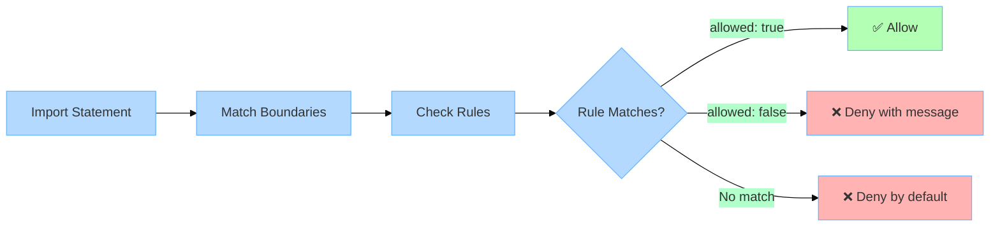
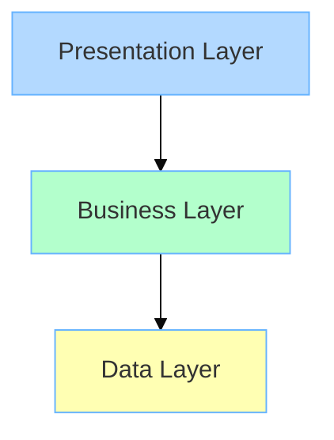
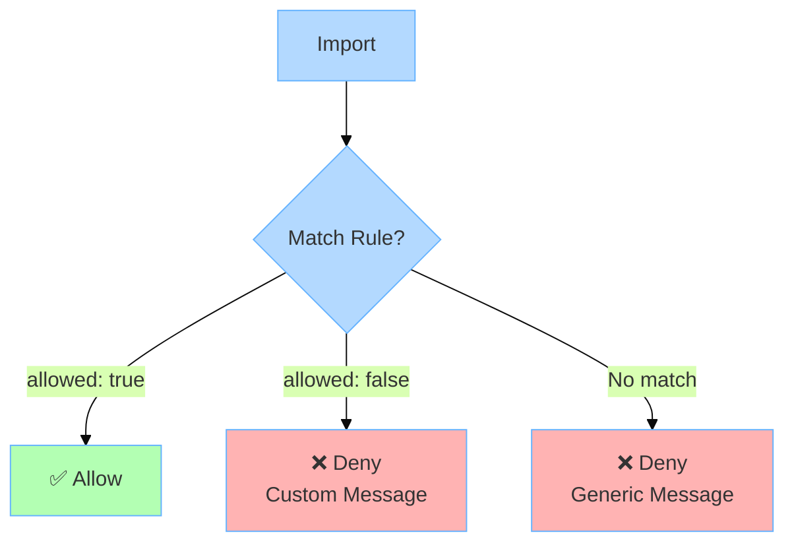
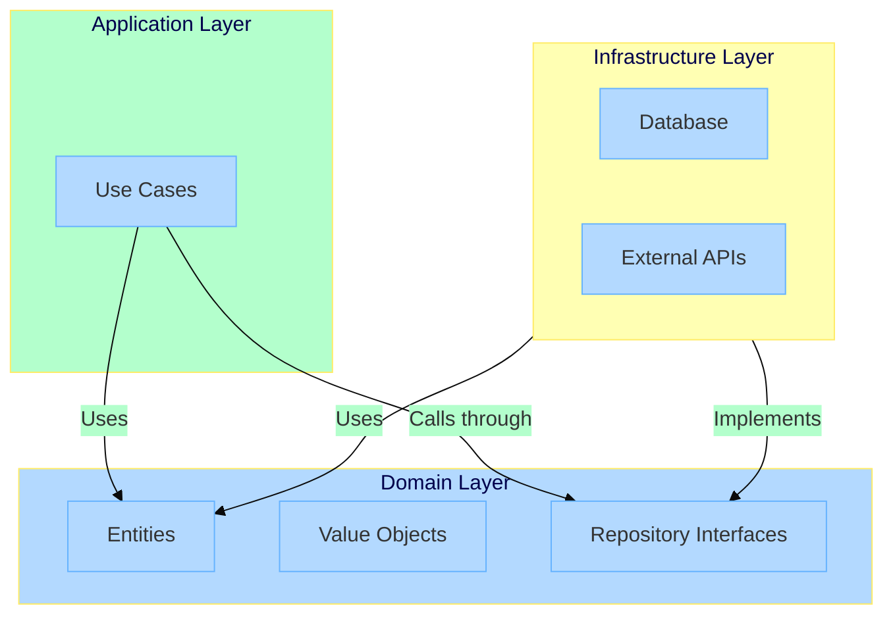

import { Card, CardGrid } from '@astrojs/starlight/components';

Understanding these core concepts will help you use Stricture effectively and create maintainable architecture rules.

## Overview

Stricture enforces architecture by validating **imports** between **boundaries** using **rules**. When an import violates a rule, ESLint reports an error with a helpful message.



## Package Architecture

Stricture is split into focused packages:

### Core Packages

**`@stricture/core`** - Validation engine
- Pure TypeScript library
- Contains all validation logic
- Used by all other packages
- **You don't install this directly**

**`@stricture/eslint-plugin`** - ESLint integration
- Thin wrapper around core
- Provides ESLint rule
- **Required for all setups**

### Preset Packages

Architecture-specific presets:
- `@stricture/hexagonal` - Ports & Adapters
- `@stricture/layered` - N-tier architecture
- `@stricture/clean` - Clean Architecture
- `@stricture/modular` - Feature modules
- `@stricture/nextjs` - Next.js patterns
- `@stricture/nestjs` - NestJS patterns

**Each preset includes:**
- Boundary definitions
- Architecture rules
- Documentation
- Depends on `@stricture/core` (automatically installed)

### Optional Packages

**`@stricture/cli`** - Command-line tools
- Interactive setup
- Validation commands
- Scaffolding
- Not required, but helpful

### Typical Installation

Most projects install:
1. **ESLint plugin** (required)
2. **One or more presets** (recommended)

```bash
npm install -D @stricture/eslint-plugin @stricture/hexagonal
```

The core package is installed automatically as a dependency.

## Boundaries

**Boundaries** define the architectural layers in your codebase. Each boundary represents a group of files with a specific role.

### What is a Boundary?

A boundary is a named region of your codebase defined by a glob pattern:

```json
{
  "name": "domain",
  "pattern": "src/core/domain/**",
  "mode": "file",
  "tags": ["core", "domain"]
}
```

**Properties:**
- `name` - Human-readable identifier
- `pattern` - Glob pattern matching files (e.g., `src/domain/**`)
- `mode` - Either `"file"` or `"folder"` matching
- `tags` - Array of tags for rule matching

### Example: Hexagonal Architecture Boundaries

```json
{
  "boundaries": [
    {
      "name": "domain",
      "pattern": "src/core/domain/**",
      "mode": "file",
      "tags": ["domain"]
    },
    {
      "name": "ports",
      "pattern": "src/core/ports/**",
      "mode": "file",
      "tags": ["ports"]
    },
    {
      "name": "application",
      "pattern": "src/core/application/**",
      "mode": "file",
      "tags": ["application"]
    },
    {
      "name": "adapters",
      "pattern": "src/adapters/**",
      "mode": "file",
      "tags": ["adapters"]
    }
  ]
}
```

### File vs Folder Mode

**File mode** (`"mode": "file"`):
- Matches individual files
- More granular control
- Best for most architectures

**Folder mode** (`"mode": "folder"`):
- Matches entire directories
- Good for feature modules
- Useful for modular architectures

```json
{
  "boundaries": [
    {
      "name": "user-module",
      "pattern": "src/modules/user/**",
      "mode": "folder",
      "tags": ["module"]
    }
  ]
}
```

### Tags

Tags are labels that group boundaries for rules. A boundary can have multiple tags:

```json
{
  "name": "driving-adapters",
  "pattern": "src/adapters/driving/**",
  "tags": ["adapters", "driving"]
}
```

This allows rules like:
- `{ tag: "adapters" }` - Matches all adapters
- `{ tag: "driving" }` - Matches only driving adapters

:::tip[Use Multiple Tags]
Multiple tags provide flexibility. You can write general rules using broad tags (`adapters`) and specific rules using narrow tags (`driving`).
:::

## Rules

**Rules** define which boundaries can import from which. A rule specifies:
- **From** - Source boundary
- **To** - Target boundary
- **Allowed** - Whether the import is permitted

### Anatomy of a Rule

```json
{
  "id": "domain-isolation",
  "name": "Domain Isolation",
  "description": "Domain layer must remain pure",
  "severity": "error",
  "from": { "tag": "domain" },
  "to": { "tag": "*" },
  "allowed": false,
  "message": "Domain cannot import from other layers or external libraries"
}
```

**Properties:**
- `id` - Unique identifier (kebab-case)
- `name` - Human-readable name
- `description` - What the rule enforces
- `severity` - `"error"`, `"warn"`, or `"off"`
- `from` - Source boundary pattern or tag
- `to` - Target boundary pattern or tag
- `allowed` - `true` allows import, `false` denies
- `message` - Custom error message (optional)

### Pattern-Based Rules

Match using glob patterns:

```json
{
  "id": "no-test-imports",
  "from": { "pattern": "src/**" },
  "to": { "pattern": "**/*.test.ts" },
  "allowed": false,
  "message": "Don't import test files in production code"
}
```

### Tag-Based Rules

Match using boundary tags:

```json
{
  "id": "application-to-domain",
  "from": { "tag": "application" },
  "to": { "tag": "domain" },
  "allowed": true
}
```

:::note[Pattern vs Tag]
- **Patterns** match file paths directly (more specific)
- **Tags** match boundary definitions (more flexible)
- Patterns have higher specificity than tags
:::

### Example: Layered Architecture Rules

```json
{
  "rules": [
    {
      "id": "presentation-to-business",
      "name": "Presentation → Business",
      "severity": "error",
      "from": { "tag": "presentation" },
      "to": { "tag": "business" },
      "allowed": true
    },
    {
      "id": "business-to-data",
      "name": "Business → Data",
      "severity": "error",
      "from": { "tag": "business" },
      "to": { "tag": "data" },
      "allowed": true
    },
    {
      "id": "no-upward-dependencies",
      "name": "No Upward Dependencies",
      "severity": "error",
      "from": { "tag": "data" },
      "to": { "tag": "business" },
      "allowed": false,
      "message": "Data layer cannot depend on business layer - violates layered architecture"
    }
  ]
}
```

This enforces unidirectional flow:



## Presets

**Presets** are pre-configured sets of boundaries and rules for common architecture patterns.

### What is a Preset?

A preset packages:
- Boundary definitions
- Rule definitions
- Architecture documentation
- Best practices

Instead of writing rules manually, use a preset:

```json
{
  "preset": "@stricture/hexagonal"
}
```

This single line gives you:
- 5 boundaries (domain, ports, application, driving-adapters, driven-adapters)
- 15+ rules enforcing hexagonal architecture
- External dependency controls
- Self-import permissions

### Available Presets

<CardGrid>
  <Card title="Hexagonal" icon="hexagon">
    Ports & Adapters with pure domain isolation.
    <a href="/presets/hexagonal/">Learn more →</a>
  </Card>
  <Card title="Layered" icon="layers">
    Traditional N-tier with unidirectional flow.
    <a href="/presets/layered/">Learn more →</a>
  </Card>
  <Card title="Clean" icon="circle">
    Uncle Bob's Clean Architecture with concentric layers.
    <a href="/presets/clean/">Learn more →</a>
  </Card>
  <Card title="Next.js" icon="external">
    Server/client boundaries for Next.js App Router.
    <a href="/presets/nextjs/">Learn more →</a>
  </Card>
</CardGrid>

### Extending Presets

Override or add rules to presets:

```json
{
  "preset": "@stricture/hexagonal",
  "boundaries": [
    {
      "name": "shared",
      "pattern": "src/shared/**",
      "tags": ["shared"]
    }
  ],
  "rules": [
    {
      "id": "allow-shared",
      "from": { "pattern": "**" },
      "to": { "tag": "shared" },
      "allowed": true
    }
  ]
}
```

Your custom boundaries and rules are **merged** with the preset's.

## Rule Specificity

When multiple rules could match an import, **the most specific rule wins** - regardless of order in the config.

### How Specificity Works

Stricture calculates a numeric score for each rule. Higher score = more specific.

**Specificity hierarchy** (highest to lowest):

1. **Node modules pattern** (10,000 points)
   - `{ pattern: "node_modules/@types/**" }`

2. **Regular pattern** (1,000 points)
   - `{ pattern: "src/domain/**" }`

3. **Specific tag** (100 points)
   - `{ tag: "domain" }`

4. **Wildcard tag** (1 point)
   - `{ tag: "*" }`

The total score is `from_score + to_score`.

### Example: Specificity in Action

```json
{
  "rules": [
    {
      "id": "domain-isolation",
      "from": { "tag": "domain" },      // 100 points
      "to": { "tag": "*" },             // 1 point
      "allowed": false                  // Total: 101
    },
    {
      "id": "domain-self-imports",
      "from": { "tag": "domain" },      // 100 points
      "to": { "tag": "domain" },        // 100 points
      "allowed": true                   // Total: 200 ✅ MORE SPECIFIC
    }
  ]
}
```

For an import like:
```typescript
// src/core/domain/order.ts
import { User } from './user';  // domain → domain
```

**Evaluation:**
1. Both rules match (from domain)
2. `domain-self-imports` has higher specificity (200 > 101)
3. Result: **Allowed** ✅

:::tip[Order Doesn't Matter]
You can write rules in any order. Specificity determines which rule applies. This makes configs easier to maintain.
:::

### Why Specificity Matters

Specificity lets you write general rules with specific exceptions:

```json
{
  "rules": [
    // General rule: domain is isolated
    {
      "id": "domain-isolated",
      "from": { "tag": "domain" },
      "to": { "tag": "*" },
      "allowed": false
    },
    // Specific exception: domain can import itself
    {
      "id": "domain-self",
      "from": { "tag": "domain" },
      "to": { "tag": "domain" },
      "allowed": true
    },
    // Another exception: domain can import types
    {
      "id": "domain-types",
      "from": { "tag": "domain" },
      "to": { "pattern": "node_modules/@types/**" },
      "allowed": true
    }
  ]
}
```

The exceptions automatically override the general rule because they're more specific.

## Deny by Default

Stricture uses a **deny-by-default** policy for safety.

### How It Works

For every import, Stricture:

1. ✅ **If explicit `allowed: true` rule matches** → Allow
2. ❌ **If explicit `allowed: false` rule matches** → Deny with custom message
3. ❌ **If NO rule matches** → Deny with generic message



### Why Deny by Default?

**Safety first**: Better to error than allow unintended dependencies.

**Example without explicit rule:**
```typescript
// src/application/use-case.ts
import _ from 'lodash';  // ❌ Denied by default
```

```
Error: Import from 'external' to 'application' is not allowed.

No rule explicitly allows this import.

To allow, add a rule:
{
  "from": { "tag": "application" },
  "to": { "tag": "external" },
  "allowed": true
}
```

**Forces explicit decisions**: Every cross-boundary import must be intentional.

### When to Use `allowed: false`

Only use `allowed: false` when:

1. **Providing a custom error message with guidance**
2. **Overriding a more general allowed rule**

Otherwise, rely on deny-by-default.

```json
{
  "rules": [
    // ❌ Redundant - deny-by-default handles this
    {
      "id": "no-data-to-presentation",
      "from": { "tag": "data" },
      "to": { "tag": "presentation" },
      "allowed": false
    },

    // ✅ Good - provides valuable guidance
    {
      "id": "domain-isolation",
      "from": { "tag": "domain" },
      "to": { "tag": "*" },
      "allowed": false,
      "message": "Domain must remain pure. Move infrastructure logic to adapters and use dependency injection."
    }
  ]
}
```

## External Dependencies

Stricture automatically detects imports from `node_modules` and treats them as a special `external` boundary.

### The `external` Tag

Use the special `external` tag to control npm package imports:

```json
{
  "id": "domain-no-externals",
  "from": { "tag": "domain" },
  "to": { "tag": "external" },
  "allowed": false,
  "message": "Domain cannot import external libraries - keep it pure"
}
```

### How External Detection Works

Stricture detects external dependencies by checking if the import path contains `node_modules`:

```typescript
// These are all external
import _ from 'lodash';                        // → node_modules/lodash
import { z } from 'zod';                       // → node_modules/zod
import React from 'react';                     // → node_modules/react
import type { FastifyRequest } from 'fastify'; // → node_modules/@types/fastify
```

### Allowing Specific External Patterns

You can allow specific npm packages using patterns:

```json
{
  "rules": [
    {
      "id": "domain-no-deps",
      "from": { "tag": "domain" },
      "to": { "tag": "external" },
      "allowed": false
    },
    {
      "id": "domain-can-use-types",
      "from": { "tag": "domain" },
      "to": { "pattern": "node_modules/@types/**" },
      "allowed": true,
      "message": "Domain can use TypeScript type definitions"
    }
  ]
}
```

The pattern rule is more specific than the tag rule, so it wins.

### Example: Layer-Specific External Rules

```json
{
  "rules": [
    // Domain: no externals at all
    {
      "from": { "tag": "domain" },
      "to": { "tag": "external" },
      "allowed": false
    },
    // Ports: only type definitions
    {
      "from": { "tag": "ports" },
      "to": { "pattern": "node_modules/@types/**" },
      "allowed": true
    },
    // Application: utility libraries OK
    {
      "from": { "tag": "application" },
      "to": { "pattern": "node_modules/{lodash,date-fns}/**" },
      "allowed": true
    },
    // Adapters: anything goes
    {
      "from": { "tag": "adapters" },
      "to": { "tag": "external" },
      "allowed": true
    }
  ]
}
```

## Pattern Matching

Stricture uses glob patterns to match files and boundaries.

### Glob Pattern Syntax

Common patterns:

| Pattern | Matches |
|---------|---------|
| `src/domain/**` | All files in `src/domain/` recursively |
| `src/domain/*.ts` | Only top-level `.ts` files in `src/domain/` |
| `**/*.test.ts` | All test files anywhere |
| `src/{domain,ports}/**` | Files in `domain` OR `ports` |
| `**/index.ts` | All `index.ts` files |

### Pattern Examples

```json
{
  "boundaries": [
    {
      "name": "domain",
      "pattern": "src/core/domain/**",      // All domain files
      "mode": "file"
    },
    {
      "name": "test-files",
      "pattern": "**/*.{test,spec}.ts",     // All test files
      "mode": "file"
    },
    {
      "name": "utils",
      "pattern": "src/{shared,utils}/**",   // Multiple folders
      "mode": "file"
    }
  ]
}
```

### Excluding Patterns

Use `exclude` to filter out specific files:

```json
{
  "name": "domain",
  "pattern": "src/domain/**",
  "exclude": ["**/*.test.ts", "**/mocks/**"]
}
```

## Putting It All Together

Let's see how all concepts work together in a complete example.

### Configuration

```json title=".stricture/config.json"
{
  "boundaries": [
    {
      "name": "domain",
      "pattern": "src/domain/**",
      "tags": ["domain"]
    },
    {
      "name": "application",
      "pattern": "src/application/**",
      "tags": ["application"]
    },
    {
      "name": "infrastructure",
      "pattern": "src/infrastructure/**",
      "tags": ["infrastructure"]
    }
  ],
  "rules": [
    {
      "id": "domain-isolation",
      "from": { "tag": "domain" },
      "to": { "tag": "*" },
      "allowed": false,
      "message": "Domain must be pure - no external dependencies"
    },
    {
      "id": "domain-self",
      "from": { "tag": "domain" },
      "to": { "tag": "domain" },
      "allowed": true
    },
    {
      "id": "app-uses-domain",
      "from": { "tag": "application" },
      "to": { "tag": "domain" },
      "allowed": true
    },
    {
      "id": "infra-implements",
      "from": { "tag": "infrastructure" },
      "to": { "tag": "domain" },
      "allowed": true
    }
  ]
}
```

### Architecture Diagram



### What This Enforces

✅ **Allowed:**
- Domain files importing other domain files
- Application importing domain
- Infrastructure importing domain (to implement interfaces)

❌ **Forbidden:**
- Domain importing application
- Domain importing infrastructure
- Domain importing external libraries
- Application importing infrastructure directly

### Real Code Example

```typescript
// ✅ src/domain/user.ts - Pure domain
export class User {
  constructor(
    public readonly id: string,
    public readonly email: string
  ) {}
}

// ✅ src/domain/user-repository.ts - Domain interface
export interface UserRepository {
  save(user: User): Promise<void>;
  findById(id: string): Promise<User | null>;
}

// ✅ src/application/create-user.ts - Use case
import { User } from '../domain/user';
import { UserRepository } from '../domain/user-repository';

export class CreateUserUseCase {
  constructor(private repo: UserRepository) {}

  async execute(email: string): Promise<User> {
    const user = new User(generateId(), email);
    await this.repo.save(user);
    return user;
  }
}

// ✅ src/infrastructure/postgres-user-repository.ts - Implementation
import { User } from '../domain/user';
import { UserRepository } from '../domain/user-repository';

export class PostgresUserRepository implements UserRepository {
  async save(user: User): Promise<void> {
    await this.db.query('INSERT INTO users...', [user.id, user.email]);
  }

  async findById(id: string): Promise<User | null> {
    const row = await this.db.query('SELECT * FROM users WHERE id = $1', [id]);
    return row ? new User(row.id, row.email) : null;
  }
}
```

## Next Steps

Now that you understand the core concepts:

<CardGrid>
  <Card title="Explore Presets" icon="puzzle">
    See how presets implement these concepts.
    <a href="/presets/">Browse presets →</a>
  </Card>
  <Card title="Custom Rules" icon="pencil">
    Learn to write custom architecture rules.
    <a href="/guides/custom-rules/">Write rules →</a>
  </Card>
  <Card title="API Reference" icon="code">
    Deep dive into configuration options.
    <a href="/api/core/">API docs →</a>
  </Card>
</CardGrid>
