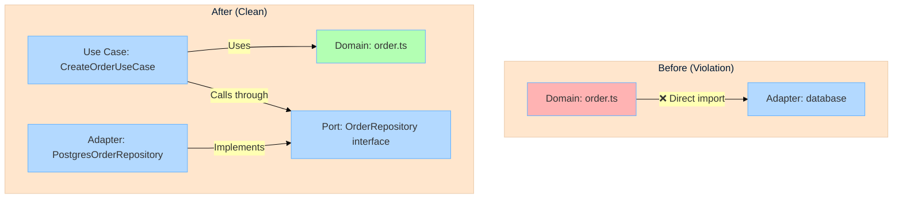

import { Tabs, TabItem } from '@astrojs/starlight/components';

Get Stricture enforcing architecture boundaries in your TypeScript project in under 5 minutes.

## Goal

By the end of this guide, you'll have:
- ✅ Stricture installed and configured
- ✅ A working hexagonal architecture preset
- ✅ ESLint reporting architecture violations
- ✅ Your first architectural boundary enforced

## Step 1: Install Package

Install the ESLint plugin:

```bash
npm install -D @stricture/eslint-plugin
# or
pnpm add -D @stricture/eslint-plugin
# or
yarn add -D @stricture/eslint-plugin
```

:::tip[Different Architecture?]
Use a different config for other architectures:
- Layered: `stricture.configs.layered()`
- Clean Architecture: `stricture.configs.clean()`
- Next.js: `stricture.configs.nextjs()`

See all [available presets](/presets/).
:::

## Step 2: Configure Stricture

You have two options:

### Option A: Inline Configuration (Recommended)

Configure everything in your ESLint config:

<Tabs>
  <TabItem label="Flat Config (ESLint 9+)">
    ```js title="eslint.config.js"
    import stricture from '@stricture/eslint-plugin'

    export default [
      {
        // Your existing ESLint config
        files: ['**/*.ts', '**/*.tsx'],
        plugins: { /* your other plugins */ },
        rules: { /* your other rules */ }
      },
      stricture.configs.hexagonal()  // Add Stricture
    ]
    ```
  </TabItem>
  <TabItem label="Legacy Config">
    ```js title=".eslintrc.js"
    const stricture = require('@stricture/eslint-plugin')

    module.exports = {
      extends: ['plugin:@stricture/recommended'],
      rules: {
        '@stricture/enforce-boundaries': ['error', {
          inlineConfig: stricture.hexagonalPreset
        }]
      }
    }
    ```
  </TabItem>
</Tabs>

### Option B: Separate Config File

Create `.stricture/config.json`:

```bash
mkdir -p .stricture
```

```json title=".stricture/config.json"
{
  "preset": "@stricture/hexagonal"
}
```

Then configure ESLint:

```js title="eslint.config.js"
import stricture from '@stricture/eslint-plugin'

export default [
  stricture.configs.recommended()  // Reads .stricture/config.json
]
```

### Which Option Should You Use?

- **Option A (Inline)**: Simple setups, using a preset with minimal customization
- **Option B (File)**: Complex configs with many custom boundaries/rules

:::note[What does this preset do?]
The hexagonal preset enforces:
- Pure domain layer (no external dependencies)
- Ports as interface contracts
- Application layer orchestrates domain + ports
- Adapters implement ports without coupling

Learn more in [Core Concepts](/getting-started/concepts/).
:::

## Step 3: See It In Action

Create a sample directory structure:

```bash
mkdir -p src/core/domain
mkdir -p src/adapters/driven/database
```

Create a domain file:

```typescript title="src/core/domain/user.ts"
export class User {
  constructor(
    public readonly id: string,
    public readonly email: string
  ) {}

  isValid(): boolean {
    return this.email.includes('@');
  }
}
```

Now create a violation - domain importing from infrastructure:

```typescript title="src/core/domain/order.ts"
// ❌ This violates hexagonal architecture!
import { Database } from '../../adapters/driven/database/db';

export class Order {
  async save() {
    // Domain should NOT directly use infrastructure
    await Database.query('INSERT INTO orders...');
  }
}
```

Run ESLint:

```bash
npx eslint src/core/domain/order.ts
```

You'll see this error:

```
src/core/domain/order.ts
  2:1  error  Import from 'driven-adapters' to 'domain' is not allowed
             Domain layer must remain pure - no dependencies on other layers or external libraries
             @stricture/enforce-boundaries
```

✅ **Success!** Stricture caught the architecture violation.

## Fixing the Violation

The correct hexagonal architecture approach:

### 1. Define a Port (Interface)

```typescript title="src/core/ports/order-repository.ts"
import { Order } from '../domain/order';

export interface OrderRepository {
  save(order: Order): Promise<void>;
  findById(id: string): Promise<Order | null>;
}
```

### 2. Update Domain (Pure Business Logic)

```typescript title="src/core/domain/order.ts"
// ✅ Domain is now pure - no infrastructure imports
export class Order {
  constructor(
    public readonly id: string,
    public readonly items: OrderItem[],
    public readonly total: number
  ) {}

  addItem(item: OrderItem): Order {
    return new Order(
      this.id,
      [...this.items, item],
      this.total + item.price
    );
  }
}
```

### 3. Create Application Use Case

```typescript title="src/core/application/create-order.ts"
import { Order } from '../domain/order';
import { OrderRepository } from '../ports/order-repository';

export class CreateOrderUseCase {
  constructor(private orderRepo: OrderRepository) {}

  async execute(items: OrderItem[]): Promise<Order> {
    const order = new Order(
      generateId(),
      items,
      items.reduce((sum, item) => sum + item.price, 0)
    );

    await this.orderRepo.save(order);
    return order;
  }
}
```

### 4. Implement Driven Adapter

```typescript title="src/adapters/driven/database/postgres-order-repository.ts"
import { Order } from '../../../core/domain/order';
import { OrderRepository } from '../../../core/ports/order-repository';

// ✅ Adapter implements port interface
export class PostgresOrderRepository implements OrderRepository {
  async save(order: Order): Promise<void> {
    await this.db.query('INSERT INTO orders...', [
      order.id,
      order.items,
      order.total
    ]);
  }

  async findById(id: string): Promise<Order | null> {
    const row = await this.db.query('SELECT * FROM orders WHERE id = $1', [id]);
    return row ? new Order(row.id, row.items, row.total) : null;
  }
}
```

### 5. Wire Everything Together

```typescript title="src/index.ts"
import { CreateOrderUseCase } from './core/application/create-order';
import { PostgresOrderRepository } from './adapters/driven/database/postgres-order-repository';

// Composition root - wire dependencies
const orderRepo = new PostgresOrderRepository(db);
const createOrder = new CreateOrderUseCase(orderRepo);

// Use the use case
const order = await createOrder.execute(items);
```

Run ESLint again:

```bash
npx eslint src/
```

```
✨ No errors found!
```

✅ **Perfect!** Your architecture is now clean and enforced.

## What You've Learned

In 5 minutes, you've:

1. ✅ **Installed Stricture** with a preset
2. ✅ **Created a config** (single line!)
3. ✅ **Added ESLint rule** to enforce boundaries
4. ✅ **Saw a violation** caught automatically
5. ✅ **Fixed the architecture** using ports and adapters

## Even Easier: Use the CLI

Instead of manual setup, you can use the interactive CLI to set everything up automatically:

```bash
npx stricture init
```

The CLI will:
- ✅ Detect your project framework (Next.js, NestJS, standard TypeScript, etc.)
- ✅ Recommend appropriate presets based on your project structure
- ✅ Create `.stricture/config.json` automatically
- ✅ Update your ESLint configuration
- ✅ Install required dependencies

This is the fastest way to get started, especially for framework-specific projects like Next.js.

[View full CLI documentation →](/api/cli/)

## Understanding the Flow

Here's what just happened:



## Next Steps

<details>
<summary>**Explore Other Presets**</summary>

Try different architecture patterns:

```json title=".stricture/config.json"
{
  "preset": "@stricture/layered"
}
```

```json title=".stricture/config.json"
{
  "preset": "@stricture/nextjs"
}
```

See all [available presets](/presets/).
</details>

<details>
<summary>**Customize Rules**</summary>

Override or extend preset rules:

```json title=".stricture/config.json"
{
  "preset": "@stricture/hexagonal",
  "rules": [
    {
      "id": "custom-rule",
      "name": "Allow Shared Utils",
      "severity": "error",
      "from": { "pattern": "**" },
      "to": { "pattern": "src/shared/utils/**" },
      "allowed": true
    }
  ]
}
```
</details>

<details>
<summary>**Add to CI/CD**</summary>

Enforce architecture in your pipeline:

```yaml title=".github/workflows/ci.yml"
- name: Lint
  run: npm run lint

- name: Check Architecture
  run: npx eslint .
```
</details>

<details>
<summary>**Learn Core Concepts**</summary>

Understand how Stricture works:
- [Boundaries](/getting-started/concepts/#boundaries)
- [Rules](/getting-started/concepts/#rules)
- [Specificity](/getting-started/concepts/#rule-specificity)
- [Deny by Default](/getting-started/concepts/#deny-by-default)

Read the [Core Concepts](/getting-started/concepts/) guide.
</details>

## Common Questions

### Can I use multiple presets?

Yes! Combine presets for monorepos:

```json title=".stricture/config.json"
{
  "preset": "@stricture/hexagonal",
  "extends": ["@stricture/nextjs"]
}
```

### Does this work with JavaScript?

Stricture works best with TypeScript, but you can use it with JavaScript projects that have type checking via JSDoc or TypeScript `checkJs` mode.

### How do I ignore certain files?

Use `ignorePatterns` in your config:

```json title=".stricture/config.json"
{
  "preset": "@stricture/hexagonal",
  "ignorePatterns": [
    "**/*.test.ts",
    "**/*.spec.ts",
    "**/test/**"
  ]
}
```

### Can I use this with existing code?

Yes! Start with `severity: "warn"` to see violations without breaking builds:

```json title=".stricture/config.json"
{
  "preset": "@stricture/hexagonal",
  "rules": [
    {
      "id": "domain-isolation",
      "severity": "warn"
    }
  ]
}
```

Then fix violations incrementally and switch to `"error"`.

## Get Help

- 📖 [Core Concepts](/getting-started/concepts/) - Deep dive into how Stricture works
- 🎯 [Preset Docs](/presets/) - Explore all architecture presets
- 💬 [GitHub Discussions](https://github.com/stricture-dev/stricture/discussions) - Ask questions
- 🐛 [Report Issues](https://github.com/stricture-dev/stricture/issues) - Found a bug?
