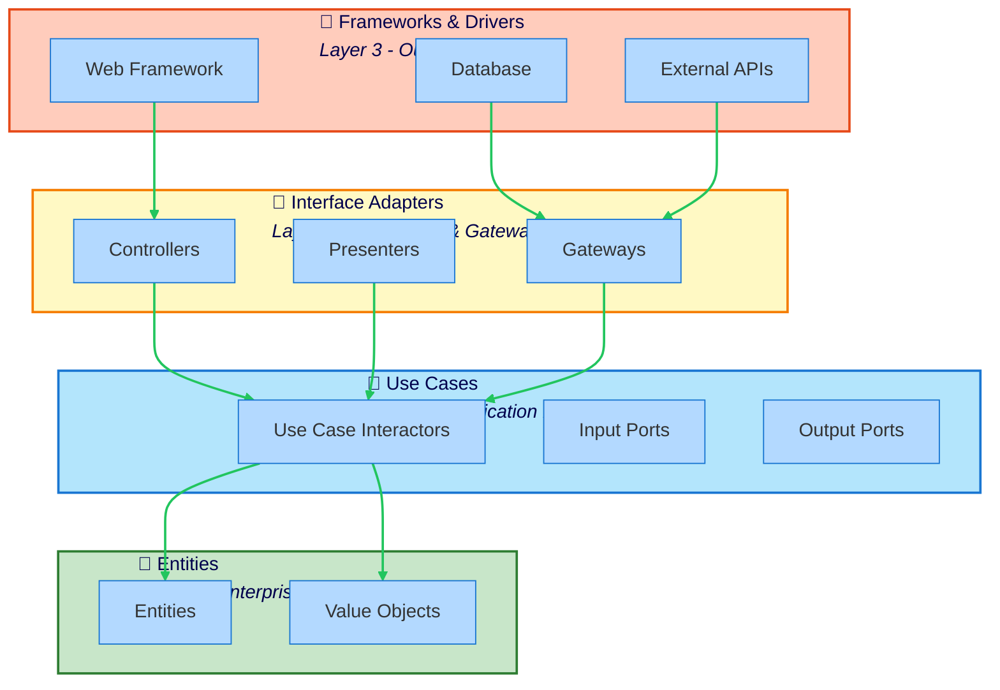

The Clean Architecture preset enforces Uncle Bob's Clean Architecture pattern, ensuring all dependencies point inward toward the entities at the center.

## What is Clean Architecture?

Clean Architecture is Uncle Bob Martin's architectural pattern that:

- **Organizes code in concentric circles** from entities (center) to frameworks (outer)
- **Enforces the Dependency Rule:** dependencies point INWARD only
- **Isolates business rules** from external concerns
- **Makes the system testable** independent of frameworks, UI, and databases

The core principle: **Source code dependencies must point only inward.**

## When to Use This Preset

Use the Clean Architecture preset when you have:

- **Enterprise applications** with long-term maintenance needs
- **Framework independence** as a requirement
- **Strict dependency control** needs
- **Complex business rules** that must be isolated
- **Teams experienced** with Clean Architecture principles

## Architecture Diagram



## Directory Structure

```
src/
├── entities/                    # Layer 0 - Innermost
│   ├── user.ts
│   ├── order.ts
│   └── value-objects/
│       └── money.ts
├── use-cases/                   # Layer 1
│   ├── create-user/
│   │   ├── create-user.ts       # Interactor
│   │   ├── input-port.ts
│   │   └── output-port.ts
│   └── get-user/
│       └── get-user.ts
├── interface-adapters/          # Layer 2
│   ├── controllers/
│   │   └── user-controller.ts
│   ├── presenters/
│   │   └── user-presenter.ts
│   └── gateways/
│       └── user-gateway.ts
└── frameworks-drivers/          # Layer 3 - Outermost
    ├── web/
    │   └── express-server.ts
    ├── database/
    │   └── postgres.ts
    └── external/
        └── email-client.ts
```

## Boundaries Defined

The preset defines four concentric circles:

### 1. Entities (Layer 0 - Innermost)
- **Pattern:** `src/entities/**`
- **Tags:** `entities`, `core`
- **Purpose:** Enterprise business rules - entities and domain logic
- **Dependencies:** ZERO (pure business logic)

### 2. Use Cases (Layer 1)
- **Pattern:** `src/use-cases/**`
- **Tags:** `use-cases`, `core`
- **Purpose:** Application business rules - use case interactors
- **Can depend on:** Entities only

### 3. Interface Adapters (Layer 2)
- **Pattern:** `src/interface-adapters/**`
- **Tags:** `interface-adapters`, `adapters`
- **Purpose:** Controllers, gateways, presenters - convert data formats
- **Can depend on:** Use Cases, Entities

### 4. Frameworks & Drivers (Layer 3 - Outermost)
- **Pattern:** `src/frameworks-drivers/**`
- **Tags:** `frameworks-drivers`, `infrastructure`
- **Purpose:** Web, database, external interfaces - framework-specific code
- **Can depend on:** Interface Adapters, Use Cases, Entities

## Key Rules Enforced

### The Dependency Rule

All dependencies point inward. Outer circles depend on inner circles, never the reverse.

```typescript
// ✅ GOOD - Use Case depending on Entity (inward)
// src/use-cases/create-order/create-order.ts
import { Order } from '../../entities/order'
import { Money } from '../../entities/value-objects/money'

export class CreateOrderUseCase {
  execute(amount: number): Order {
    const price = new Money(amount)
    return new Order(crypto.randomUUID(), price)
  }
}
```

```typescript
// ❌ BAD - Entity depending on Use Case (outward)
// src/entities/order.ts
import { CreateOrderUseCase } from '../use-cases/create-order/create-order'
// This violates the Dependency Rule!
```

### Entities Have Zero Dependencies

Entities are pure business logic with no external dependencies.

```typescript
// ✅ GOOD - Pure entity
// src/entities/order.ts
import { Money } from './value-objects/money'
import { OrderItem } from './order-item'

export class Order {
  constructor(
    public readonly id: string,
    private items: OrderItem[] = []
  ) {}

  addItem(item: OrderItem): void {
    this.items.push(item)
  }

  calculateTotal(): Money {
    return this.items.reduce(
      (total, item) => total.add(item.price),
      new Money(0)
    )
  }
}
```

```typescript
// ❌ BAD - Entity with external dependencies
// src/entities/order.ts
import { OrderController } from '../interface-adapters/controllers/order-controller'
import axios from 'axios'
// Entities must have ZERO dependencies on outer layers!
```

### Use Cases Define Interfaces for Outer Layers

Use cases define output ports (interfaces) that outer layers implement.

```typescript
// ✅ GOOD - Use Case defining output port
// src/use-cases/create-order/output-port.ts
import { Order } from '../../entities/order'

export interface OrderOutput {
  present(order: Order): void
}

// src/use-cases/create-order/create-order.ts
import { Order } from '../../entities/order'
import { OrderGateway } from './order-gateway-interface'
import { OrderOutput } from './output-port'

export class CreateOrderUseCase {
  constructor(
    private gateway: OrderGateway,
    private output: OrderOutput
  ) {}

  async execute(customerId: string, items: any[]): Promise<void> {
    const order = new Order(crypto.randomUUID())
    // ... add items ...
    await this.gateway.save(order)
    this.output.present(order)
  }
}
```

### Interface Adapters Implement Use Case Interfaces

Controllers call use cases, presenters implement output ports, gateways implement repository interfaces.

```typescript
// ✅ GOOD - Presenter implementing output port
// src/interface-adapters/presenters/order-presenter.ts
import { OrderOutput } from '../../use-cases/create-order/output-port'
import { Order } from '../../entities/order'

export class OrderPresenter implements OrderOutput {
  private viewModel: any

  present(order: Order): void {
    this.viewModel = {
      id: order.id,
      total: order.calculateTotal().amount,
      itemCount: order.items.length
    }
  }

  getViewModel() {
    return this.viewModel
  }
}
```

### Frameworks Layer Wires Everything Together

The outermost layer contains framework-specific code and composition.

```typescript
// ✅ GOOD - Framework layer wiring dependencies
// src/frameworks-drivers/web/express-server.ts
import express from 'express'
import { CreateOrderUseCase } from '../../use-cases/create-order/create-order'
import { OrderController } from '../../interface-adapters/controllers/order-controller'
import { OrderPresenter } from '../../interface-adapters/presenters/order-presenter'
import { OrderGateway } from '../../interface-adapters/gateways/order-gateway'
import { PostgresDatabase } from '../database/postgres'

const app = express()
const db = new PostgresDatabase()

// Wire dependencies
const gateway = new OrderGateway(db)
const presenter = new OrderPresenter()
const useCase = new CreateOrderUseCase(gateway, presenter)
const controller = new OrderController(useCase, presenter)

app.post('/orders', (req, res) => controller.create(req, res))
```

## Example Configuration

```json
{
  "preset": "@stricture/clean"
}
```

No additional configuration needed.

## Real Code Example

### Entities Layer

```typescript
// src/entities/order.ts
import { Money } from './value-objects/money'

export class Order {
  private items: OrderItem[] = []

  constructor(public readonly id: string) {}

  addItem(productId: string, quantity: number, price: Money): void {
    const item = new OrderItem(productId, quantity, price)
    this.items.push(item)
  }

  calculateTotal(): Money {
    return this.items.reduce(
      (total, item) => total.add(item.subtotal()),
      new Money(0)
    )
  }

  canBeCancelled(): boolean {
    // Business rule: Orders can only be cancelled if total < $100
    return this.calculateTotal().amount < 100
  }
}

export class OrderItem {
  constructor(
    public readonly productId: string,
    public readonly quantity: number,
    public readonly price: Money
  ) {}

  subtotal(): Money {
    return this.price.multiply(this.quantity)
  }
}
```

### Use Cases Layer

```typescript
// src/use-cases/create-order/create-order.ts
import { Order } from '../../entities/order'
import { Money } from '../../entities/value-objects/money'

export interface OrderGateway {
  save(order: Order): Promise<void>
}

export interface OrderOutput {
  present(order: Order): void
}

export interface CreateOrderInput {
  customerId: string
  items: Array<{
    productId: string
    quantity: number
    price: number
  }>
}

export class CreateOrderUseCase {
  constructor(
    private gateway: OrderGateway,
    private output: OrderOutput
  ) {}

  async execute(input: CreateOrderInput): Promise<void> {
    const order = new Order(crypto.randomUUID())

    for (const item of input.items) {
      order.addItem(
        item.productId,
        item.quantity,
        new Money(item.price)
      )
    }

    await this.gateway.save(order)
    this.output.present(order)
  }
}
```

### Interface Adapters Layer

```typescript
// src/interface-adapters/controllers/order-controller.ts
import { CreateOrderUseCase } from '../../use-cases/create-order/create-order'
import { OrderPresenter } from '../presenters/order-presenter'

export class OrderController {
  constructor(
    private createOrder: CreateOrderUseCase,
    private presenter: OrderPresenter
  ) {}

  async create(req: any, res: any): Promise<void> {
    try {
      await this.createOrder.execute({
        customerId: req.body.customerId,
        items: req.body.items
      })

      const viewModel = this.presenter.getViewModel()
      res.status(201).json(viewModel)
    } catch (error) {
      res.status(400).json({ error: error.message })
    }
  }
}
```

```typescript
// src/interface-adapters/presenters/order-presenter.ts
import { OrderOutput } from '../../use-cases/create-order/create-order'
import { Order } from '../../entities/order'

export class OrderPresenter implements OrderOutput {
  private viewModel: any = null

  present(order: Order): void {
    this.viewModel = {
      id: order.id,
      total: order.calculateTotal().amount,
      canBeCancelled: order.canBeCancelled()
    }
  }

  getViewModel() {
    return this.viewModel
  }
}
```

```typescript
// src/interface-adapters/gateways/order-gateway.ts
import { OrderGateway } from '../../use-cases/create-order/create-order'
import { Order } from '../../entities/order'

export class OrderGatewayImpl implements OrderGateway {
  constructor(private db: any) {}

  async save(order: Order): Promise<void> {
    await this.db.query(
      'INSERT INTO orders (id, total) VALUES ($1, $2)',
      [order.id, order.calculateTotal().amount]
    )
  }
}
```

### Frameworks & Drivers Layer

```typescript
// src/frameworks-drivers/web/express-server.ts
import express from 'express'
import { Pool } from 'pg'
import { CreateOrderUseCase } from '../../use-cases/create-order/create-order'
import { OrderController } from '../../interface-adapters/controllers/order-controller'
import { OrderPresenter } from '../../interface-adapters/presenters/order-presenter'
import { OrderGatewayImpl } from '../../interface-adapters/gateways/order-gateway'

const app = express()
const pool = new Pool({ connectionString: process.env.DATABASE_URL })

app.use(express.json())

app.post('/orders', async (req, res) => {
  // Wire dependencies for this request
  const gateway = new OrderGatewayImpl(pool)
  const presenter = new OrderPresenter()
  const useCase = new CreateOrderUseCase(gateway, presenter)
  const controller = new OrderController(useCase, presenter)

  await controller.create(req, res)
})

export { app }
```

## Common Violations and Fixes

### Violation: Use Case importing Controller

```typescript
// ❌ BAD
// src/use-cases/create-order/create-order.ts
import { OrderController } from '../../interface-adapters/controllers/order-controller'
// Use cases cannot depend on outer layers!
```

**Fix:** Define interface in use case, implement in adapter

```typescript
// ✅ GOOD
// src/use-cases/create-order/output-port.ts
export interface OrderOutput {
  present(order: Order): void
}

// src/interface-adapters/presenters/order-presenter.ts
export class OrderPresenter implements OrderOutput {
  present(order: Order): void {
    // Implementation
  }
}
```

### Violation: Entity importing Framework

```typescript
// ❌ BAD
// src/entities/order.ts
import express from 'express'
// Entities must have ZERO outward dependencies!
```

**Fix:** Keep entities pure

```typescript
// ✅ GOOD
// src/entities/order.ts
export class Order {
  // Pure business logic only
  calculateTotal(): Money {
    return this.items.reduce(
      (total, item) => total.add(item.price),
      new Money(0)
    )
  }
}
```

## Benefits

- **Framework independence:** Business rules don't depend on frameworks
- **Testability:** Core business logic is easy to test
- **Flexibility:** Can swap databases, UI, or frameworks easily
- **Maintainability:** Changes to frameworks don't affect business rules

## Trade-offs

- **Complexity:** More layers and abstractions
- **Learning curve:** Team needs to understand the pattern deeply
- **Indirection:** More interfaces to navigate
- **Overhead:** Can be overkill for simple applications

## Related Patterns

- [Hexagonal Architecture](/presets/hexagonal) - Similar isolation with different organization
- [Layered Architecture](/presets/layered) - Simpler alternative with fewer abstractions

## Next Steps

- Check out the [clean architecture example](/examples#clean)
- Read about [Dependency Inversion Principle](/guides/solid#dependency-inversion)
- Learn about [customizing presets](/configuration#extending-presets)
