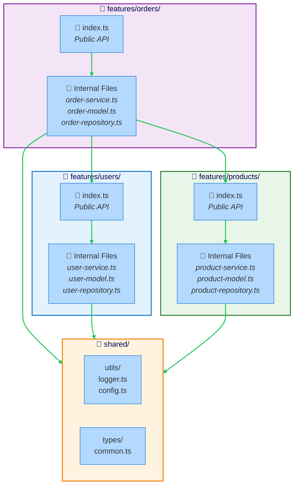

The Modular Architecture preset enforces feature-based organization where each module has a public API (index.ts) and internal implementation details are encapsulated.

## What is Modular Architecture?

Modular Architecture is a pattern that:

- **Organizes code by features** (not technical layers)
- **Enforces public API boundaries** through index.ts exports
- **Prevents direct access** to module internals
- **Enables team scalability** by isolating features
- **Promotes loose coupling** between modules

The core principle: **Modules communicate only through public APIs.**

## When to Use This Preset

Use the Modular preset when you have:

- **Large applications** with many features
- **Multiple teams** working on different features
- **Need for module isolation** and clear boundaries
- **Feature-based organization** preference
- **Scalability requirements** for growing teams

## Architecture Diagram



## Directory Structure

```
src/
├── features/                    # Feature modules
│   ├── users/
│   │   ├── index.ts            # Public API (exports)
│   │   ├── user-service.ts     # Internal
│   │   ├── user-model.ts       # Internal
│   │   ├── user-repository.ts  # Internal
│   │   └── types.ts            # Internal
│   ├── orders/
│   │   ├── index.ts            # Public API
│   │   ├── order-service.ts    # Internal
│   │   ├── order-model.ts      # Internal
│   │   └── order-repository.ts # Internal
│   └── products/
│       ├── index.ts            # Public API
│       ├── product-service.ts  # Internal
│       └── product-model.ts    # Internal
└── shared/                      # Shared utilities
    ├── utils/
    │   ├── logger.ts
    │   └── validation.ts
    ├── types/
    │   └── common.ts
    └── config/
        └── database.ts
```

## Boundaries Defined

The preset defines three boundaries:

### 1. Module Public API
- **Pattern:** `src/features/*/index.ts`
- **Tags:** `module-public`, `features`
- **Purpose:** Public API exports for feature modules
- **Visibility:** Public

### 2. Module Internal
- **Pattern:** `src/features/**` (excludes index.ts)
- **Tags:** `module-internal`, `features`
- **Purpose:** Internal implementation files within feature modules
- **Visibility:** Private (to the module)

### 3. Shared
- **Pattern:** `src/shared/**`
- **Tags:** `shared`, `common`
- **Purpose:** Shared utilities, components, and types
- **Visibility:** Public (available to all modules)

## Key Rules Enforced

### Modules Must Import via Public APIs

Modules can only import from other modules through their index.ts public API.

```typescript
// ❌ BAD - Directly importing internal file
// src/features/orders/order-service.ts
import { UserRepository } from '../users/user-repository'
// This violates encapsulation!

// ✅ GOOD - Importing from public API
// src/features/orders/order-service.ts
import { getUserById } from '../users' // From users/index.ts
```

### Public API Exports Only What's Needed

The index.ts file explicitly exports only the public interface of the module.

```typescript
// ✅ GOOD - Public API with selective exports
// src/features/users/index.ts
export { createUser, getUserById, updateUser } from './user-service'
export type { User, CreateUserInput } from './types'

// Internal functions are NOT exported:
// - UserRepository
// - validateUserEmail (helper)
// - formatUserData (helper)
```

### Shared Code Cannot Import Features

Shared utilities must remain generic and feature-independent.

```typescript
// ❌ BAD - Shared importing from feature
// src/shared/utils/user-helper.ts
import { User } from '../../features/users/types'
// Shared cannot depend on features!

// ✅ GOOD - Shared with generic types
// src/shared/utils/formatter.ts
export function formatName(firstName: string, lastName: string): string {
  return `${firstName} ${lastName}`
}

// ✅ GOOD - Shared with generic interface
// src/shared/types/common.ts
export interface Entity {
  id: string
  createdAt: Date
}

// Features can use/extend these generic types
```

### Within a Module, Import Freely

Files within the same module can import each other directly.

```typescript
// ✅ GOOD - Internal files importing each other
// src/features/users/user-service.ts
import { UserRepository } from './user-repository'
import { validateEmail } from './validators'
import { User } from './types'

export async function createUser(email: string) {
  validateEmail(email)
  const user = new User(email)
  return await UserRepository.save(user)
}
```

## Example Configuration

```json
{
  "preset": "@stricture/modular"
}
```

No additional configuration needed for standard modular structure.

## Real Code Example

### Public API (index.ts)

```typescript
// src/features/users/index.ts
// This is the ONLY way other modules can interact with this feature

export {
  createUser,
  getUserById,
  getUserByEmail,
  updateUser,
  deleteUser
} from './user-service'

export type {
  User,
  CreateUserInput,
  UpdateUserInput
} from './types'

// NOT exported (internal only):
// - UserRepository
// - validateUserEmail
// - formatUserData
// - UserModel (database model)
```

### Internal Service

```typescript
// src/features/users/user-service.ts
import { UserRepository } from './user-repository'
import { validateEmail } from './validators'
import { User, CreateUserInput, UpdateUserInput } from './types'

export async function createUser(input: CreateUserInput): Promise<User> {
  validateEmail(input.email)

  const existing = await UserRepository.findByEmail(input.email)
  if (existing) {
    throw new Error('User already exists')
  }

  const user: User = {
    id: crypto.randomUUID(),
    email: input.email,
    name: input.name,
    createdAt: new Date()
  }

  await UserRepository.save(user)
  return user
}

export async function getUserById(id: string): Promise<User | null> {
  return await UserRepository.findById(id)
}

export async function updateUser(
  id: string,
  input: UpdateUserInput
): Promise<User> {
  const user = await UserRepository.findById(id)
  if (!user) {
    throw new Error('User not found')
  }

  const updated = { ...user, ...input }
  await UserRepository.save(updated)
  return updated
}
```

### Internal Repository

```typescript
// src/features/users/user-repository.ts
import { User } from './types'
import { db } from '../../shared/config/database'

export class UserRepository {
  static async save(user: User): Promise<void> {
    await db.query(
      `INSERT INTO users (id, email, name, created_at)
       VALUES ($1, $2, $3, $4)
       ON CONFLICT (id) DO UPDATE
       SET email = $2, name = $3`,
      [user.id, user.email, user.name, user.createdAt]
    )
  }

  static async findById(id: string): Promise<User | null> {
    const result = await db.query(
      'SELECT * FROM users WHERE id = $1',
      [id]
    )
    return result.rows[0] || null
  }

  static async findByEmail(email: string): Promise<User | null> {
    const result = await db.query(
      'SELECT * FROM users WHERE email = $1',
      [email]
    )
    return result.rows[0] || null
  }
}
```

### Another Module Using Public API

```typescript
// src/features/orders/order-service.ts
import { getUserById } from '../users' // From users/index.ts
import { getProductById } from '../products' // From products/index.ts
import { Order, CreateOrderInput } from './types'

export async function createOrder(input: CreateOrderInput): Promise<Order> {
  // Validate user exists (using public API)
  const user = await getUserById(input.userId)
  if (!user) {
    throw new Error('User not found')
  }

  // Validate product exists (using public API)
  const product = await getProductById(input.productId)
  if (!product) {
    throw new Error('Product not found')
  }

  const order: Order = {
    id: crypto.randomUUID(),
    userId: input.userId,
    productId: input.productId,
    quantity: input.quantity,
    total: product.price * input.quantity,
    createdAt: new Date()
  }

  await OrderRepository.save(order)
  return order
}
```

### Shared Utilities

```typescript
// src/shared/utils/logger.ts
export class Logger {
  static info(message: string, data?: any): void {
    console.log(`[INFO] ${message}`, data)
  }

  static error(message: string, error?: Error): void {
    console.error(`[ERROR] ${message}`, error)
  }
}
```

```typescript
// src/shared/utils/validation.ts
export function isValidEmail(email: string): boolean {
  return /^[^\s@]+@[^\s@]+\.[^\s@]+$/.test(email)
}

export function isValidUUID(id: string): boolean {
  return /^[0-9a-f]{8}-[0-9a-f]{4}-[0-9a-f]{4}-[0-9a-f]{4}-[0-9a-f]{12}$/i.test(id)
}
```

## Common Violations and Fixes

### Violation: Direct import of internal file

```typescript
// ❌ BAD
// src/features/orders/order-service.ts
import { UserRepository } from '../users/user-repository'
import { validateEmail } from '../users/validators'
// Violates module encapsulation!
```

**Fix:** Use public API or move logic to shared

```typescript
// ✅ GOOD - Option 1: Use public API
// src/features/orders/order-service.ts
import { getUserById } from '../users'

// ✅ GOOD - Option 2: Move to shared if generic
// src/shared/utils/validation.ts
export function isValidEmail(email: string): boolean {
  return /^[^\s@]+@[^\s@]+\.[^\s@]+$/.test(email)
}

// src/features/orders/order-service.ts
import { isValidEmail } from '../../shared/utils/validation'
```

### Violation: Shared importing features

```typescript
// ❌ BAD
// src/shared/utils/user-formatter.ts
import { User } from '../../features/users/types'

export function formatUser(user: User): string {
  return `${user.name} <${user.email}>`
}
```

**Fix:** Use generic types or parameters

```typescript
// ✅ GOOD - Generic interface in shared
// src/shared/types/common.ts
export interface UserLike {
  name: string
  email: string
}

// src/shared/utils/user-formatter.ts
import { UserLike } from '../types/common'

export function formatUser(user: UserLike): string {
  return `${user.name} <${user.email}>`
}

// Features can use it
// src/features/users/user-service.ts
import { formatUser } from '../../shared/utils/user-formatter'
// Works because User matches UserLike structure
```

### Violation: Not exporting through index.ts

```typescript
// ❌ BAD
// Another module directly importing
// src/features/orders/order-service.ts
import { createUser } from '../users/user-service'
// Should import from index.ts instead
```

**Fix:** Always import from index.ts

```typescript
// ✅ GOOD
// src/features/orders/order-service.ts
import { createUser } from '../users'
// Imports from users/index.ts
```

## Benefits

- **Scalability:** Teams can work on different modules independently
- **Encapsulation:** Internal implementation can change without affecting others
- **Clear boundaries:** Public API makes module contracts explicit
- **Discoverability:** Easy to find what a module offers (check index.ts)
- **Maintainability:** Changes are localized to modules

## Trade-offs

- **More index.ts files:** Need to maintain public API exports
- **Potential duplication:** Shared logic needs careful extraction
- **Granularity decisions:** Determining module boundaries requires thought

## Best Practices

### Keep Public APIs Small

Only export what other modules truly need.

```typescript
// ✅ GOOD - Minimal public API
// src/features/users/index.ts
export { createUser, getUserById } from './user-service'
export type { User } from './types'

// ❌ BAD - Exposing too much
export * from './user-service'
export * from './user-repository'
export * from './validators'
// This defeats the purpose of encapsulation!
```

### Use Barrel Exports Wisely

```typescript
// ✅ GOOD - Explicit exports
export { createUser, getUserById } from './user-service'

// ⚠️ USE CAREFULLY - Barrel export
export * from './user-service'
// Only if you want to export everything from that file
```

### Extract Common Logic to Shared

If logic is used by multiple modules, move it to shared.

```typescript
// Before: Duplicated in users and orders
// src/features/users/validators.ts
export function isValidEmail(email: string) { ... }

// src/features/orders/validators.ts
export function isValidEmail(email: string) { ... }

// After: Extracted to shared
// src/shared/utils/validation.ts
export function isValidEmail(email: string) { ... }
```

## Related Patterns

- [Hexagonal Architecture](/presets/hexagonal) - Can be combined with modular
- [Layered Architecture](/presets/layered) - Alternative organization approach

## Next Steps

- Check out the [modular example](/examples#modular)
- Learn about [feature slicing strategies](/guides/feature-slicing)
- Read about [customizing presets](/configuration#extending-presets)
