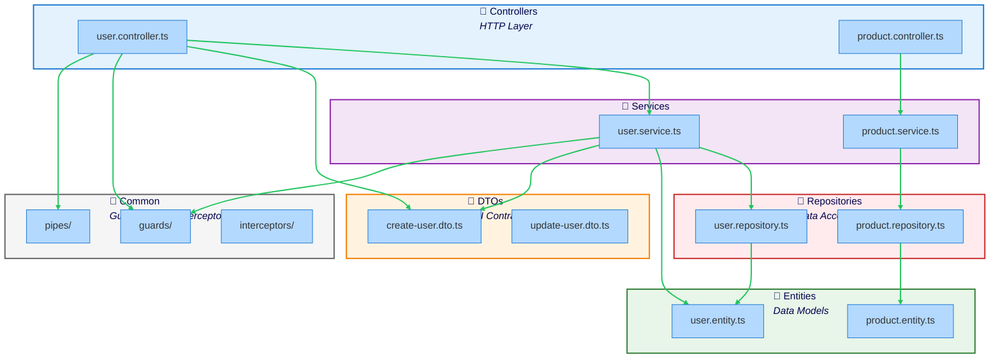

The NestJS preset enforces NestJS architectural best practices, ensuring proper separation of concerns across controllers, services, repositories, and DTOs.

## What is the NestJS Preset?

The NestJS preset enforces patterns specific to NestJS applications:

- **Controllers handle HTTP only** - no business logic or direct database access
- **Services contain business logic** - called by controllers
- **Repositories manage data** - called by services
- **DTOs define API contracts** - separate from entities
- **Entities are for data models** - used by repositories and services
- **Cross-cutting concerns** (guards, pipes, interceptors) available everywhere

The core principle: **Controllers → Services → Repositories, with clear separation.**

## When to Use This Preset

Use the NestJS preset when you have:

- **NestJS application** (any version)
- **API backend** with clear layering needs
- **Dependency injection** patterns
- **TypeScript decorators** usage
- **Need to enforce** NestJS best practices

## Architecture Diagram



## Directory Structure

```
src/
├── users/
│   ├── users.module.ts          # Module definition
│   ├── users.controller.ts      # HTTP controller
│   ├── users.service.ts         # Business logic
│   ├── users.repository.ts      # Data access
│   ├── dto/
│   │   ├── create-user.dto.ts   # Input DTO
│   │   └── update-user.dto.ts   # Input DTO
│   └── entities/
│       └── user.entity.ts       # Database entity
├── products/
│   ├── products.module.ts
│   ├── products.controller.ts
│   ├── products.service.ts
│   └── entities/
│       └── product.entity.ts
├── common/                       # Shared utilities
│   ├── guards/
│   │   └── auth.guard.ts
│   ├── interceptors/
│   │   └── logging.interceptor.ts
│   ├── pipes/
│   │   └── validation.pipe.ts
│   └── decorators/
│       └── user.decorator.ts
├── config/                       # Configuration
│   └── database.config.ts
└── main.ts                       # Application entry point
```

## Boundaries Defined

The preset defines multiple boundaries:

### 1. Controllers
- **Pattern:** `src/**/*.controller.ts`
- **Tags:** `nestjs`, `controllers`, `presentation`
- **Purpose:** HTTP controllers handling requests and responses
- **Layer:** 0 (entry points)

### 2. Services
- **Pattern:** `src/**/*.service.ts`
- **Tags:** `nestjs`, `services`, `business-logic`
- **Purpose:** Business logic providers injected via DI
- **Layer:** 1

### 3. DTOs
- **Pattern:** `src/**/dto/**`
- **Tags:** `nestjs`, `dtos`, `contracts`
- **Purpose:** Data Transfer Objects for API contracts
- **Layer:** 0 (presentation layer)

### 4. Entities
- **Pattern:** `src/**/entities/**`
- **Tags:** `nestjs`, `entities`, `data`
- **Purpose:** Database entities and domain models
- **Layer:** 2 (data layer)

### 5. Repositories
- **Pattern:** `src/**/*.repository.ts`
- **Tags:** `nestjs`, `repositories`, `data`
- **Purpose:** Data access layer (TypeORM, Prisma, etc.)
- **Layer:** 2

### 6-11. Cross-Cutting Concerns
- **Guards:** `src/**/guards/**`
- **Interceptors:** `src/**/interceptors/**`
- **Pipes:** `src/**/pipes/**`
- **Decorators:** `src/**/decorators/**`
- **Common:** `src/common/**`
- **Config:** `src/config/**`
- **Purpose:** Available throughout the application

## Key Rules Enforced

### Controllers Call Services, Not Repositories

Controllers delegate to services for business logic, never accessing data directly.

```typescript
// ❌ BAD - Controller using repository directly
// users/users.controller.ts
import { UsersRepository } from './users.repository'

@Controller('users')
export class UsersController {
  constructor(private usersRepo: UsersRepository) {} // Violation!

  @Get()
  findAll() {
    return this.usersRepo.findAll() // Skipping service layer!
  }
}
```

```typescript
// ✅ GOOD - Controller using service
// users/users.controller.ts
import { UsersService } from './users.service'

@Controller('users')
export class UsersController {
  constructor(private usersService: UsersService) {}

  @Get()
  findAll() {
    return this.usersService.findAll()
  }
}
```

### DTOs Cannot Import Entities

DTOs define API contracts, entities define database models. Keep them separate.

```typescript
// ❌ BAD - DTO importing entity
// users/dto/create-user.dto.ts
import { User } from '../entities/user.entity'

export class CreateUserDto extends User {} // Tight coupling!
```

```typescript
// ✅ GOOD - DTO independent from entity
// users/dto/create-user.dto.ts
import { IsEmail, IsString, MinLength } from 'class-validator'

export class CreateUserDto {
  @IsEmail()
  email: string

  @IsString()
  @MinLength(2)
  name: string

  @IsString()
  @MinLength(8)
  password: string
}
```

### Controllers Cannot Import Entities

Controllers should use DTOs for API contracts, not entities.

```typescript
// ❌ BAD - Controller using entity
// users/users.controller.ts
import { User } from './entities/user.entity'

@Controller('users')
export class UsersController {
  @Get()
  findAll(): Promise<User[]> { // Exposes database structure!
    return this.usersService.findAll()
  }
}
```

```typescript
// ✅ GOOD - Controller using DTO
// users/users.controller.ts
import { UserDto } from './dto/user.dto'

@Controller('users')
export class UsersController {
  @Get()
  async findAll(): Promise<UserDto[]> {
    const users = await this.usersService.findAll()
    return users.map(u => new UserDto(u))
  }
}
```

### Controllers Are Independent

Controllers should not import each other. Share logic via services.

```typescript
// ❌ BAD - Controller importing another controller
// products/products.controller.ts
import { UsersController } from '../users/users.controller'

@Controller('products')
export class ProductsController {
  constructor(private usersCtrl: UsersController) {} // Violation!
}
```

```typescript
// ✅ GOOD - Controllers using shared service
// products/products.controller.ts
import { UsersService } from '../users/users.service'

@Controller('products')
export class ProductsController {
  constructor(private usersService: UsersService) {} // Correct!
}
```

### Repositories Work with Entities, Not DTOs

Repositories persist entities, not DTOs.

```typescript
// ❌ BAD - Repository using DTO
// users/users.repository.ts
import { CreateUserDto } from './dto/create-user.dto'

@Injectable()
export class UsersRepository {
  async create(dto: CreateUserDto) {} // Wrong!
}
```

```typescript
// ✅ GOOD - Repository using entity
// users/users.repository.ts
import { User } from './entities/user.entity'

@Injectable()
export class UsersRepository {
  constructor(
    @InjectRepository(User)
    private repo: Repository<User>
  ) {}

  async create(user: User): Promise<User> {
    return this.repo.save(user)
  }

  async findAll(): Promise<User[]> {
    return this.repo.find()
  }
}
```

## Example Configuration

```json
{
  "preset": "@stricture/nestjs"
}
```

No additional configuration needed for standard NestJS structure.

## Real Code Example

### Controller

```typescript
// users/users.controller.ts
import {
  Controller,
  Get,
  Post,
  Body,
  Param,
  UseGuards
} from '@nestjs/common'
import { UsersService } from './users.service'
import { CreateUserDto } from './dto/create-user.dto'
import { UserDto } from './dto/user.dto'
import { AuthGuard } from '../common/guards/auth.guard'

@Controller('users')
@UseGuards(AuthGuard)
export class UsersController {
  constructor(private readonly usersService: UsersService) {}

  @Post()
  async create(@Body() createUserDto: CreateUserDto): Promise<UserDto> {
    const user = await this.usersService.create(createUserDto)
    return new UserDto(user)
  }

  @Get()
  async findAll(): Promise<UserDto[]> {
    const users = await this.usersService.findAll()
    return users.map(u => new UserDto(u))
  }

  @Get(':id')
  async findOne(@Param('id') id: string): Promise<UserDto> {
    const user = await this.usersService.findOne(id)
    return new UserDto(user)
  }
}
```

### Service

```typescript
// users/users.service.ts
import { Injectable, NotFoundException } from '@nestjs/common'
import { UsersRepository } from './users.repository'
import { User } from './entities/user.entity'
import { CreateUserDto } from './dto/create-user.dto'
import * as bcrypt from 'bcrypt'

@Injectable()
export class UsersService {
  constructor(private readonly usersRepo: UsersRepository) {}

  async create(createUserDto: CreateUserDto): Promise<User> {
    // Business logic
    const existingUser = await this.usersRepo.findByEmail(
      createUserDto.email
    )

    if (existingUser) {
      throw new ConflictException('User already exists')
    }

    // Hash password
    const hashedPassword = await bcrypt.hash(
      createUserDto.password,
      10
    )

    // Create entity
    const user = new User()
    user.email = createUserDto.email
    user.name = createUserDto.name
    user.password = hashedPassword

    // Save via repository
    return this.usersRepo.create(user)
  }

  async findAll(): Promise<User[]> {
    return this.usersRepo.findAll()
  }

  async findOne(id: string): Promise<User> {
    const user = await this.usersRepo.findById(id)
    if (!user) {
      throw new NotFoundException(`User with ID ${id} not found`)
    }
    return user
  }
}
```

### Repository

```typescript
// users/users.repository.ts
import { Injectable } from '@nestjs/common'
import { InjectRepository } from '@nestjs/typeorm'
import { Repository } from 'typeorm'
import { User } from './entities/user.entity'

@Injectable()
export class UsersRepository {
  constructor(
    @InjectRepository(User)
    private readonly repo: Repository<User>
  ) {}

  async create(user: User): Promise<User> {
    return this.repo.save(user)
  }

  async findAll(): Promise<User[]> {
    return this.repo.find()
  }

  async findById(id: string): Promise<User | null> {
    return this.repo.findOne({ where: { id } })
  }

  async findByEmail(email: string): Promise<User | null> {
    return this.repo.findOne({ where: { email } })
  }
}
```

### DTO

```typescript
// users/dto/create-user.dto.ts
import { IsEmail, IsString, MinLength } from 'class-validator'

export class CreateUserDto {
  @IsEmail()
  email: string

  @IsString()
  @MinLength(2)
  name: string

  @IsString()
  @MinLength(8)
  password: string
}
```

```typescript
// users/dto/user.dto.ts
import { Exclude } from 'class-transformer'
import { User } from '../entities/user.entity'

export class UserDto {
  id: string
  email: string
  name: string
  createdAt: Date

  @Exclude()
  password: string

  constructor(partial: Partial<User>) {
    Object.assign(this, partial)
  }
}
```

### Entity

```typescript
// users/entities/user.entity.ts
import {
  Entity,
  Column,
  PrimaryGeneratedColumn,
  CreateDateColumn
} from 'typeorm'

@Entity('users')
export class User {
  @PrimaryGeneratedColumn('uuid')
  id: string

  @Column({ unique: true })
  email: string

  @Column()
  name: string

  @Column()
  password: string

  @CreateDateColumn()
  createdAt: Date
}
```

### Module

```typescript
// users/users.module.ts
import { Module } from '@nestjs/common'
import { TypeOrmModule } from '@nestjs/typeorm'
import { UsersController } from './users.controller'
import { UsersService } from './users.service'
import { UsersRepository } from './users.repository'
import { User } from './entities/user.entity'

@Module({
  imports: [TypeOrmModule.forFeature([User])],
  controllers: [UsersController],
  providers: [UsersService, UsersRepository],
  exports: [UsersService] // Export for other modules
})
export class UsersModule {}
```

### Cross-Cutting Concern (Guard)

```typescript
// common/guards/auth.guard.ts
import {
  Injectable,
  CanActivate,
  ExecutionContext
} from '@nestjs/common'
import { Observable } from 'rxjs'

@Injectable()
export class AuthGuard implements CanActivate {
  canActivate(
    context: ExecutionContext
  ): boolean | Promise<boolean> | Observable<boolean> {
    const request = context.switchToHttp().getRequest()
    const token = request.headers.authorization?.split(' ')[1]

    if (!token) {
      return false
    }

    // Validate token
    return this.validateToken(token)
  }

  private async validateToken(token: string): Promise<boolean> {
    // Token validation logic
    return true
  }
}
```

## Common Violations and Fixes

### Violation: Controller bypassing service layer

```typescript
// ❌ BAD
@Controller('users')
export class UsersController {
  constructor(private usersRepo: UsersRepository) {}

  @Get()
  findAll() {
    return this.usersRepo.findAll() // Skipping service layer!
  }
}
```

**Fix:** Use service layer

```typescript
// ✅ GOOD
@Controller('users')
export class UsersController {
  constructor(private usersService: UsersService) {}

  @Get()
  findAll() {
    return this.usersService.findAll()
  }
}
```

### Violation: DTO extending entity

```typescript
// ❌ BAD
import { User } from '../entities/user.entity'

export class CreateUserDto extends User {
  // This creates tight coupling!
}
```

**Fix:** Define DTOs independently

```typescript
// ✅ GOOD
export class CreateUserDto {
  @IsEmail()
  email: string

  @IsString()
  name: string
}

// Service maps between DTO and Entity
async create(dto: CreateUserDto): Promise<User> {
  const user = new User()
  user.email = dto.email
  user.name = dto.name
  return this.usersRepo.create(user)
}
```

### Violation: Repository using DTO

```typescript
// ❌ BAD
@Injectable()
export class UsersRepository {
  async create(dto: CreateUserDto) {
    // Repository should work with entities!
  }
}
```

**Fix:** Repository uses entities

```typescript
// ✅ GOOD
@Injectable()
export class UsersRepository {
  async create(user: User): Promise<User> {
    return this.repo.save(user)
  }
}

// Service maps DTO to Entity
async create(dto: CreateUserDto): Promise<User> {
  const user = this.mapDtoToEntity(dto)
  return this.usersRepo.create(user)
}
```

## Benefits

- **Clear separation of concerns:** Each layer has a specific responsibility
- **Testability:** Easy to mock services and repositories
- **Maintainability:** Changes are localized to appropriate layers
- **Type safety:** DTOs provide compile-time validation
- **Scalability:** Pattern works well as application grows

## Trade-offs

- **More files:** Need controllers, services, repositories, DTOs, entities
- **Boilerplate:** Mapping between DTOs and entities
- **Learning curve:** Understanding dependency injection and decorators

## Best Practices

### Keep Controllers Thin

Controllers should only handle HTTP concerns.

```typescript
// ✅ GOOD - Thin controller
@Controller('users')
export class UsersController {
  constructor(private usersService: UsersService) {}

  @Post()
  create(@Body() dto: CreateUserDto) {
    return this.usersService.create(dto)
  }
}

// ❌ BAD - Fat controller
@Controller('users')
export class UsersController {
  @Post()
  async create(@Body() dto: CreateUserDto) {
    // Validation logic
    if (!dto.email.includes('@')) throw new Error()
    // Business logic
    const hashedPwd = await bcrypt.hash(dto.password, 10)
    // Database access
    return this.db.save({ ...dto, password: hashedPwd })
    // Too much responsibility!
  }
}
```

### Use DTOs for All API Boundaries

```typescript
// Input DTOs for requests
export class CreateUserDto { ... }

// Output DTOs for responses
export class UserDto { ... }

// Don't expose entities directly
// ❌ @Get() findAll(): Promise<User[]>
// ✅ @Get() findAll(): Promise<UserDto[]>
```

### Export Services, Not Repositories

```typescript
// ✅ GOOD - Module exports service
@Module({
  exports: [UsersService]
})
export class UsersModule {}

// ❌ BAD - Module exports repository
@Module({
  exports: [UsersRepository] // Should be internal to module
})
```

## Related Patterns

- [Layered Architecture](/presets/layered) - Similar layering approach
- [Hexagonal Architecture](/presets/hexagonal) - Alternative with ports/adapters

## Next Steps

- Check out the [NestJS example](/examples#nestjs)
- Read [NestJS documentation](https://docs.nestjs.com/)
- Learn about [NestJS fundamentals](https://docs.nestjs.com/first-steps)
