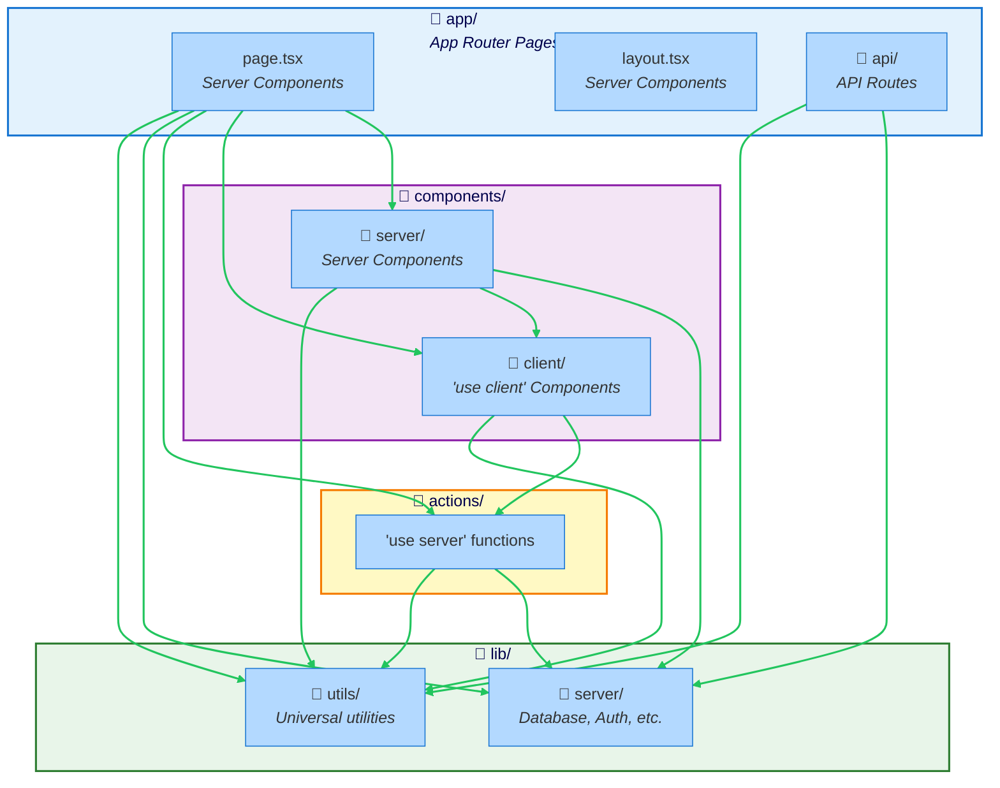

The Next.js preset enforces Next.js App Router patterns, ensuring proper separation between Server Components, Client Components, Server Actions, and API routes.

## What is the Next.js Preset?

The Next.js preset enforces patterns specific to Next.js 13+ App Router:

- **Server/Client Component separation** preventing client code from importing server-only utilities
- **Server Actions** properly isolated and callable from client components
- **API routes** separated from UI components
- **Shared utilities** accessible from both server and client
- **Server-only code** (database, auth) protected from client imports

The core principle: **Client code cannot import server-only dependencies.**

## When to Use This Preset

Use the Next.js preset when you have:

- **Next.js 13+ application** using App Router
- **React Server Components** (RSC) architecture
- **Server Actions** for mutations
- **Mixed server/client rendering** needs
- **Need to prevent** accidental server code in client bundles

## Architecture Diagram



## Directory Structure

```
├── app/                         # App Router
│   ├── page.tsx                # Server Component (default)
│   ├── layout.tsx              # Server Component
│   ├── users/
│   │   └── page.tsx
│   └── api/                    # API Routes
│       └── users/
│           └── route.ts
├── components/
│   ├── server/                 # Server Components
│   │   ├── user-list.tsx
│   │   └── dashboard.tsx
│   └── client/                 # Client Components
│       ├── user-form.tsx       # "use client"
│       └── interactive-chart.tsx
├── actions/                     # Server Actions
│   ├── user-actions.ts         # "use server"
│   └── product-actions.ts
└── lib/
    ├── server/                  # Server-only code
    │   ├── db.ts               # Database client
    │   ├── auth.ts             # Auth utilities
    │   └── session.ts          # Session management
    └── utils/                   # Universal utilities
        ├── format.ts
        └── validation.ts
```

## Boundaries Defined

The preset defines seven boundaries:

### 1. App Routes
- **Pattern:** `app/**`
- **Tags:** `app`, `routes`
- **Purpose:** App Router pages and layouts (Server Components by default)
- **Runtime:** Server

### 2. API Routes
- **Pattern:** `app/api/**`
- **Tags:** `api`, `server`
- **Purpose:** API route handlers
- **Runtime:** Server

### 3. Server Components
- **Pattern:** `components/server/**`
- **Tags:** `components`, `server`
- **Purpose:** React Server Components
- **Runtime:** Server

### 4. Client Components
- **Pattern:** `components/client/**`
- **Tags:** `components`, `client`
- **Purpose:** Client Components with "use client" directive
- **Runtime:** Client (browser)

### 5. Server Actions
- **Pattern:** `actions/**`
- **Tags:** `actions`, `server`
- **Purpose:** Server Actions with "use server" directive
- **Runtime:** Server

### 6. Server Utilities
- **Pattern:** `lib/server/**`
- **Tags:** `lib`, `server`, `server-utils`
- **Purpose:** Server-only code (database, auth, etc.)
- **Runtime:** Server

### 7. Shared Utilities
- **Pattern:** `lib/!(server)/**`
- **Tags:** `lib`, `shared`
- **Purpose:** Universal utilities that work on both server and client
- **Runtime:** Universal

## Key Rules Enforced

### Client Components Cannot Import Server-Only Code

The most critical rule: Client Components cannot import from `lib/server/**`.

```typescript
// ❌ BAD - Client Component importing server code
// components/client/user-form.tsx
"use client"
import { db } from '@/lib/server/database'
// This will cause a build error!

// ✅ GOOD - Client Component using Server Action
// components/client/user-form.tsx
"use client"
import { createUser } from '@/actions/user-actions'

export function UserForm() {
  async function handleSubmit(formData: FormData) {
    await createUser(formData) // Server Action call
  }

  return <form action={handleSubmit}>...</form>
}
```

### Client Components Can Call Server Actions

Client Components can import and call Server Actions for mutations.

```typescript
// ✅ GOOD - Server Action
// actions/user-actions.ts
"use server"
import { db } from '@/lib/server/database'

export async function createUser(formData: FormData) {
  const email = formData.get('email') as string
  const name = formData.get('name') as string

  await db.user.create({
    data: { email, name }
  })
}
```

```typescript
// ✅ GOOD - Client Component calling Server Action
// components/client/user-form.tsx
"use client"
import { createUser } from '@/actions/user-actions'
import { useState } from 'react'

export function UserForm() {
  const [isPending, setIsPending] = useState(false)

  async function handleSubmit(formData: FormData) {
    setIsPending(true)
    await createUser(formData)
    setIsPending(false)
  }

  return (
    <form action={handleSubmit}>
      <input name="email" type="email" />
      <input name="name" type="text" />
      <button disabled={isPending}>Create User</button>
    </form>
  )
}
```

### Server Components Can Import Everything

Server Components can import server-only code, client components, and shared utilities.

```typescript
// ✅ GOOD - Server Component using server code
// components/server/user-list.tsx
import { db } from '@/lib/server/database'
import { UserCard } from '@/components/client/user-card'

export async function UserList() {
  const users = await db.user.findMany()

  return (
    <div>
      {users.map(user => (
        <UserCard key={user.id} user={user} />
      ))}
    </div>
  )
}
```

### API Routes Cannot Import UI Components

API routes should contain business logic only, not UI components.

```typescript
// ❌ BAD - API route importing component
// app/api/users/route.ts
import { UserCard } from '@/components/client/user-card'
// API routes should not import UI!

// ✅ GOOD - API route with business logic
// app/api/users/route.ts
import { db } from '@/lib/server/database'
import { NextResponse } from 'next/server'

export async function GET() {
  const users = await db.user.findMany()
  return NextResponse.json(users)
}
```

### Shared Utilities Are Universal

Shared utilities can be imported by both server and client code.

```typescript
// ✅ GOOD - Shared utility
// lib/utils/format.ts
export function formatCurrency(amount: number): string {
  return new Intl.NumberFormat('en-US', {
    style: 'currency',
    currency: 'USD'
  }).format(amount)
}

// Used in Server Component
// components/server/product-price.tsx
import { formatCurrency } from '@/lib/utils/format'

export function ProductPrice({ price }: { price: number }) {
  return <span>{formatCurrency(price)}</span>
}

// Used in Client Component
// components/client/price-input.tsx
"use client"
import { formatCurrency } from '@/lib/utils/format'

export function PriceInput({ onChange }: Props) {
  const [value, setValue] = useState(0)
  return <span>{formatCurrency(value)}</span>
}
```

## Example Configuration

```json
{
  "preset": "@stricture/nextjs"
}
```

No additional configuration needed for standard Next.js App Router structure.

## Real Code Example

### Server Component with Data Fetching

```typescript
// app/users/page.tsx (Server Component by default)
import { db } from '@/lib/server/database'
import { UserCard } from '@/components/client/user-card'

export default async function UsersPage() {
  // Direct database access in Server Component
  const users = await db.user.findMany({
    orderBy: { createdAt: 'desc' }
  })

  return (
    <div>
      <h1>Users</h1>
      {users.map(user => (
        <UserCard key={user.id} user={user} />
      ))}
    </div>
  )
}
```

### Client Component with Interactivity

```typescript
// components/client/user-card.tsx
"use client"
import { useState } from 'react'
import { deleteUser } from '@/actions/user-actions'

interface Props {
  user: {
    id: string
    name: string
    email: string
  }
}

export function UserCard({ user }: Props) {
  const [isDeleting, setIsDeleting] = useState(false)

  async function handleDelete() {
    setIsDeleting(true)
    await deleteUser(user.id)
  }

  return (
    <div>
      <h3>{user.name}</h3>
      <p>{user.email}</p>
      <button onClick={handleDelete} disabled={isDeleting}>
        {isDeleting ? 'Deleting...' : 'Delete'}
      </button>
    </div>
  )
}
```

### Server Actions

```typescript
// actions/user-actions.ts
"use server"
import { db } from '@/lib/server/database'
import { revalidatePath } from 'next/cache'

export async function createUser(formData: FormData) {
  const email = formData.get('email') as string
  const name = formData.get('name') as string

  await db.user.create({
    data: { email, name }
  })

  revalidatePath('/users')
}

export async function deleteUser(id: string) {
  await db.user.delete({
    where: { id }
  })

  revalidatePath('/users')
}
```

### Server-Only Utilities

```typescript
// lib/server/database.ts
import { PrismaClient } from '@prisma/client'

declare global {
  var prisma: PrismaClient | undefined
}

export const db = global.prisma || new PrismaClient()

if (process.env.NODE_ENV !== 'production') {
  global.prisma = db
}
```

```typescript
// lib/server/auth.ts
import { cookies } from 'next/headers'
import { SignJWT, jwtVerify } from 'jose'

const secret = new TextEncoder().encode(process.env.JWT_SECRET)

export async function createSession(userId: string) {
  const token = await new SignJWT({ userId })
    .setProtectedHeader({ alg: 'HS256' })
    .setExpirationTime('24h')
    .sign(secret)

  cookies().set('session', token, {
    httpOnly: true,
    secure: process.env.NODE_ENV === 'production',
    sameSite: 'lax',
    maxAge: 60 * 60 * 24
  })
}

export async function getSession() {
  const token = cookies().get('session')?.value
  if (!token) return null

  try {
    const verified = await jwtVerify(token, secret)
    return verified.payload as { userId: string }
  } catch {
    return null
  }
}
```

### API Route

```typescript
// app/api/users/route.ts
import { db } from '@/lib/server/database'
import { NextResponse } from 'next/server'

export async function GET() {
  const users = await db.user.findMany()
  return NextResponse.json(users)
}

export async function POST(request: Request) {
  const body = await request.json()

  const user = await db.user.create({
    data: {
      email: body.email,
      name: body.name
    }
  })

  return NextResponse.json(user, { status: 201 })
}
```

## Common Violations and Fixes

### Violation: Client Component importing database

```typescript
// ❌ BAD
// components/client/user-list.tsx
"use client"
import { db } from '@/lib/server/database'
// Client Components cannot import server-only code!
```

**Fix:** Use Server Component or Server Action

```typescript
// ✅ GOOD - Option 1: Server Component
// components/server/user-list.tsx
import { db } from '@/lib/server/database'

export async function UserList() {
  const users = await db.user.findMany()
  return <div>{/* render users */}</div>
}

// ✅ GOOD - Option 2: Client Component + Server Action
// components/client/user-list.tsx
"use client"
import { getUsers } from '@/actions/user-actions'
import { useEffect, useState } from 'react'

export function UserList() {
  const [users, setUsers] = useState([])

  useEffect(() => {
    getUsers().then(setUsers)
  }, [])

  return <div>{/* render users */}</div>
}
```

### Violation: API route importing component

```typescript
// ❌ BAD
// app/api/users/route.ts
import { UserCard } from '@/components/client/user-card'
// API routes should not import UI components!
```

**Fix:** Keep API routes focused on data

```typescript
// ✅ GOOD
// app/api/users/route.ts
import { db } from '@/lib/server/database'

export async function GET() {
  const users = await db.user.findMany()
  return Response.json(users)
}
```

## Benefits

- **Type safety:** Prevents runtime errors from server code in client bundles
- **Performance:** Ensures client bundles don't include server dependencies
- **Security:** Protects server-only code (database credentials, auth) from exposure
- **Clear boundaries:** Explicit separation of server and client concerns

## Trade-offs

- **File organization:** Need to organize components by runtime
- **Learning curve:** Team needs to understand Server Components vs Client Components
- **Migration:** Existing Next.js apps may need restructuring

## Best Practices

### Colocate by Feature, Separate by Runtime

```
features/
└── users/
    ├── components/
    │   ├── server/
    │   │   └── user-list.tsx
    │   └── client/
    │       └── user-form.tsx
    ├── actions/
    │   └── user-actions.ts
    └── page.tsx
```

### Use Server Actions for Mutations

Prefer Server Actions over API routes for form submissions and mutations.

```typescript
// ✅ GOOD - Server Action (simpler)
"use server"
export async function createUser(formData: FormData) {
  await db.user.create({ data: { ... } })
}

// ⚠️ LESS IDEAL - API route (more code)
export async function POST(request: Request) {
  const body = await request.json()
  await db.user.create({ data: body })
  return Response.json({ success: true })
}
```

### Keep Shared Utils Pure

Shared utilities should work on both server and client.

```typescript
// ✅ GOOD - Pure function
export function formatDate(date: Date): string {
  return date.toLocaleDateString()
}

// ❌ BAD - Server-only in shared
import { cookies } from 'next/headers'
export function getCookie() { ... }
```

## Related Patterns

- [Modular Architecture](/presets/modular) - Can combine with Next.js preset
- [Layered Architecture](/presets/layered) - Alternative organization

## Next Steps

- Check out the [Next.js example](/examples#nextjs)
- Read [Next.js App Router docs](https://nextjs.org/docs/app)
- Learn about [Server Actions](https://nextjs.org/docs/app/building-your-application/data-fetching/server-actions-and-mutations)
