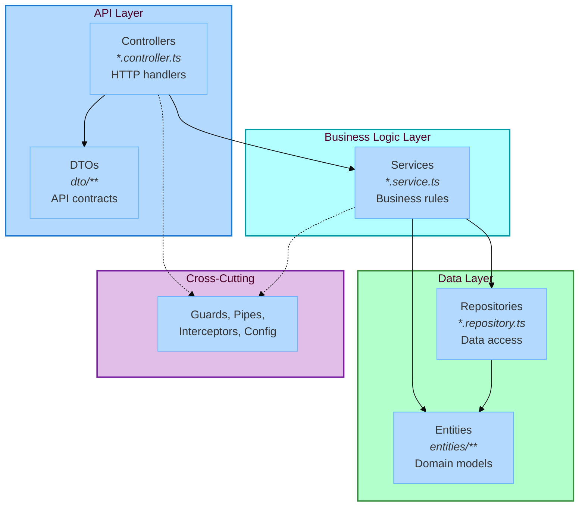

# NestJS Layered Architecture Example

> Production-ready REST API built with NestJS demonstrating layered architecture enforced by Stricture

## Overview

This is a complete, runnable example of **NestJS with Layered Architecture**. It demonstrates how Stricture enforces NestJS best practices and architectural boundaries in a real-world REST API. The example implements a task management system with proper layering, dependency injection, and clean separation of concerns.

**What you'll learn:**
- How to structure a NestJS application with proper layering
- How to separate API contracts (DTOs) from database models (Entities)
- How Stricture enforces critical architectural rules automatically
- Best practices for NestJS dependency injection and module organization
- The importance of keeping controllers, services, and repositories independent

## Architecture Diagram



## Key Architectural Rules (Enforced by Stricture)

### ✅ Controllers Use DTOs, Not Entities

**WHY:** API contracts should be independent of database models

```typescript
// ❌ BAD - Exposes database structure to API
@Get()
async findAll(): Promise<Task[]> { ... }  // Entity type!

// ✅ GOOD - Uses API contract
@Get()
async findAll(): Promise<TaskDto[]> { ... }  // DTO type!
```

**Stricture prevents** controllers from importing entity files.

### ✅ Controllers Call Services, Not Repositories

**WHY:** Business logic belongs in services, not controllers

```typescript
// ❌ BAD - Controller does data access directly
@Injectable()
export class TasksController {
  constructor(private repo: TasksRepository) {}  // Violation!
}

// ✅ GOOD - Controller delegates to service
@Injectable()
export class TasksController {
  constructor(private service: TasksService) {}  // Correct!
}
```

**Stricture prevents** controllers from importing repository files.

### ✅ DTOs Are Independent of Entities

**WHY:** API and database can evolve independently

```typescript
// ❌ BAD - DTO depends on entity
import { Task } from '../entities/task.entity'
export class TaskDto extends Task { }  // Tight coupling!

// ✅ GOOD - DTO is independent
export class TaskDto {
  id: string
  title: string
  // ... defined independently
}
```

**Stricture prevents** DTOs from importing entity files.

### ✅ Controllers Are Independent

**WHY:** Controllers should be focused and not depend on each other

```typescript
// ❌ BAD - Controller imports another controller
import { UsersController } from './users.controller'  // Violation!

// ✅ GOOD - Share logic via service
@Injectable()
export class SharedService { ... }  // Both controllers use this
```

**Stricture prevents** controllers from importing other controllers.

## Quick Start

### Installation

```bash
cd examples/nestjs-layered
pnpm install
```

### Run Development Server

```bash
pnpm run dev
```

Server runs at `http://localhost:3000`

### Try the API

**Create a task:**
```bash
curl -X POST http://localhost:3000/tasks \
  -H "Content-Type: application/json" \
  -d '{"title": "Learn Stricture", "description": "Understand architecture enforcement", "priority": "high"}'
```

**List tasks:**
```bash
curl http://localhost:3000/tasks
```

**Complete a task:**
```bash
curl -X PATCH http://localhost:3000/tasks/{id}/complete
```

### Run Tests

```bash
# Unit tests
pnpm run test

# E2E tests
pnpm run test:e2e

# Coverage
pnpm run test:cov
```

### Check Architecture

```bash
# Lint and check Stricture rules
pnpm run lint

# Type check
pnpm run type-check
```

## Project Structure

```
src/
├── main.ts                          # App bootstrap
├── app.module.ts                    # Root module
├── tasks/
│   ├── tasks.module.ts              # Module configuration
│   ├── tasks.controller.ts          # HTTP endpoints
│   ├── tasks.service.ts             # Business logic
│   ├── tasks.repository.ts          # Data access
│   ├── dto/
│   │   ├── create-task.dto.ts       # Input DTO
│   │   ├── update-task.dto.ts       # Input DTO
│   │   └── task.dto.ts              # Output DTO
│   └── entities/
│       └── task.entity.ts           # Domain model
└── common/
    └── types.ts                     # Shared enums
```

## API Endpoints

| Method | Endpoint | Description |
|--------|----------|-------------|
| `GET` | `/tasks` | List all tasks |
| `GET` | `/tasks/:id` | Get task by ID |
| `POST` | `/tasks` | Create new task |
| `PUT` | `/tasks/:id` | Update task |
| `DELETE` | `/tasks/:id` | Delete task |
| `PATCH` | `/tasks/:id/complete` | Mark as complete |

## The Layers Explained

### 1. Controllers (Presentation Layer)

**Location:** `*.controller.ts`

**Purpose:** Handle HTTP requests and responses

**Example** (`tasks.controller.ts:10-20`):
```typescript
@Controller('tasks')
export class TasksController {
  constructor(private readonly tasksService: TasksService) {}

  @Post()
  async create(@Body() createTaskDto: CreateTaskDto): Promise<TaskDto> {
    return this.tasksService.create(createTaskDto)
  }
}
```

**Can import:**
- ✅ Services
- ✅ DTOs
- ✅ NestJS decorators

**Cannot import:**
- ❌ Entities
- ❌ Repositories
- ❌ Other controllers

### 2. Services (Business Logic Layer)

**Location:** `*.service.ts`

**Purpose:** Implement business rules and orchestrate use cases

**Example** (`tasks.service.ts:25-40`):
```typescript
@Injectable()
export class TasksService {
  constructor(private readonly tasksRepository: TasksRepository) {}

  async create(createTaskDto: CreateTaskDto): Promise<TaskDto> {
    // Business rule validation
    if (!createTaskDto.title.trim()) {
      throw new BadRequestException('Title cannot be empty')
    }

    // Create entity from DTO
    const task: Task = {
      id: this.generateId(),
      title: createTaskDto.title,
      description: createTaskDto.description || '',
      status: TaskStatus.TODO,
      priority: createTaskDto.priority,
      createdAt: new Date(),
      updatedAt: new Date(),
    }

    // Persist
    await this.tasksRepository.save(task)

    // Map to DTO for response
    return this.entityToDto(task)
  }
}
```

**Can import:**
- ✅ Repositories
- ✅ Entities
- ✅ DTOs
- ✅ Other services

**Cannot import:**
- ❌ Controllers

### 3. Repositories (Data Access Layer)

**Location:** `*.repository.ts`

**Purpose:** Encapsulate data persistence

**Example** (`tasks.repository.ts:10-25`):
```typescript
@Injectable()
export class TasksRepository {
  private tasks: Map<string, Task> = new Map()

  async save(task: Task): Promise<void> {
    this.tasks.set(task.id, task)
  }

  async findById(id: string): Promise<Task | null> {
    return this.tasks.get(id) || null
  }

  async findAll(): Promise<Task[]> {
    return Array.from(this.tasks.values())
  }
}
```

**Can import:**
- ✅ Entities
- ✅ External libraries (TypeORM, Prisma)

**Cannot import:**
- ❌ DTOs
- ❌ Controllers
- ❌ Services

### 4. Entities (Domain Models)

**Location:** `entities/*.entity.ts`

**Purpose:** Define domain structure

**Example** (`entities/task.entity.ts:5-15`):
```typescript
export class Task {
  id: string
  title: string
  description: string
  status: TaskStatus
  priority: Priority
  createdAt: Date
  updatedAt: Date
}
```

**Can import:**
- ✅ Other entities (relationships)
- ✅ ORM decorators

**Cannot import:**
- ❌ DTOs
- ❌ Controllers
- ❌ Services
- ❌ Repositories

### 5. DTOs (Data Transfer Objects)

**Location:** `dto/*.dto.ts`

**Purpose:** Define API contracts with validation

**Example** (`dto/create-task.dto.ts:5-20`):
```typescript
export class CreateTaskDto {
  @IsNotEmpty()
  @IsString()
  title: string

  @IsOptional()
  @IsString()
  description?: string

  @IsEnum(Priority)
  priority: Priority
}
```

**Can import:**
- ✅ Other DTOs
- ✅ Validation decorators

**Cannot import:**
- ❌ Entities (CRITICAL!)
- ❌ Controllers
- ❌ Services
- ❌ Repositories

## Stricture Configuration

See `.stricture/config.json`:

```json
{
  "preset": "@stricture/nestjs"
}
```

That's it! The preset provides:
- **12 boundary definitions** (controllers, services, repositories, entities, DTOs, guards, pipes, etc.)
- **40+ architectural rules** enforcing NestJS best practices
- **Helpful error messages** with examples for violations

## Why This Architecture?

### 1. API/Database Independence

When your DTO structure differs from your entity structure, you can:
- Change database schema without breaking API
- Add computed fields to DTOs without touching entities
- Version your API independently of your data model

**Example:**
```typescript
// Entity stores Date objects
export class Task {
  createdAt: Date
}

// DTO exposes ISO strings to API
export class TaskDto {
  createdAt: string  // ISO format
}
```

### 2. Testability

Each layer can be tested independently with mocks:

```typescript
// Test service without database
const mockRepo = { save: jest.fn(), findById: jest.fn() }
const service = new TasksService(mockRepo)
await service.create({ title: 'Test', priority: 'high' })
expect(mockRepo.save).toHaveBeenCalled()

// Test controller without service logic
const mockService = { create: jest.fn() }
const controller = new TasksController(mockService)
await controller.create({ title: 'Test', priority: 'high' })
expect(mockService.create).toHaveBeenCalled()
```

### 3. Business Logic Isolation

Business rules live in services, not scattered across controllers and repositories:

```typescript
// ✅ Business rule in service
@Injectable()
export class TasksService {
  async complete(id: string): Promise<TaskDto> {
    const task = await this.tasksRepository.findById(id)

    // Business rule enforced here
    if (task.status === TaskStatus.DONE) {
      throw new BadRequestException('Already completed')
    }

    task.status = TaskStatus.DONE
    await this.tasksRepository.update(task)
    return this.entityToDto(task)
  }
}
```

### 4. Clear Separation of Concerns

Each file type has a single, clear responsibility:
- Controllers: HTTP ↔ App translation
- Services: Business logic
- Repositories: Data ↔ Persistence
- DTOs: API contracts
- Entities: Domain models

## Common Violations and Fixes

### Violation 1: Controller Importing Entity

**Error:**
```
src/tasks/tasks.controller.ts
  2:1  error  Controllers should not import entities directly
              @stricture/enforce-boundaries
```

**Bad Code:**
```typescript
import { Task } from './entities/task.entity'  // ❌

@Controller('tasks')
export class TasksController {
  @Get()
  async findAll(): Promise<Task[]> { ... }
}
```

**Fix:**
```typescript
import { TaskDto } from './dto/task.dto'  // ✅

@Controller('tasks')
export class TasksController {
  @Get()
  async findAll(): Promise<TaskDto[]> { ... }
}
```

### Violation 2: DTO Importing Entity

**Error:**
```
src/tasks/dto/create-task.dto.ts
  1:1  error  DTOs should not import entities
              @stricture/enforce-boundaries
```

**Bad Code:**
```typescript
import { Task } from '../entities/task.entity'  // ❌

export class CreateTaskDto extends Task {
  // Inheriting from entity creates tight coupling!
}
```

**Fix:**
```typescript
// Define DTO independently ✅
export class CreateTaskDto {
  @IsNotEmpty()
  title: string

  @IsOptional()
  description?: string

  @IsEnum(Priority)
  priority: Priority
}
```

### Violation 3: Controller Importing Repository

**Error:**
```
src/tasks/tasks.controller.ts
  3:1  error  Controllers should not import repositories directly
              @stricture/enforce-boundaries
```

**Bad Code:**
```typescript
import { TasksRepository } from './tasks.repository'  // ❌

@Controller('tasks')
export class TasksController {
  constructor(private tasksRepo: TasksRepository) {}
}
```

**Fix:**
```typescript
import { TasksService } from './tasks.service'  // ✅

@Controller('tasks')
export class TasksController {
  constructor(private tasksService: TasksService) {}
}
```

## Testing

### Unit Tests (Services)

Test business logic in isolation:

```typescript
describe('TasksService', () => {
  it('should reject empty titles', async () => {
    const mockRepo = { save: jest.fn() }
    const service = new TasksService(mockRepo)

    await expect(
      service.create({ title: '', priority: Priority.LOW })
    ).rejects.toThrow('Title cannot be empty')
  })

  it('should prevent completing already done tasks', async () => {
    const mockRepo = {
      findById: jest.fn().mockResolvedValue({
        id: '1',
        status: TaskStatus.DONE
      })
    }
    const service = new TasksService(mockRepo)

    await expect(
      service.complete('1')
    ).rejects.toThrow('Already completed')
  })
})
```

### Integration Tests (Controllers)

Test HTTP layer with NestJS testing utilities:

```typescript
describe('TasksController', () => {
  let controller: TasksController
  let service: TasksService

  beforeEach(async () => {
    const module = await Test.createTestingModule({
      controllers: [TasksController],
      providers: [
        {
          provide: TasksService,
          useValue: { create: jest.fn(), findAll: jest.fn() }
        }
      ]
    }).compile()

    controller = module.get(TasksController)
    service = module.get(TasksService)
  })

  it('should create task', async () => {
    const dto = { title: 'Test', priority: Priority.HIGH }
    jest.spyOn(service, 'create').mockResolvedValue({ id: '1', ...dto })

    const result = await controller.create(dto)

    expect(result.id).toBe('1')
  })
})
```

### E2E Tests

Test full API with real HTTP requests:

```typescript
describe('Tasks API (e2e)', () => {
  let app: INestApplication

  beforeAll(async () => {
    const module = await Test.createTestingModule({
      imports: [AppModule]
    }).compile()

    app = module.createNestApplication()
    await app.init()
  })

  it('POST /tasks creates task', () => {
    return request(app.getHttpServer())
      .post('/tasks')
      .send({ title: 'Test Task', priority: 'high' })
      .expect(201)
      .expect((res) => {
        expect(res.body.id).toBeDefined()
        expect(res.body.title).toBe('Test Task')
      })
  })
})
```

## Learning More

### Stricture Documentation
- [Main Documentation](../../README.md)
- [NestJS Preset](../../packages/nestjs/README.md)
- [ESLint Plugin](../../packages/eslint-plugin/README.md)

### NestJS Resources
- [NestJS Documentation](https://docs.nestjs.com/)
- [NestJS Architecture](https://docs.nestjs.com/fundamentals/custom-providers)
- [Testing in NestJS](https://docs.nestjs.com/fundamentals/testing)

### Other Examples
- [NestJS Basic](../nestjs-basic/) - Simpler NestJS example
- [Simple Layered](../simple-layered/) - Non-NestJS layered architecture
- [Simple Hexagonal](../simple-hexagonal/) - Alternative architecture pattern

## License

MIT
