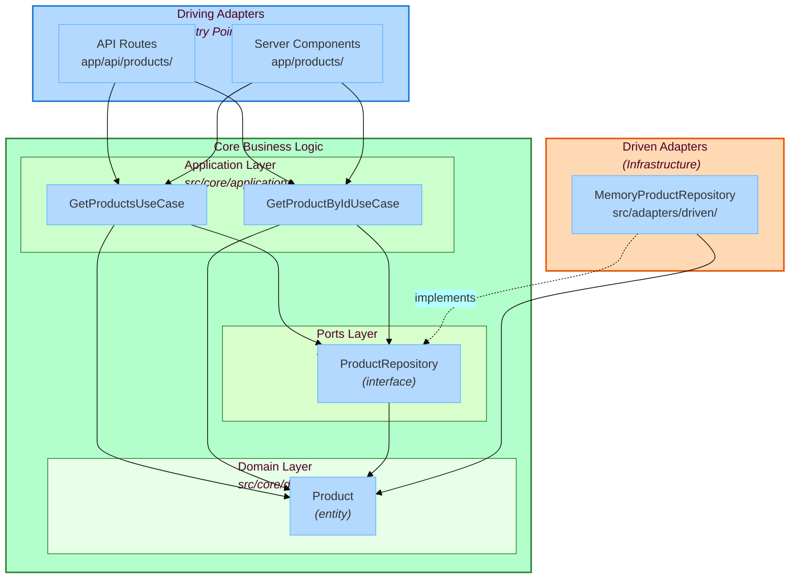

# Next.js Hexagonal Architecture Example

A simple product catalog built with **Next.js 14 (App Router)** using **Hexagonal Architecture**, enforced by **Stricture**.

This example demonstrates how to structure a Next.js application with clean architecture principles, making it testable, maintainable, and framework-independent at the core.

## What You'll Learn

- How to apply Hexagonal Architecture (Ports & Adapters) in Next.js
- How to structure your code with clear boundaries between layers
- How to use Stricture to enforce architectural rules automatically
- How to make your business logic independent of frameworks
- How to test your application with mock dependencies
- How to swap implementations without changing your application code

## Architecture Overview



### Layer Responsibilities

1. **Domain Layer** (`src/core/domain/`)
   - Pure business entities and logic
   - Zero external dependencies
   - Example: `Product` class with validation rules

2. **Ports Layer** (`src/core/ports/`)
   - Interfaces defining contracts
   - Example: `ProductRepository` interface

3. **Application Layer** (`src/core/application/`)
   - Use case orchestration
   - Depends on domain and ports, not adapters
   - Example: `GetProductsUseCase`

4. **Driving Adapters** (`app/api/`, `app/products/`)
   - Entry points (API routes, Server Components)
   - Call use cases, don't know about infrastructure

5. **Driven Adapters** (`src/adapters/driven/`)
   - Infrastructure implementations
   - Example: `MemoryProductRepository`

## Project Structure

```
nextjs-hexagonal/
├── .stricture/
│   └── config.json              # Stricture: hexagonal preset
├── src/
│   ├── core/                    # Core business logic (no framework deps)
│   │   ├── domain/
│   │   │   └── product.ts       # Product entity with business rules
│   │   ├── ports/
│   │   │   └── product-repository.ts  # Repository interface
│   │   └── application/
│   │       ├── get-products.ts        # Use case: list products
│   │       └── get-product-by-id.ts   # Use case: get single product
│   └── adapters/
│       ├── driving/             # Entry points (Next.js handles these)
│       └── driven/
│           └── memory-repository.ts   # In-memory implementation
├── app/
│   ├── di-container.ts          # Composition root (DI)
│   ├── api/
│   │   └── products/
│   │       ├── route.ts         # GET /api/products
│   │       └── [id]/route.ts    # GET /api/products/:id
│   ├── products/
│   │   ├── page.tsx             # Product list page
│   │   └── [id]/page.tsx        # Product detail page
│   ├── layout.tsx
│   └── page.tsx
├── tests/                       # Comprehensive test suite
│   ├── domain/
│   ├── application/
│   └── adapters/
└── package.json
```

## Quick Start

```bash
# Install dependencies
pnpm install

# Run development server
pnpm dev

# Run tests
pnpm test

# Run type checking
pnpm type-check

# Run linter (includes Stricture checks)
pnpm lint
```

Then visit:
- **http://localhost:3000/products** - Product catalog (Server Component)
- **http://localhost:3000/api/products** - REST API

## Code Examples

### Domain Entity (Pure Business Logic)

```typescript
// src/core/domain/product.ts
export class Product {
  constructor(
    public readonly id: string,
    public readonly name: string,
    public readonly price: number,
    public readonly description: string,
    public readonly inStock: boolean
  ) {
    // Business rules enforced in domain
    if (price <= 0) {
      throw new Error('Price must be positive')
    }
    if (!name || name.trim().length === 0) {
      throw new Error('Name cannot be empty')
    }
    if (description.length > 500) {
      throw new Error('Description too long')
    }
  }

  getFormattedPrice(): string {
    return `$${this.price.toFixed(2)}`
  }
}
```

### Port Interface

```typescript
// src/core/ports/product-repository.ts
import type { Product } from '../domain/product.js'

export interface ProductRepository {
  findAll(): Promise<Product[]>
  findById(id: string): Promise<Product | null>
}
```

### Use Case

```typescript
// src/core/application/get-products.ts
import type { Product } from '../domain/product.js'
import type { ProductRepository } from '../ports/product-repository.js'

export class GetProductsUseCase {
  constructor(private readonly productRepository: ProductRepository) {}

  async execute(): Promise<Product[]> {
    return await this.productRepository.findAll()
  }
}
```

### Driven Adapter (Repository Implementation)

```typescript
// src/adapters/driven/memory-repository.ts
import { Product } from '../../core/domain/product.js'
import type { ProductRepository } from '../../core/ports/product-repository.js'

export class MemoryProductRepository implements ProductRepository {
  private products: Map<string, Product> = new Map()

  constructor() {
    // Pre-populate with sample data
    this.seed()
  }

  async findAll(): Promise<Product[]> {
    return Array.from(this.products.values())
  }

  async findById(id: string): Promise<Product | null> {
    return this.products.get(id) || null
  }

  private seed(): void {
    const products = [
      new Product('1', 'Laptop', 999.99, 'High-performance laptop', true),
      new Product('2', 'Mouse', 29.99, 'Wireless mouse', true),
      new Product('3', 'Keyboard', 79.99, 'Mechanical keyboard', false)
    ]
    products.forEach(p => this.products.set(p.id, p))
  }
}
```

### Composition Root (Dependency Injection)

```typescript
// app/di-container.ts
import { MemoryProductRepository } from '@/src/adapters/driven/memory-repository.js'
import { GetProductsUseCase } from '@/src/core/application/get-products.js'
import { GetProductByIdUseCase } from '@/src/core/application/get-product-by-id.js'

// 1. Create infrastructure (driven adapters)
const productRepository = new MemoryProductRepository()

// 2. Create use cases with dependencies injected
export const getProductsUseCase = new GetProductsUseCase(productRepository)
export const getProductByIdUseCase = new GetProductByIdUseCase(productRepository)
```

### Driving Adapter (Next.js API Route)

```typescript
// app/api/products/route.ts
import { getProductsUseCase } from '@/app/di-container'

export async function GET() {
  const products = await getProductsUseCase.execute()
  return Response.json(products)
}
```

### Driving Adapter (Next.js Server Component)

```typescript
// app/products/page.tsx
import { getProductsUseCase } from '@/app/di-container'

export default async function ProductsPage() {
  const products = await getProductsUseCase.execute()

  return (
    <div>
      <h1>Products</h1>
      <ul>
        {products.map(product => (
          <li key={product.id}>
            {product.name} - {product.getFormattedPrice()}
            {!product.inStock && ' (Out of stock)'}
          </li>
        ))}
      </ul>
    </div>
  )
}
```

## Stricture Configuration

This example uses `@stricture/hexagonal` preset with **custom boundaries for Next.js integration**.

### Why Custom Configuration?

Next.js App Router requires the `app/` folder at the project root for routing. This doesn't match the hexagonal preset's expected structure (`src/adapters/driving/`). Therefore, we need custom boundaries to adapt the preset to Next.js:

**Standard Hexagonal Architecture:**
```
src/adapters/driving/**  ← Driving adapters (entry points)
src/adapters/driven/**   ← Driven adapters (infrastructure)
src/core/application/**  ← Use cases
src/core/ports/**        ← Interfaces
src/core/domain/**       ← Domain logic
```

**This Next.js Example:**
```
app/**                   ← Driving adapters (Next.js requirement)
  ├── di-container.ts    ← Composition root (special role)
  ├── page.tsx           ← Server Components
  └── api/               ← API routes
src/adapters/driven/**   ← Driven adapters
src/core/application/**  ← Use cases
src/core/ports/**        ← Interfaces
src/core/domain/**       ← Domain logic
```

### Configuration Breakdown

**.stricture/config.json:**
```json
{
  "preset": "@stricture/hexagonal",
  "boundaries": [
    {
      "name": "composition-root",
      "pattern": "app/di-container.ts",
      "tags": ["app", "composition-root"]
    },
    {
      "name": "nextjs-driving-adapters",
      "pattern": "app/**/!(di-container).{ts,tsx}",
      "tags": ["app", "driving"]
    }
  ],
  "rules": [
    // Custom rules for Next.js integration
    // See .stricture/config.json for full details
  ]
}
```

**What This Enforces:**

✅ **From hexagonal preset:**
- Domain layer is pure (no external imports)
- Ports can use domain types
- Application uses domain and ports, not adapters
- Driven adapters implement ports
- All layers properly isolated

✅ **From custom config:**
- Composition root (`di-container.ts`) can import everything (wires dependencies)
- Driving adapters (pages, API routes) call use cases from DI container
- Driving adapters **cannot** import driven adapters directly
- Clear separation between wiring (DI) and business logic (pages)

❌ **Violations caught:**
- Domain importing external dependencies
- Application importing concrete adapters
- Pages importing repositories directly (must use DI container)
- Driving adapters importing domain entities directly

**Run `pnpm lint` to check architecture violations!**

### Why This Pattern?

This demonstrates **architectural adaptation** - applying strict architectural patterns to real-world framework constraints. The core hexagonal principles remain intact, but the folder structure adapts to Next.js requirements.

## Testing

### Domain Tests (Pure Unit Tests)

```typescript
// tests/domain/product.test.ts
import { Product } from '@/src/core/domain/product'

test('creates valid product', () => {
  const product = new Product('1', 'Laptop', 999.99, 'Description', true)
  expect(product.name).toBe('Laptop')
  expect(product.getFormattedPrice()).toBe('$999.99')
})

test('rejects negative price', () => {
  expect(() => {
    new Product('1', 'Laptop', -10, 'Description', true)
  }).toThrow('Price must be positive')
})
```

### Application Tests (With Mock Repository)

```typescript
// tests/application/get-products.test.ts
import { GetProductsUseCase } from '@/src/core/application/get-products'
import { Product } from '@/src/core/domain/product'

test('returns all products from repository', async () => {
  // Mock repository
  const mockRepo = {
    findAll: jest.fn().mockResolvedValue([
      new Product('1', 'Test', 10, 'Desc', true)
    ]),
    findById: jest.fn()
  }

  const useCase = new GetProductsUseCase(mockRepo)
  const products = await useCase.execute()

  expect(products).toHaveLength(1)
  expect(mockRepo.findAll).toHaveBeenCalled()
})
```

## Key Benefits

### 1. Testability

- Domain logic tested without any infrastructure
- Use cases tested with mock repositories
- Easy to write fast, reliable unit tests

### 2. Flexibility

- Swap `MemoryProductRepository` for `PostgresProductRepository`
- No changes needed to application or domain layers
- Only change composition root

### 3. Framework Independence

- Core business logic has no Next.js dependencies
- Could port to Express, Fastify, or even CLI
- Business rules survive framework migrations

### 4. Clear Boundaries

- Stricture enforces rules at lint/build time
- Violations caught before code review
- Architecture documented as code

### 5. Dependency Inversion

- Application depends on interfaces (ports), not implementations
- Follows SOLID principles
- High-level policy doesn't depend on low-level details

## Common Patterns

### Pattern 1: Adding a New Use Case

1. Define it in `src/core/application/`
2. Inject required ports via constructor
3. Export from composition root (`app/di-container.ts`)
4. Use in any driving adapter (API route, page, etc.)

### Pattern 2: Swapping Repository Implementation

1. Create new adapter in `src/adapters/driven/`
2. Implement the `ProductRepository` interface
3. Update composition root to use new implementation
4. Zero changes to application or domain layers

### Pattern 3: Adding a New Driving Adapter

1. Create new Next.js route/component
2. Import use cases from composition root
3. Call use case methods
4. Handle presentation logic

## Why This Architecture?

**Traditional Next.js:**
```typescript
// app/products/page.tsx
export default async function Page() {
  const products = await db.products.findMany() // Direct DB coupling
  return <div>{/* render */}</div>
}
```

**Problems:**
- Hard to test (needs real database)
- Can't swap database easily
- Business logic mixed with framework
- No architectural boundaries

**Hexagonal Next.js:**
```typescript
// app/products/page.tsx
import { getProductsUseCase } from '@/app/di-container'

export default async function Page() {
  const products = await getProductsUseCase.execute()  // Clean dependency
  return <div>{/* render */}</div>
}
```

**Benefits:**
- Easy to test (mock use case)
- Swap implementation in one place
- Business logic separate from framework
- Stricture enforces boundaries

## Learn More

- [Hexagonal Architecture Explained](../../packages/hexagonal/README.md)
- [Stricture Documentation](../../README.md)
- [SPEC.md](./SPEC.md) - Technical specification

## License

MIT
