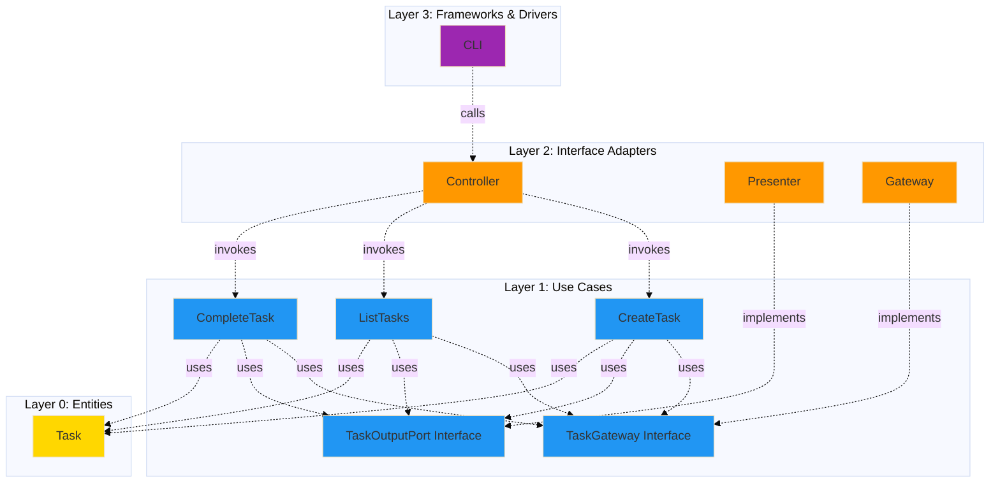

# Simple Clean Architecture Example

> A minimal terminal app demonstrating Clean Architecture with Stricture boundary enforcement

[](https://opensource.org/licenses/MIT)

## Overview

This is a minimal, runnable example of **Clean Architecture** by Robert C. Martin (Uncle Bob). It demonstrates how `@stricture` enforces architectural boundaries in a real TypeScript project. The example implements a simple task management system that stores tasks in memory and runs from the terminal.

This example exists as the perfect starting point for understanding Clean Architecture. It shows how Stricture prevents violations of the Dependency Rule and enforces the concentric circle design.

**What you'll learn:**
- How to structure a Clean Architecture project with four layers
- How the Dependency Rule ensures dependencies point INWARD only
- How to configure Stricture for automatic boundary enforcement
- The difference between entities, use cases, interface adapters, and frameworks

## Architecture Diagram



**Dependency Flow:** All dependencies point INWARD → toward entities
**Core Principle:** The Dependency Rule - source code dependencies must point only inward

## The Four Layers of Clean Architecture

### Layer 0: Entities (Innermost)

**Location**: `src/entities/`

**Purpose**: Enterprise business rules

**In this example**: The `Task` entity with business logic for task management

**The Dependency Rule**:
- ❌ Entities CANNOT depend on ANY outer layer
- ✅ Entities CAN depend on other entities

**Code example** (`src/entities/task.ts:91`):
```typescript
export class Task {
  // Pure business logic - no dependencies!
  complete(): Task {
    if (this.status === TaskStatus.DONE) {
      throw new Error('Task is already completed')
    }

    return new Task(
      this.id,
      this.title,
      this.description,
      TaskStatus.DONE,
      this.priority,
      this.createdAt,
      new Date()
    )
  }
}
```

### Layer 1: Use Cases

**Location**: `src/use-cases/`

**Purpose**: Application business rules

**In this example**:
- `CreateTaskUseCase` - Creates a new task
- `ListTasksUseCase` - Lists all tasks
- `CompleteTaskUseCase` - Marks a task as complete
- `TaskGateway` interface - Data access contract
- `TaskOutputPort` interface - Presentation contract

**The Dependency Rule**:
- ❌ Use cases CANNOT depend on interface adapters or frameworks
- ✅ Use cases CAN depend on entities

**Key Pattern - Dependency Inversion**:

Use cases define interfaces (ports) that outer layers implement:

```typescript
// Use case defines what it needs
export interface TaskGateway {
  save(task: Task): Promise<void>
  findById(id: string): Promise<Task | null>
  // ...
}

// Use case uses the interface
export class CreateTaskUseCase {
  constructor(
    private readonly taskGateway: TaskGateway,  // Interface, not implementation!
    private readonly outputPort: TaskOutputPort
  ) {}
}
```

The concrete implementation lives in the interface adapters layer.

### Layer 2: Interface Adapters

**Location**: `src/interface-adapters/`

**Purpose**: Convert data between use cases and external agencies

**In this example**:
- `InMemoryTaskGateway` - Implements `TaskGateway` interface
- `ConsoleTaskPresenter` - Implements `TaskOutputPort` interface
- `TaskController` - Receives external input, invokes use cases

**The Dependency Rule**:
- ❌ Interface adapters SHOULD NOT depend on frameworks (keep thin)
- ✅ Interface adapters CAN depend on use cases and entities

**Gateway Example** (`src/interface-adapters/in-memory-task-gateway.ts`):
```typescript
// Implements interface defined in use-cases layer
export class InMemoryTaskGateway implements TaskGateway {
  private tasks: Map<string, Task> = new Map()

  async save(task: Task): Promise<void> {
    this.tasks.set(task.id, task)
  }
  // ...
}
```

**Presenter Example** (`src/interface-adapters/console-task-presenter.ts`):
```typescript
// Implements interface defined in use-cases layer
export class ConsoleTaskPresenter implements TaskOutputPort {
  presentTask(task: Task): void {
    console.log('📋 Task Details:')
    console.log(`  Title: ${task.title}`)
    // Format output for console
  }
}
```

### Layer 3: Frameworks & Drivers (Outermost)

**Location**: `src/frameworks-drivers/` and `index.ts`

**Purpose**: Framework-specific code and dependency wiring

**In this example**:
- `CLI` - Command-line interface framework code
- `index.ts` - Composition root where everything is wired together

**The Dependency Rule**:
- ✅ Frameworks CAN depend on EVERYTHING (outermost layer)

**Composition Root** (`index.ts`):
```typescript
// 1. Create infrastructure
const taskGateway = new InMemoryTaskGateway()
const taskPresenter = new ConsoleTaskPresenter()

// 2. Create use cases (inject dependencies)
const createTaskUseCase = new CreateTaskUseCase(taskGateway, taskPresenter)

// 3. Create controller (inject use cases)
const taskController = new TaskController(createTaskUseCase, ...)

// 4. Create CLI (inject controller)
const cli = new CLI(taskController)

// 5. Run!
cli.run(process.argv.slice(2))
```

## Installation

```bash
# From repository root
cd examples/simple-clean

# Install dependencies
pnpm install

# Build TypeScript
pnpm build
```

## Usage

### Create a Task

```bash
node index.js create "Buy groceries" "Get milk, eggs, and bread" high
```

**Output:**
```
✅ Task "Buy groceries" created successfully

📋 Task Details:
  ID: task_abc123def
  Title: Buy groceries
  Description: Get milk, eggs, and bread
  Status: TODO
  Priority: HIGH
  Created: 11/13/2025, 9:30:00 PM
```

### List All Tasks

```bash
node index.js list
```

**Output:**
```
📋 Tasks (2):

  ⬜ 🔴 Buy groceries
    ID: task_abc123def
  ⬜ 🟡 Write report
    ID: task_xyz789ghi
```

### Complete a Task

```bash
node index.js complete task_abc123def
```

**Output:**
```
✅ Task "Buy groceries" completed

📋 Task Details:
  ID: task_abc123def
  Title: Buy groceries
  Status: DONE
  Completed: 11/13/2025, 9:35:00 PM
```

## File Structure

```
examples/simple-clean/
├── .stricture/
│   └── config.json              # Stricture configuration (clean preset)
├── .eslintrc.cjs                # ESLint + Stricture integration
├── package.json
├── tsconfig.json
├── index.ts                     # Main entry point / Composition root
├── src/
│   ├── entities/                # Layer 0: Enterprise business rules
│   │   └── task.ts              # Task entity with business logic
│   ├── use-cases/               # Layer 1: Application business rules
│   │   ├── task-gateway.ts      # Gateway interface (data access)
│   │   ├── output-port.ts       # Output port interface (presentation)
│   │   ├── create-task.ts       # Create task use case
│   │   ├── list-tasks.ts        # List tasks use case
│   │   └── complete-task.ts     # Complete task use case
│   ├── interface-adapters/      # Layer 2: Interface adapters
│   │   ├── in-memory-task-gateway.ts    # Gateway implementation
│   │   ├── console-task-presenter.ts    # Presenter implementation
│   │   └── task-controller.ts           # Controller
│   └── frameworks-drivers/      # Layer 3: Frameworks & drivers
│       └── cli.ts               # CLI framework
└── README.md
```

## The Dependency Rule in Action

### ✅ Valid: Use Case Depends on Entity

```typescript
// src/use-cases/create-task.ts
import { Task } from '../entities/task.js'  // ✅ Inner layer

export class CreateTaskUseCase {
  async execute(input: CreateTaskInput): Promise<void> {
    const task = new Task(...)  // Use entity
  }
}
```

### ❌ Invalid: Entity Depends on Use Case

```typescript
// src/entities/task.ts
import { TaskGateway } from '../use-cases/task-gateway.js'  // ❌ Outer layer!

export class Task {
  async save(): Promise<void> {
    // Entity should NOT know about persistence!
    await new TaskGateway().save(this)  // ❌ VIOLATION!
  }
}
```

**Stricture will catch this:**
```
src/entities/task.ts
  2:1  error  Entities cannot depend on outer layers
             Entities (enterprise business rules) must have zero dependencies
             @stricture/enforce-boundaries
```

### ❌ Invalid: Use Case Depends on Interface Adapter

```typescript
// src/use-cases/create-task.ts
import { InMemoryTaskGateway } from '../interface-adapters/in-memory-task-gateway.js'  // ❌ Outer layer!

export class CreateTaskUseCase {
  private gateway = new InMemoryTaskGateway()  // ❌ VIOLATION!
}
```

**Correct approach - Dependency Inversion:**
```typescript
// src/use-cases/create-task.ts
import { TaskGateway } from './task-gateway.js'  // ✅ Interface in same layer

export class CreateTaskUseCase {
  constructor(
    private readonly taskGateway: TaskGateway  // ✅ Depend on interface
  ) {}
}
```

## Why Clean Architecture?

### 1. Independent of Frameworks

Business logic doesn't depend on Express, React, or any framework. You can swap frameworks without touching entities or use cases.

### 2. Testable

```typescript
// Easy to test - just mock the interfaces!
const mockGateway: TaskGateway = {
  save: vi.fn(),
  findById: vi.fn(),
  findAll: vi.fn(),
  delete: vi.fn()
}

const useCase = new CreateTaskUseCase(mockGateway, mockPresenter)
await useCase.execute({ title: 'Test', ... })

expect(mockGateway.save).toHaveBeenCalled()
```

### 3. Independent of Database

Want to switch from memory to PostgreSQL? Just create `PostgresTaskGateway` that implements `TaskGateway`. No changes to business logic!

### 4. Independent of UI

The same use cases work with CLI, web, mobile, or desktop UIs. Just create different adapters!

## Stricture Configuration

See `.stricture/config.json`:

```json
{
  "preset": "@stricture/clean",
  "boundaries": [
    {
      "name": "entities",
      "pattern": "src/entities/**",
      "mode": "file"
    },
    {
      "name": "use-cases",
      "pattern": "src/use-cases/**",
      "mode": "file"
    },
    {
      "name": "interface-adapters",
      "pattern": "src/interface-adapters/**",
      "mode": "file"
    },
    {
      "name": "frameworks-drivers",
      "pattern": "src/frameworks-drivers/**",
      "mode": "file"
    }
  ]
}
```

The preset automatically enforces the Dependency Rule across all layers.

## Learning More

### Stricture Documentation
- [Main Stricture Documentation](../../README.md)
- [Clean Architecture Preset Documentation](../../packages/clean/README.md)
- [ESLint Plugin Documentation](../../packages/eslint-plugin/README.md)

### Clean Architecture
- [Clean Architecture by Robert C. Martin](https://blog.cleancoder.com/uncle-bob/2012/08/13/the-clean-architecture.html)
- [The Clean Architecture Book](https://www.amazon.com/Clean-Architecture-Craftsmans-Software-Structure/dp/0134494164)

### More Complex Examples
- [Simple Hexagonal Example](../simple-hexagonal/) - Different architecture pattern

## License

MIT
