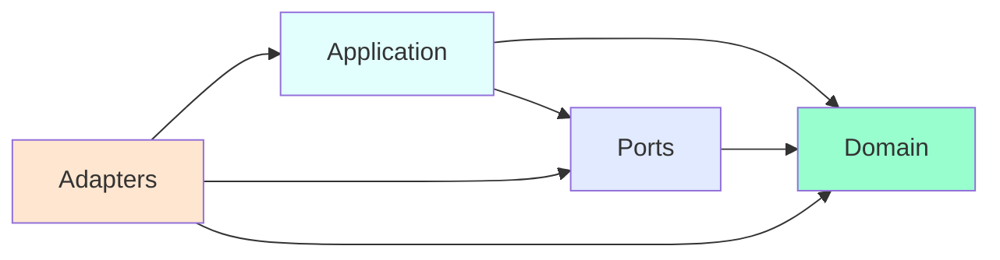

# Simple Hexagonal Architecture - Technical Specification

## Overview

**Package:** `@stricture-examples/simple-hexagonal`
**Purpose:** Minimal demonstration of hexagonal architecture with Stricture boundary enforcement
**Type:** Example project (not a published package)
**License:** MIT

### Key Features

- **Terminal CLI application** for user management
- **In-memory storage** (no database dependencies)
- **Comprehensive Stricture configuration** demonstrating hexagonal preset
- **Clear layer separation** between domain, ports, application, and adapters
- **Educational focus** with detailed comments and violation examples

## Objectives

This example aims to teach developers:

1. **How to structure a hexagonal architecture project** with proper directory layout and file organization
2. **How to configure Stricture for boundary enforcement** using the hexagonal preset and custom rules
3. **How ESLint integrates with Stricture** to provide real-time architectural feedback
4. **What architectural violations look like** and how Stricture prevents them
5. **How to keep the domain pure** with zero external dependencies

## Architecture Overview

### Domain Layer

**File:** `src/core/domain/user.ts`

#### Responsibilities

- Define the `User` entity with immutable properties
- Validate email format using business rules
- Validate that names are not empty
- Provide business logic methods (e.g., `getDisplayName()`)
- Contain NO infrastructure code whatsoever

#### Key Characteristics

- **Zero external dependencies** - no imports from other layers or packages
- **Pure TypeScript classes** - only uses language built-ins
- **Immutable where possible** - uses `readonly` properties
- **No knowledge of persistence, HTTP, CLI, etc.** - completely infrastructure-agnostic
- **Self-contained validation** - business rules enforced in constructors/methods

#### Implementation Details

```typescript
export class User {
  constructor(
    public readonly id: string,
    public readonly name: string,
    public readonly email: string
  ) {
    // Business rule: Email must be valid
    if (!this.isValidEmail(email)) {
      throw new Error('Invalid email format')
    }

    // Business rule: Name cannot be empty
    if (!name || name.trim().length === 0) {
      throw new Error('Name cannot be empty')
    }
  }

  /**
   * Business logic: Validate email format
   * Note: Simplified for demonstration
   */
  private isValidEmail(email: string): boolean {
    return email.includes('@') && email.includes('.')
  }

  /**
   * Business method: Get display name
   */
  getDisplayName(): string {
    return `${this.name} (${this.email})`
  }
}
```

#### Stricture Rules Applied

- **Rule ID:** `domain-self-imports` - Domain files CAN import other domain files
- **Rule ID:** `domain-isolation` - Domain CANNOT import from any other layer or external packages
- **Enforcement:** ESLint will report errors if domain imports from ports, application, or adapters
- **Severity:** Error (blocks build if violations exist)

#### Why This Matters

Domain isolation ensures that:
1. Business logic can be tested without any infrastructure setup
2. Domain entities can be moved to other projects without bringing infrastructure dependencies
3. Changes to infrastructure (database, API, CLI) don't affect business logic
4. Business rules are expressed in pure code without framework-specific concepts

---

### Ports Layer

**File:** `src/core/ports/user-repository.ts`

#### Responsibilities

- Define the `UserRepository` interface (contract for persistence)
- Specify method signatures for CRUD operations
- Use domain types (`User` entity) in the interface
- Abstract away all persistence implementation details

#### Key Characteristics

- **Interface-only** - no concrete implementations in this layer
- **Can reference domain types** - imports `User` from domain layer
- **Defines async operations** - all methods return `Promise` types
- **Technology-agnostic** - no mention of specific databases, storage formats, etc.

#### Implementation Details

```typescript
import { User } from '../domain/user'

export interface UserRepository {
  /**
   * Save a user to storage
   * @param user - The user entity to persist
   */
  save(user: User): Promise<void>

  /**
   * Find a user by their unique ID
   * @param id - The user's unique identifier
   * @returns The user if found, null otherwise
   */
  findById(id: string): Promise<User | null>

  /**
   * Find all users in the system
   * @returns Array of all users
   */
  findAll(): Promise<User[]>
}
```

#### Stricture Rules Applied

- **Rule ID:** `ports-to-domain` - Ports CAN import from domain layer
- **Enforcement:** Ports CANNOT import from application or adapters
- **Purpose:** Ports define interfaces using domain types, enabling dependency inversion

#### Why Interfaces Matter

The ports layer enables:
1. **Dependency Inversion** - Application depends on abstractions, not concrete implementations
2. **Testability** - Easy to create mock implementations for testing
3. **Flexibility** - Can swap implementations (Memory → PostgreSQL → MongoDB) without changing application code
4. **Clear contracts** - Explicitly defines what operations the application needs

---

### Application Layer

**Files:**
- `src/core/application/create-user.ts`
- `src/core/application/list-users.ts`

#### Responsibilities

- Implement **use cases** (business workflows)
- Orchestrate domain entities and port interfaces
- Handle application-specific logic (ID generation, workflow coordination)
- Remain independent of infrastructure details

#### Key Characteristics

- **Depends on port interfaces** (not concrete implementations)
- **Uses domain entities** to enforce business rules
- **Stateless** - no internal state, all dependencies injected
- **One use case per file** - single responsibility principle
- **Technology-agnostic** - no knowledge of databases, HTTP, CLI, etc.

#### Implementation Details

**CreateUserUseCase** (`src/core/application/create-user.ts:13`):
```typescript
import { User } from '../domain/user'
import { UserRepository } from '../ports/user-repository'

export class CreateUserUseCase {
  constructor(private readonly userRepository: UserRepository) {}

  async execute(name: string, email: string): Promise<User> {
    // Generate unique ID (application-specific logic)
    const id = this.generateId()

    // Create domain entity (validation happens in User constructor)
    const user = new User(id, name, email)

    // Persist using the port interface
    await this.userRepository.save(user)

    return user
  }

  private generateId(): string {
    // Simple ID generation for demonstration
    // In production: use UUID or database auto-increment
    return `user_${Math.random().toString(36).substr(2, 9)}`
  }
}
```

**ListUsersUseCase** (`src/core/application/list-users.ts:9`):
```typescript
import { User } from '../domain/user'
import { UserRepository } from '../ports/user-repository'

export class ListUsersUseCase {
  constructor(private readonly userRepository: UserRepository) {}

  async execute(): Promise<User[]> {
    return await this.userRepository.findAll()
  }
}
```

#### Stricture Rules Applied

- **Rule ID:** `application-to-domain` - Application CAN import from domain
- **Rule ID:** `application-to-ports` - Application CAN import from ports
- **Rule ID:** `application-not-adapters` - Application CANNOT import from adapters
- **Enforcement:** ESLint will error if application imports concrete adapter implementations
- **Message:** "Application layer should depend on port interfaces, not concrete adapter implementations"

#### Dependency Injection Pattern

```typescript
// ✅ GOOD - Depends on interface
constructor(private readonly userRepository: UserRepository) {}

// ❌ BAD - Depends on concrete implementation
constructor(private readonly userRepository: MemoryUserRepository) {}
```

This pattern enables:
1. **Testing** - Pass mock repositories in tests
2. **Flexibility** - Swap implementations without changing use case code
3. **Clear dependencies** - Constructor explicitly shows what the use case needs

---

### Adapters Layer

The adapters layer is divided into two categories based on the direction of dependency:

#### Driving Adapters (`src/adapters/driving/`)

File: `src/adapters/driving/cli.ts`

**Responsibilities**:
- Receive input from external sources (users, HTTP requests, messages)
- Parse and validate external input
- Invoke appropriate use cases
- Format responses for external consumers
- Handle dependency injection (wiring)

**Key characteristics**:
- Active/Primary adapters
- They call the application
- Entry points to the system
- Can import from application and ports

**Implementation details**:

**CliAdapter** (`src/adapters/driving/cli.ts:13`):
```typescript
import { CreateUserUseCase } from '../../core/application/create-user'
import { ListUsersUseCase } from '../../core/application/list-users'
import { MemoryUserRepository } from '../driven/memory-repository'

export class CliAdapter {
  // Wire up dependencies (dependency injection)
  private readonly repository = new MemoryUserRepository()
  private readonly createUserUseCase = new CreateUserUseCase(this.repository)
  private readonly listUsersUseCase = new ListUsersUseCase(this.repository)

  async run(args: string[]): Promise<void> {
    const command = args[0]

    try {
      switch (command) {
        case 'create':
          await this.handleCreate(args[1], args[2])
          break
        case 'list':
          await this.handleList()
          break
        default:
          this.showHelp()
      }
    } catch (error) {
      if (error instanceof Error) {
        console.error(`❌ Error: ${error.message}`)
        process.exit(1)
      }
      throw error
    }
  }

  private async handleCreate(name: string, email: string): Promise<void> {
    if (!name || !email) {
      console.error('❌ Usage: create <name> <email>')
      process.exit(1)
    }

    // Driving adapter calls the application
    const user = await this.createUserUseCase.execute(name, email)

    console.log('✅ User created successfully!')
    console.log(`ID: ${user.id}`)
    console.log(`Name: ${user.name}`)
    console.log(`Email: ${user.email}`)
  }

  private async handleList(): Promise<void> {
    const users = await this.listUsersUseCase.execute()

    if (users.length === 0) {
      console.log('📋 No users found')
      return
    }

    console.log(`📋 Users (${users.length}):`)
    users.forEach(user => {
      console.log(`- ${user.getDisplayName()}`)
    })
  }

  private showHelp(): void {
    console.log('Usage:')
    console.log('  create <name> <email>  - Create a new user')
    console.log('  list                   - List all users')
  }
}
```

**Stricture rules applied**:
- Can import from application (to call use cases)
- Can import from ports (for dependency injection)
- Cannot import from domain directly
- Enforced by rules: `driving-to-application`, `driving-to-ports`

---

#### Driven Adapters (`src/adapters/driven/`)

File: `src/adapters/driven/memory-repository.ts`

**Responsibilities**:
- Implement port interfaces
- Handle infrastructure concerns (database, filesystem, external APIs)
- Translate between domain models and external systems
- Handle persistence, networking, etc.

**Key characteristics**:
- Passive/Secondary adapters
- They are called by the application
- Implement port contracts
- Can only import from ports (not application)

**Implementation details**:

**MemoryUserRepository** (`src/adapters/driven/memory-repository.ts:13`):
```typescript
import { User } from '../../core/domain/user'
import { UserRepository } from '../../core/ports/user-repository'

export class MemoryUserRepository implements UserRepository {
  // In-memory storage using JavaScript Map
  private users: Map<string, User> = new Map()

  // Driven adapter is called by application through port
  async save(user: User): Promise<void> {
    this.users.set(user.id, user)
  }

  async findById(id: string): Promise<User | null> {
    return this.users.get(id) || null
  }

  async findAll(): Promise<User[]> {
    return Array.from(this.users.values())
  }
}
```

**Stricture rules applied**:
- Can import from ports (implements interfaces)
- Cannot import from application (passive, doesn't call use cases)
- Cannot import from domain directly
- Enforced by rules: `driven-implements-ports`, `driven-not-application`

#### Swappable Implementations

The adapter pattern allows easy replacement:

```typescript
// Could easily create alternative adapters:

// PostgreSQL adapter
export class PostgresUserRepository implements UserRepository {
  constructor(private db: PostgresClient) {}
  async save(user: User): Promise<void> {
    await this.db.query('INSERT INTO users...', [user.id, user.name, user.email])
  }
  // ...
}

// HTTP API adapter
export class HttpAdapter {
  private readonly repository = new PostgresUserRepository(db)
  private readonly createUserUseCase = new CreateUserUseCase(this.repository)

  setupRoutes() {
    app.post('/users', async (req, res) => {
      const user = await this.createUserUseCase.execute(req.body.name, req.body.email)
      res.json(user)
    })
  }
}
```

---

## Dependency Flow

### Allowed Dependencies



**Allowed:**
- Domain → (nothing) - Domain is pure and isolated
- Ports → Domain - Ports reference domain types in interfaces
- Application → Domain, Ports - Application orchestrates domain and ports
- Adapters → Domain, Ports, Application - Adapters are outermost and can depend on everything

**Forbidden:**
- Domain → Anything - Domain must remain pure
- Ports → Application, Adapters - Ports should not know about use cases or infrastructure
- Application → Adapters - Application should depend on interfaces, not implementations

### Dependency Inversion Principle

The key to hexagonal architecture is **dependency inversion**:

```typescript
// Traditional layered architecture (BAD)
class CreateUserUseCase {
  private repository = new PostgresUserRepository()  // ❌ Direct dependency
  // Use case is tightly coupled to PostgreSQL
}

// Hexagonal architecture (GOOD)
class CreateUserUseCase {
  constructor(private repository: UserRepository) {}  // ✅ Depends on interface
  // Use case works with ANY implementation of UserRepository
}
```

This inversion allows:
1. **Testing** - Inject mock repositories
2. **Flexibility** - Swap database implementations
3. **Isolation** - Use case doesn't need to know about infrastructure

---

## Stricture Configuration

### Configuration File

**Location:** `.stricture/config.json`

```json
{
  "preset": "@stricture/hexagonal",
  "boundaries": [ /* ... */ ],
  "rules": [ /* ... */ ]
}
```

### Boundaries Definition

Each boundary defines a layer in the architecture:

```json
{
  "name": "domain",
  "pattern": "src/core/domain/**",
  "mode": "file",
  "tags": ["core", "domain"],
  "metadata": {
    "description": "Pure business logic - entities, value objects, domain services",
    "layer": 0
  }
}
```

**Fields explained:**
- **name:** Human-readable identifier for the boundary
- **pattern:** Glob pattern matching files in this boundary (e.g., `src/core/domain/**` matches all files in domain directory)
- **mode:** `"file"` means match individual files (not just directories)
- **tags:** Array of tags used in rules for easier referencing (e.g., `["core", "domain"]`)
- **metadata.description:** Human-readable explanation of the boundary's purpose
- **metadata.layer:** Numeric layer (0 = innermost, 3 = outermost)

### Rules Definition

Each rule defines an allowed or forbidden dependency:

#### Rule 1: Domain Self-Imports

```json
{
  "id": "domain-self-imports",
  "name": "Domain Can Import Itself",
  "description": "Domain files can import other domain files",
  "severity": "error",
  "from": { "tag": "domain", "mode": "file" },
  "to": { "tag": "domain", "mode": "file" },
  "allowed": true
}
```

**Purpose:** Domain files CAN import other domain files (e.g., `User` entity importing `Email` value object).

**Why it's needed:** This rule is more specific than `domain-isolation` and must come first. Without it, domain files couldn't import each other.

#### Rule 2: Domain Isolation

```json
{
  "id": "domain-isolation",
  "name": "Domain Isolation",
  "description": "Domain layer must remain pure with no external dependencies",
  "severity": "error",
  "from": { "tag": "domain", "mode": "file" },
  "to": { "tag": "*", "mode": "file" },
  "allowed": false,
  "message": "Domain layer must remain pure - no dependencies on other layers or external libraries"
}
```

**Purpose:** Domain CANNOT import from ANY other layer or external package.

**Why it's needed:** This is the core principle of hexagonal architecture - domain isolation.

**How it works:**
- `from: { "tag": "domain" }` - Matches any file tagged as "domain"
- `to: { "tag": "*" }` - Matches ANY other file or package
- `allowed: false` - This dependency is forbidden
- Combined with `domain-self-imports` (which is evaluated first due to rule order), domain can only import other domain files

#### Rule 3: Ports to Domain

```json
{
  "id": "ports-to-domain",
  "name": "Ports Can Reference Domain",
  "description": "Ports define interfaces using domain types",
  "severity": "error",
  "from": { "tag": "ports", "mode": "file" },
  "to": { "tag": "domain", "mode": "file" },
  "allowed": true
}
```

**Purpose:** Ports CAN import from domain to use domain types in interface definitions.

**Example:**
```typescript
import { User } from '../domain/user'  // ✅ Allowed

export interface UserRepository {
  save(user: User): Promise<void>  // Uses domain type
}
```

#### Rule 4: Application to Domain

```json
{
  "id": "application-to-domain",
  "name": "Application Uses Domain",
  "description": "Application layer orchestrates domain entities",
  "severity": "error",
  "from": { "tag": "application", "mode": "file" },
  "to": { "tag": "domain", "mode": "file" },
  "allowed": true
}
```

**Purpose:** Application CAN import from domain to use entities in use cases.

#### Rule 5: Application to Ports

```json
{
  "id": "application-to-ports",
  "name": "Application Uses Ports",
  "description": "Application layer depends on port interfaces",
  "severity": "error",
  "from": { "tag": "application", "mode": "file" },
  "to": { "tag": "ports", "mode": "file" },
  "allowed": true
}
```

**Purpose:** Application CAN import from ports to depend on interfaces.

#### Rule 6: Application Not Adapters

```json
{
  "id": "application-not-adapters",
  "name": "Application Isolated from Adapters",
  "description": "Application layer cannot import adapters directly",
  "severity": "error",
  "from": { "tag": "application", "mode": "file" },
  "to": { "tag": "adapters", "mode": "file" },
  "allowed": false,
  "message": "Application layer should depend on port interfaces, not concrete adapter implementations"
}
```

**Purpose:** Application CANNOT import concrete adapter implementations - must use interfaces.

**Example:**
```typescript
// ❌ BAD
import { MemoryUserRepository } from '../../adapters/memory-repository'

// ✅ GOOD
import { UserRepository } from '../ports/user-repository'
```

#### Rule 7-9: Adapter Rules

```json
{
  "id": "adapters-to-ports",
  "from": { "tag": "adapters" },
  "to": { "tag": "ports" },
  "allowed": true
},
{
  "id": "adapters-to-application",
  "from": { "tag": "adapters" },
  "to": { "tag": "application" },
  "allowed": true
},
{
  "id": "adapters-to-domain",
  "from": { "tag": "adapters" },
  "to": { "tag": "domain" },
  "allowed": true
}
```

**Purpose:** Adapters CAN import from all inner layers (domain, ports, application) because they're the outermost layer.

---

## ESLint Integration

### Configuration

**File:** `.eslintrc.js`

```javascript
module.exports = {
  root: true,
  parser: '@typescript-eslint/parser',
  parserOptions: {
    ecmaVersion: 2020,
    sourceType: 'module',
    project: './tsconfig.json'
  },
  plugins: ['@typescript-eslint', '@stricture'],
  extends: [
    'eslint:recommended',
    'plugin:@typescript-eslint/recommended'
  ],
  rules: {
    // Stricture boundary enforcement - this is the key rule!
    '@stricture/enforce-boundaries': 'error'
  }
}
```

### How It Works

1. **ESLint parses TypeScript files** using `@typescript-eslint/parser`
2. **For each import statement**, ESLint calls the `@stricture/eslint-plugin`
3. **Plugin loads `.stricture/config.json`** to understand boundaries and rules
4. **Validates import against rules** using `@stricture/core` engine
5. **Reports violation** if a rule is broken, with detailed error message

### Example Flow

```
User edits: src/core/domain/user.ts
    ↓
Adds import: import { MemoryUserRepository } from '../../adapters/driven/memory-repository'
    ↓
ESLint runs on file save (via editor integration)
    ↓
@stricture/eslint-plugin is invoked
    ↓
Plugin checks:
  - Source file: src/core/domain/user.ts → tagged as "domain"
  - Import target: src/adapters/driven/memory-repository.ts → tagged as "adapters", "driven"
  - Rule "domain-isolation": from "domain" to "*" is NOT allowed
  - Rule "domain-self-imports": from "domain" to "domain" IS allowed (but doesn't match)
    ↓
Violation found!
    ↓
ESLint reports error in editor:
  "Domain layer cannot import from adapters"
```

### Example Violations

#### Violation 1: Domain Importing Adapter

**File:** `src/core/domain/user.ts`

```typescript
import { MemoryUserRepository } from '../../adapters/driven/memory-repository'  // ❌
```

**ESLint Output:**
```
src/core/domain/user.ts
  3:1  error  Domain layer cannot import from adapters

              From: domain (src/core/domain/**)
              To:   adapters (src/adapters/**)
              Rule: domain-isolation

              Domain must remain pure - no external dependencies.

              @stricture/enforce-boundaries

✖ 1 problem (1 error, 0 warnings)
```

#### Violation 2: Application Importing Concrete Adapter

**File:** `src/core/application/create-user.ts`

```typescript
import { MemoryUserRepository } from '../../adapters/driven/memory-repository'  // ❌
```

**ESLint Output:**
```
src/core/application/create-user.ts
  3:1  error  Application layer cannot import adapters directly

              From: application (src/core/application/**)
              To:   adapters (src/adapters/**)
              Rule: application-not-adapters

              Application layer should depend on port interfaces,
              not concrete adapter implementations.

              Allowed:
                ✅ import { UserRepository } from '../ports/user-repository'

              Forbidden:
                ❌ import { MemoryUserRepository } from '../../adapters/driven/memory-repository'

              @stricture/enforce-boundaries

✖ 1 problem (1 error, 0 warnings)
```

---

## Running the Example

### Available Commands

```bash
# Development - Run with ts-node (no build required)
npm run dev -- create "John Doe" "john@example.com"
npm run dev -- list

# Production - Build first, then run
npm run build
node dist/index.js create "John Doe" "john@example.com"
node dist/index.js list

# Architecture validation
npm run lint           # Check for boundary violations
npm run type-check     # Validate TypeScript types
```

### Expected Behavior

#### Create Command

**Input:**
```bash
node dist/index.js create "Jane Smith" "jane@example.com"
```

**Execution flow:**
1. `index.ts` creates `CliAdapter` and calls `run(['create', 'Jane Smith', 'jane@example.com'])`
2. `CliAdapter.handleCreate()` is invoked
3. `CreateUserUseCase.execute()` is called with name and email
4. `User` entity is created (validation happens in constructor)
5. If validation passes, `userRepository.save(user)` is called
6. `MemoryUserRepository.save()` stores user in memory
7. User is returned and displayed

**Output:**
```
✅ User created successfully!
ID: user_a7b3c9d2e
Name: Jane Smith
Email: jane@example.com
```

#### List Command

**Input:**
```bash
node dist/index.js list
```

**Execution flow:**
1. `CliAdapter.handleList()` is invoked
2. `ListUsersUseCase.execute()` is called
3. `userRepository.findAll()` retrieves all users from memory
4. Users are displayed

**Output:**
```
📋 Users (2):
- Jane Smith (jane@example.com)
- John Doe (john@example.com)
```

#### Lint Command

**Input:**
```bash
npm run lint
```

**Execution flow:**
1. ESLint runs on all TypeScript files in `src/`
2. For each file, all import statements are checked
3. `@stricture/eslint-plugin` validates each import against rules
4. If no violations, lint passes

**Output (success):**
```
✨ All files pass architectural boundaries!
```

**Output (violation):**
```
src/core/domain/user.ts
  3:1  error  Domain layer cannot import from adapters  @stricture/enforce-boundaries

✖ 1 problem (1 error, 0 warnings)
```

---

## Testing Strategy

(Optional - not implemented in v1, but here's how you would test each layer)

### Domain Layer Testing

Domain entities should be tested with **pure unit tests** - no mocks, no infrastructure:

```typescript
import { User } from '../src/core/domain/user'

describe('User', () => {
  it('should create a valid user', () => {
    const user = new User('user_123', 'John Doe', 'john@example.com')
    expect(user.name).toBe('John Doe')
    expect(user.email).toBe('john@example.com')
  })

  it('should reject invalid email', () => {
    expect(() => {
      new User('user_123', 'John Doe', 'invalid-email')
    }).toThrow('Invalid email format')
  })

  it('should reject empty name', () => {
    expect(() => {
      new User('user_123', '', 'john@example.com')
    }).toThrow('Name cannot be empty')
  })
})
```

### Application Layer Testing

Use cases should be tested with **mock repositories**:

```typescript
import { CreateUserUseCase } from '../src/core/application/create-user'
import { UserRepository } from '../src/core/ports/user-repository'
import { User } from '../src/core/domain/user'

class MockUserRepository implements UserRepository {
  savedUsers: User[] = []

  async save(user: User): Promise<void> {
    this.savedUsers.push(user)
  }

  async findById(id: string): Promise<User | null> {
    return this.savedUsers.find(u => u.id === id) || null
  }

  async findAll(): Promise<User[]> {
    return this.savedUsers
  }
}

describe('CreateUserUseCase', () => {
  it('should create and save a user', async () => {
    const mockRepo = new MockUserRepository()
    const useCase = new CreateUserUseCase(mockRepo)

    const user = await useCase.execute('John Doe', 'john@example.com')

    expect(user.name).toBe('John Doe')
    expect(user.email).toBe('john@example.com')
    expect(mockRepo.savedUsers).toHaveLength(1)
  })
})
```

### Adapter Layer Testing

Adapters should be tested with **integration tests** using real infrastructure:

```typescript
import { MemoryUserRepository } from '../src/adapters/memory-repository'
import { User } from '../src/core/domain/user'

describe('MemoryUserRepository', () => {
  it('should save and retrieve a user', async () => {
    const repo = new MemoryUserRepository()
    const user = new User('user_123', 'John Doe', 'john@example.com')

    await repo.save(user)
    const retrieved = await repo.findById('user_123')

    expect(retrieved).toEqual(user)
  })

  it('should return null for non-existent user', async () => {
    const repo = new MemoryUserRepository()
    const retrieved = await repo.findById('non-existent')

    expect(retrieved).toBeNull()
  })
})
```

---

## File Manifest

Complete list of all files in this example:

```
.stricture/config.json              (~120 lines)  - Stricture configuration
.eslintrc.js                        (~15 lines)   - ESLint configuration
package.json                        (~30 lines)   - Package definition
tsconfig.json                       (~20 lines)   - TypeScript configuration
README.md                           (~500 lines)  - User documentation
SPEC.md                             (~800 lines)  - This file (technical spec)

src/core/domain/user.ts                  (~40 lines)   - User entity (domain layer)
src/core/ports/user-repository.ts        (~25 lines)   - Repository interface (ports layer)
src/core/application/create-user.ts      (~30 lines)   - Create user use case
src/core/application/list-users.ts       (~15 lines)   - List users use case
src/adapters/driving/cli.ts              (~80 lines)   - CLI adapter (driving/entry point)
src/adapters/driven/memory-repository.ts (~25 lines)   - In-memory repository (driven/implementation)

index.ts                            (~15 lines)   - Main entry point
examples/violation.example.ts       (~120 lines)  - Educational examples of violations

Total: ~1,835 lines across 14 files
```

---

## Future Enhancements

(Out of scope for v1, but potential additions)

### Additional Adapters

1. **PostgreSQL Adapter**
   - Implement `UserRepository` with PostgreSQL
   - Add migration scripts
   - Demonstrate adapter swapping

2. **HTTP API Adapter**
   - Express or Fastify server
   - REST endpoints for user operations
   - Same use cases, different entry point

3. **File System Adapter**
   - Store users in JSON file
   - Demonstrate another persistence option

### Additional Use Cases

1. **UpdateUserUseCase** - Modify user information
2. **DeleteUserUseCase** - Remove a user
3. **FindUserByEmailUseCase** - Search functionality

### Testing

1. Add unit tests for domain layer
2. Add integration tests for application layer
3. Add adapter tests
4. Add end-to-end tests

### Tooling

1. **Docker setup** for running with PostgreSQL
2. **Migration scripts** for database setup
3. **Seed data** for development
4. **CI/CD configuration** for automated validation

---

## Conclusion

This example demonstrates the core principles of hexagonal architecture:

1. **Domain Isolation** - Pure business logic with zero dependencies
2. **Dependency Inversion** - Application depends on interfaces, not implementations
3. **Flexibility** - Easy to swap adapters without changing core logic
4. **Testability** - Each layer can be tested independently
5. **Clear boundaries** - Stricture enforces architectural rules automatically

By using Stricture, these principles are **enforced automatically** - you can't accidentally violate them without ESLint catching the error.

For more information, see:
- [README.md](./README.md) - User-friendly guide
- [Stricture Documentation](../../README.md) - Main documentation
- [Hexagonal Preset](../../packages/hexagonal/README.md) - Preset details
