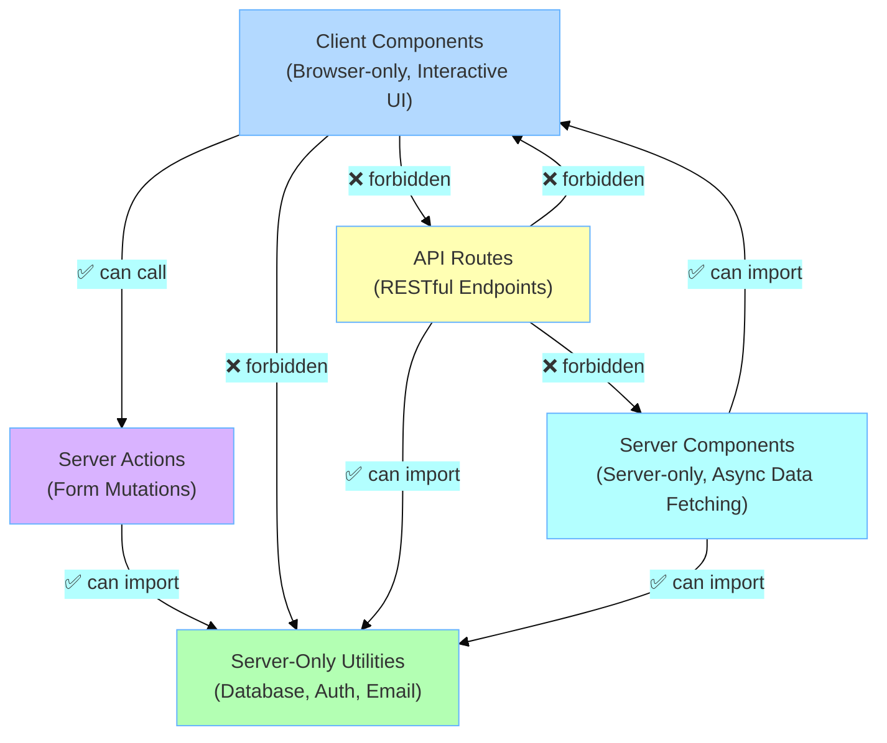

# Simple Next.js Example

> A minimal Next.js App Router application demonstrating architecture boundary enforcement with Stricture

[](https://opensource.org/licenses/MIT)

## Overview

This is a minimal, runnable example of **Next.js App Router architecture** with `@stricture/nextjs` boundary enforcement. It implements a simple todo application that demonstrates the proper separation between Server Components, Client Components, API routes, and server-only code.

This example exists as the perfect starting point for understanding Next.js App Router architecture. It shows how Stricture prevents common violations like Client Components importing server-only code, or API routes importing UI components. Unlike production examples, this one is deliberately simple and focused on architecture rather than features.

**What you'll learn:**
- How to structure a Next.js App Router project with proper boundaries
- How Server Components and Client Components work together
- When to use Server Actions vs API routes
- How Stricture enforces architectural rules automatically via ESLint

## Architecture Diagram



## File Structure

```
simple-nextjs/
├── .stricture/
│   └── config.json              # Just: { "preset": "@stricture/nextjs" }
│
├── app/                         # App Router
│   ├── page.tsx                 # Homepage (Server Component)
│   ├── layout.tsx               # Root layout
│   ├── globals.css              # Global styles
│   └── api/
│       └── todos/
│           └── route.ts         # API route handler
│
├── components/
│   ├── server/                  # Server Components
│   │   ├── todo-list.tsx       # Fetches data directly
│   │   └── stats.tsx           # Server-side calculations
│   └── client/                  # Client Components
│       ├── todo-item.tsx       # Interactive todo item
│       └── add-todo-form.tsx   # Form with hooks
│
├── actions/
│   └── todos.ts                 # Server Actions ('use server')
│
└── lib/
    ├── server/                  # Server-only code
    │   └── database.ts         # Database access
    └── utils/                   # Shared utilities
        └── format.ts           # Pure functions
```

## Quick Start

### 1. Install Dependencies

```bash
cd examples/simple-nextjs
pnpm install
```

### 2. Run Development Server

```bash
pnpm dev
```

Open [http://localhost:3000](http://localhost:3000)

### 3. Try the Example

- ✅ **Add a todo** - Uses Server Actions from Client Component
- ✅ **Toggle completion** - Client Component calls Server Action
- ✅ **View stats** - Server Component fetches and calculates data
- ✅ **See real-time updates** - Next.js automatically revalidates

## Architectural Patterns Demonstrated

### 1. Server Components

**File**: `components/server/todo-list.tsx`

Server Components can:
- ✅ Import server-only code (`lib/server/database.ts`)
- ✅ Import Client Components
- ✅ Use `async/await` for data fetching
- ❌ Cannot use React hooks or handle interactions

```typescript
import { db } from '@/lib/server/database'  // ✅ Server-only import
import { TodoItem } from '@/components/client/todo-item'  // ✅ Client Component

export async function TodoList() {
  const todos = await db.todos.findAll()  // ✅ Direct database access
  
  return (
    <div>
      {todos.map(todo => (
        <TodoItem key={todo.id} {...todo} />  // ✅ Using Client Component
      ))}
    </div>
  )
}
```

### 2. Client Components

**File**: `components/client/todo-item.tsx`

Client Components can:
- ✅ Use React hooks (`useState`, `useEffect`, etc.)
- ✅ Handle user interactions
- ✅ Call Server Actions
- ❌ Cannot import server-only code

```typescript
'use client'

import { useState } from 'react'  // ✅ React hooks
import { toggleTodo } from '@/actions/todos'  // ✅ Server Action

export function TodoItem({ id, title, completed }: Props) {
  const [isLoading, setIsLoading] = useState(false)  // ✅ State

  const handleToggle = async () => {
    setIsLoading(true)
    await toggleTodo(id)  // ✅ Calling Server Action
    setIsLoading(false)
  }

  return <div onClick={handleToggle}>...</div>  // ✅ Event handler
}
```

### 3. Server Actions

**File**: `actions/todos.ts`

Server Actions provide type-safe server functions callable from Client Components:

```typescript
'use server'

import { db } from '@/lib/server/database'  // ✅ Server-only import
import { revalidatePath } from 'next/cache'

export async function createTodo(formData: FormData) {
  const title = formData.get('title') as string
  await db.todos.create({ title, completed: false })
  revalidatePath('/')  // Revalidate the homepage
}
```

### 4. API Routes

**File**: `app/api/todos/route.ts`

API routes for external access (mobile apps, third-party clients):

```typescript
import { db } from '@/lib/server/database'  // ✅ Server-only import
import { NextResponse } from 'next/server'

export async function GET() {
  const todos = await db.todos.findAll()
  return NextResponse.json(todos)
}

// ❌ Cannot import UI components
// import { TodoItem } from '@/components/client/todo-item'  // ERROR!
```

### 5. Server-Only Utilities

**File**: `lib/server/database.ts`

Code that should NEVER be in the client bundle:

```typescript
// This file should NEVER be imported by Client Components
export const db = {
  todos: {
    findAll: async () => { /* ... */ },
    create: async (data) => { /* ... */ },
  }
}
```

If you try to import this in a Client Component, Stricture will catch it:

```typescript
// components/client/bad-component.tsx
'use client'
import { db } from '@/lib/server/database'  // ❌ Stricture ERROR!

// Error: Client Components cannot import server-only code.
// Use Server Actions or API routes instead.
```

## Running Stricture Checks

### Lint (includes Stricture rules)

```bash
pnpm lint
```

This will check for architectural violations like:
- ❌ Client Components importing server-only code
- ❌ API routes importing UI components
- ❌ Incorrect import patterns

### Type Check

```bash
pnpm type-check
```

## Common Violations (All Prevented by Stricture)

### ❌ Client Component Importing Server Code

```typescript
// components/client/bad.tsx
'use client'
import { db } from '@/lib/server/database'  // ❌ ERROR!

// Error from Stricture:
// Client Components cannot import server-only code.
// Use Server Actions or API routes instead.
```

**Fix**: Use Server Actions

```typescript
// ✅ actions/todos.ts
'use server'
import { db } from '@/lib/server/database'
export async function getTodos() {
  return db.todos.findAll()
}

// ✅ components/client/good.tsx
'use client'
import { getTodos } from '@/actions/todos'
```

### ❌ API Route Importing UI Component

```typescript
// app/api/bad/route.ts
import { TodoItem } from '@/components/client/todo-item'  // ❌ ERROR!

// Error from Stricture:
// API routes should contain business logic only, not UI components.
```

**Fix**: Separate concerns

```typescript
// ✅ app/api/todos/route.ts
import { db } from '@/lib/server/database'  // Business logic only
export async function GET() {
  return NextResponse.json(await db.todos.findAll())
}
```

### ❌ Client Component Importing API Route

```typescript
// components/client/bad.tsx
'use client'
import { GET } from '@/app/api/todos/route'  // ❌ ERROR!

// Error from Stricture:
// Client Components should fetch from API routes, not import them.
```

**Fix**: Use fetch

```typescript
// ✅ components/client/good.tsx
'use client'
const response = await fetch('/api/todos')
const todos = await response.json()
```

## Configuration

### .stricture/config.json

```json
{
  "preset": "@stricture/nextjs"
}
```

That's it! No customization needed for standard Next.js App Router projects.

## Learn More

- **Next.js App Router**: [https://nextjs.org/docs/app](https://nextjs.org/docs/app)
- **Server Components**: [https://nextjs.org/docs/app/building-your-application/rendering/server-components](https://nextjs.org/docs/app/building-your-application/rendering/server-components)
- **Server Actions**: [https://nextjs.org/docs/app/building-your-application/data-fetching/server-actions-and-mutations](https://nextjs.org/docs/app/building-your-application/data-fetching/server-actions-and-mutations)
- **Stricture**: [https://stricture.dev](https://stricture.dev)

## License

MIT
