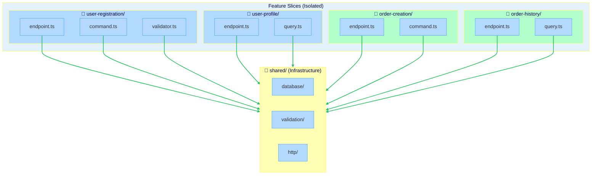

# Vertical Slice Architecture Example

> A minimal Express API demonstrating vertical slice architecture with Stricture boundary enforcement

[](https://opensource.org/licenses/MIT)

## Overview

This is a minimal, runnable example of **Vertical Slice Architecture (VSA)**. It demonstrates how `@stricture` enforces feature isolation in a real TypeScript project. The example implements a simple user and order management API using Express—minimal infrastructure, maximum focus on architectural concepts.

This example exists to demonstrate an alternative to traditional layered architectures. Instead of organizing code by technical concerns (controllers, services, repositories), VSA organizes code by business features (user-registration, order-creation). Each feature is a complete vertical slice through all technical layers, and features are isolated from each other.

**What you'll learn:**
- How to structure a vertical slice architecture project from scratch
- How to configure Stricture for feature isolation without using a preset
- How to prevent coupling between features while allowing shared infrastructure
- The dependency flow in a use-case-driven architecture

## Architecture Diagram



**Dependency Flow:** Features → Shared (one-way)
**Core Principle:** Features are isolated—no feature can import another feature

## What is Vertical Slice Architecture?

Vertical Slice Architecture (VSA) is an alternative to traditional layered architectures. Instead of organizing code by technical layers (presentation, business logic, data access), VSA organizes code by **features** or **use cases**.

### Traditional Layered vs Vertical Slice

**Traditional Layered:**
```
src/
  controllers/
    user-controller.ts      # All user endpoints
    order-controller.ts     # All order endpoints
  services/
    user-service.ts         # All user business logic
    order-service.ts        # All order business logic
  repositories/
    user-repository.ts      # All user data access
    order-repository.ts     # All order data access
```

**Problems:**
- Changes to a single feature require touching multiple files across layers
- Easy to create tight coupling between unrelated features
- Shared services become "god objects" with too many responsibilities

**Vertical Slice:**
```
src/
  features/
    user-registration/
      endpoint.ts           # HTTP handling
      command.ts            # Business logic
      validator.ts          # Validation
    user-profile/
      endpoint.ts
      query.ts
    order-creation/
      endpoint.ts
      command.ts
  shared/
    database/
    validation/
    http/
```

**Benefits:**
- All code for a feature lives in one place (high cohesion)
- Features are isolated from each other (low coupling)
- Easy to find and change feature-specific code
- Prevents "shotgun surgery" (changing many files for one feature)

### Key Principles

#### 1. Feature Isolation

**Rule:** Features CANNOT import from other features.

```typescript
// ❌ VIOLATION - feature importing another feature
// src/features/order-creation/command.ts
import { createUser } from '../../user-registration/command'  // ❌ Forbidden!

// ✅ CORRECT - features are independent
// If you need user creation from order creation, call the API endpoint
// or use shared domain events/messaging
```

**Why:** Features should be loosely coupled. This prevents cascading changes and makes features easier to understand in isolation.

#### 2. Shared Infrastructure

**Rule:** All features CAN import from `shared/`.

```typescript
// ✅ CORRECT - feature using shared infrastructure
// src/features/user-registration/command.ts
import { db } from '../../shared/database/client'
import { validateEmail } from '../../shared/validation/email'
```

**Why:** Infrastructure code (database, validation, HTTP utilities) is genuinely reusable across features. Shared is for technical utilities, not business logic.

#### 3. No Shared Business Logic

**Rule:** `shared/` CANNOT import from `features/`.

```typescript
// ❌ VIOLATION - shared importing from features
// src/shared/utils/user-helper.ts
import { UserCommand } from '../../features/user-registration/command'  // ❌ Forbidden!
```

**Why:** Shared should be generic infrastructure. If business logic is shared, it's likely premature abstraction. VSA prefers duplication over the wrong abstraction.

#### 4. One Feature = One Use Case

**Rule:** Each feature folder represents a single use case.

```
user-registration/    # One feature: register a new user
user-profile/         # Different feature: get user profile
user-update/          # Different feature: update user info
```

**Why:** Small, focused features are easier to understand, test, and change. If a feature grows too large, it's probably multiple use cases that should be split.

## File Structure

```
examples/vertical-slice-express/
├── .stricture/
│   └── config.json              # Stricture configuration (custom, no preset)
├── .eslintrc.js                 # ESLint + Stricture integration
├── package.json                 # Dependencies and scripts
├── tsconfig.json                # TypeScript configuration
├── README.md                    # This file
├── src/
│   ├── features/                # 🎯 Feature slices (isolated)
│   │   ├── user-registration/
│   │   │   ├── endpoint.ts      # HTTP route + handler
│   │   │   ├── command.ts       # Business logic (write)
│   │   │   └── validator.ts     # Feature-specific validation
│   │   ├── user-profile/
│   │   │   ├── endpoint.ts      # HTTP route + handler
│   │   │   └── query.ts         # Business logic (read)
│   │   ├── order-creation/
│   │   │   ├── endpoint.ts      # HTTP route + handler
│   │   │   └── command.ts       # Business logic (write)
│   │   └── order-history/
│   │       ├── endpoint.ts      # HTTP route + handler
│   │       └── query.ts         # Business logic (read)
│   └── shared/                  # 🔧 Shared infrastructure
│       ├── database/
│       │   └── client.ts        # Database connection
│       ├── validation/
│       │   ├── email.ts         # Email validation utility
│       │   └── validator.ts     # Generic validation helpers
│       └── http/
│           ├── response.ts      # HTTP response helpers
│           └── error.ts         # HTTP error handling
├── index.ts                     # Composition root + Express app
└── tests/
    ├── user-registration.test.ts
    ├── user-profile.test.ts
    ├── order-creation.test.ts
    └── order-history.test.ts
```

## Feature Slices

Each feature slice is a complete vertical cut through the application. Let's look at an example:

### User Registration Feature

**Endpoint** (`src/features/user-registration/endpoint.ts:5`):
```typescript
import express from 'express'
import { registerUser } from './command.js'
import { validateRegistration } from './validator.js'
import { success, error } from '../../shared/http/response.js'

export const router = express.Router()

router.post('/users/register', async (req, res) => {
  try {
    // 1. Validate request
    const validation = validateRegistration(req.body)
    if (!validation.valid) {
      return error(res, 400, validation.error!)
    }

    // 2. Execute command (business logic)
    const user = await registerUser(validation.data!)

    // 3. Return response
    return success(res, 201, { user })
  } catch (err) {
    return error(res, 500, 'Internal server error')
  }
})
```

**Command** (`src/features/user-registration/command.ts:5`):
```typescript
import { db } from '../../shared/database/client.js'

export interface RegisterUserInput {
  name: string
  email: string
  password: string
}

export interface User {
  id: string
  name: string
  email: string
  createdAt: Date
}

export async function registerUser(input: RegisterUserInput): Promise<User> {
  // Business logic for user registration
  const userId = generateUserId()
  const now = new Date()

  const user: User = {
    id: userId,
    name: input.name,
    email: input.email,
    createdAt: now
  }

  // Persist using shared database
  await db.users.set(userId, user)

  return user
}

function generateUserId(): string {
  return `user_${Math.random().toString(36).substr(2, 9)}`
}
```

**Validator** (`src/features/user-registration/validator.ts:5`):
```typescript
import { isValidEmail } from '../../shared/validation/email.js'
import { RegisterUserInput } from './command.js'

export interface ValidationResult<T> {
  valid: boolean
  data?: T
  error?: string
}

export function validateRegistration(body: any): ValidationResult<RegisterUserInput> {
  if (!body.name || typeof body.name !== 'string' || body.name.trim().length === 0) {
    return { valid: false, error: 'Name is required' }
  }

  if (!body.email || typeof body.email !== 'string') {
    return { valid: false, error: 'Email is required' }
  }

  if (!isValidEmail(body.email)) {
    return { valid: false, error: 'Invalid email format' }
  }

  if (!body.password || typeof body.password !== 'string' || body.password.length < 8) {
    return { valid: false, error: 'Password must be at least 8 characters' }
  }

  return {
    valid: true,
    data: {
      name: body.name.trim(),
      email: body.email.toLowerCase(),
      password: body.password
    }
  }
}
```

**Notice:**
- All code for user registration lives in one folder
- The feature imports ONLY from `shared/`, never from other features
- The endpoint delegates to the command for business logic
- Validation is feature-specific (different features may have different validation needs)

## Shared Infrastructure

The `shared/` directory contains reusable technical infrastructure:

### Database Client (`src/shared/database/client.ts:5`)

```typescript
// Simple in-memory database for the example
interface Database {
  users: Map<string, any>
  orders: Map<string, any>
}

export const db: Database = {
  users: new Map(),
  orders: new Map()
}
```

### Email Validation (`src/shared/validation/email.ts:5`)

```typescript
export function isValidEmail(email: string): boolean {
  // Simple email validation
  return email.includes('@') && email.includes('.')
}
```

### HTTP Response Helpers (`src/shared/http/response.ts:5`)

```typescript
import { Response } from 'express'

export function success(res: Response, status: number, data: any) {
  return res.status(status).json({ success: true, data })
}

export function error(res: Response, status: number, message: string) {
  return res.status(status).json({ success: false, error: message })
}
```

**Key point:** Shared code is technical infrastructure, not business logic.

## Composition Root

The `index.ts` file acts as the composition root—it assembles all feature endpoints into the Express app:

```typescript
// index.ts
import express from 'express'
import { router as userRegistrationRouter } from './src/features/user-registration/endpoint.js'
import { router as userProfileRouter } from './src/features/user-profile/endpoint.js'
import { router as orderCreationRouter } from './src/features/order-creation/endpoint.js'
import { router as orderHistoryRouter } from './src/features/order-history/endpoint.js'

const app = express()
app.use(express.json())

// Mount feature routers
app.use('/api', userRegistrationRouter)
app.use('/api', userProfileRouter)
app.use('/api', orderCreationRouter)
app.use('/api', orderHistoryRouter)

const PORT = process.env.PORT || 3000
app.listen(PORT, () => {
  console.log(`Server running on http://localhost:${PORT}`)
})
```

**Why this pattern:**
- Each feature exports its own router
- The composition root knows about all features
- Features remain isolated from each other
- Easy to add/remove features

## Installation

```bash
# From repository root
cd examples/vertical-slice-express

# Install dependencies
npm install

# Build TypeScript
npm run build
```

## Usage

### Start the Server

```bash
node dist/index.js
```

**Expected output:**
```
Server running on http://localhost:3000
```

### Register a User

```bash
curl -X POST http://localhost:3000/api/users/register \
  -H "Content-Type: application/json" \
  -d '{
    "name": "John Doe",
    "email": "john@example.com",
    "password": "password123"
  }'
```

**Expected output:**
```json
{
  "success": true,
  "data": {
    "user": {
      "id": "user_abc123",
      "name": "John Doe",
      "email": "john@example.com",
      "createdAt": "2025-11-17T10:30:00.000Z"
    }
  }
}
```

### Get User Profile

```bash
curl http://localhost:3000/api/users/user_abc123
```

**Expected output:**
```json
{
  "success": true,
  "data": {
    "user": {
      "id": "user_abc123",
      "name": "John Doe",
      "email": "john@example.com",
      "createdAt": "2025-11-17T10:30:00.000Z"
    }
  }
}
```

### Create an Order

```bash
curl -X POST http://localhost:3000/api/orders \
  -H "Content-Type: application/json" \
  -d '{
    "userId": "user_abc123",
    "items": ["item1", "item2"],
    "total": 99.99
  }'
```

### Get Order History

```bash
curl http://localhost:3000/api/users/user_abc123/orders
```

### Validate Architecture

Check that all architectural boundaries are respected:

```bash
npm run lint
```

**Expected output (if no violations):**
```
✅ All files pass architectural boundaries!
```

### Type Check

Ensure TypeScript types are correct:

```bash
npm run type-check
```

## Stricture Configuration

The `.stricture/config.json` file defines the architectural boundaries and rules for VSA:

```json
{
  "boundaries": [
    {
      "name": "user-registration",
      "pattern": "src/features/user-registration/**",
      "mode": "file",
      "tags": ["feature", "user-feature"]
    },
    {
      "name": "user-profile",
      "pattern": "src/features/user-profile/**",
      "mode": "file",
      "tags": ["feature", "user-feature"]
    },
    {
      "name": "order-creation",
      "pattern": "src/features/order-creation/**",
      "mode": "file",
      "tags": ["feature", "order-feature"]
    },
    {
      "name": "order-history",
      "pattern": "src/features/order-history/**",
      "mode": "file",
      "tags": ["feature", "order-feature"]
    },
    {
      "name": "shared",
      "pattern": "src/shared/**",
      "mode": "file",
      "tags": ["shared", "infrastructure"]
    }
  ],
  "rules": [
    {
      "id": "feature-to-shared",
      "from": { "tag": "feature" },
      "to": { "tag": "shared" },
      "allowed": true
    },
    {
      "id": "feature-to-external",
      "from": { "tag": "feature" },
      "to": { "tag": "external" },
      "allowed": true
    },
    {
      "id": "feature-self-imports",
      "from": { "tag": "user-feature" },
      "to": { "tag": "user-feature" },
      "allowed": true
    },
    {
      "id": "order-feature-self-imports",
      "from": { "tag": "order-feature" },
      "to": { "tag": "order-feature" },
      "allowed": true
    },
    {
      "id": "shared-to-external",
      "from": { "tag": "shared" },
      "to": { "tag": "external" },
      "allowed": true
    },
    {
      "id": "shared-self-imports",
      "from": { "tag": "shared" },
      "to": { "tag": "shared" },
      "allowed": true
    }
  ]
}
```

**What this configuration does:**

- **Defines five boundaries:** Four feature slices and one shared infrastructure
- **Feature isolation:** Features can only import from `shared/` and external packages (deny-by-default prevents feature-to-feature imports)
- **Shared utilities:** Shared can import from external packages but not from features
- **Self-imports:** Files within the same feature can import each other

**Key insight:** Notice there's NO explicit rule denying feature-to-feature imports. Stricture's **deny-by-default** policy handles this automatically. Any import without an explicit `allowed: true` rule is denied.

## Try Breaking the Architecture

Want to see Stricture in action? Let's try breaking the feature isolation!

### Example 1: Feature Importing Another Feature (❌ VIOLATION)

Edit `src/features/order-creation/command.ts` and add this import:

```typescript
// ❌ BAD - Feature importing another feature
import { registerUser } from '../../user-registration/command'

export async function createOrder(input: CreateOrderInput) {
  // Attempting to create a user from the order feature
  const user = await registerUser({ name: 'Test', email: 'test@example.com', password: 'password' })  // ❌ VIOLATION!
  // ...
}
```

**Run:** `npm run lint`

**Output:**
```
src/features/order-creation/command.ts
  3:1  error  Import from 'src/features/user-registration/command' is not allowed
              No rule explicitly allows this import. Features should be isolated.
              To allow this, add a rule to .stricture/config.json
              @stricture/enforce-boundaries

❌ 1 error
```

### Example 2: Shared Importing from Feature (❌ VIOLATION)

Edit `src/shared/utils/helper.ts` (create if needed):

```typescript
// ❌ BAD - Shared importing from feature
import { registerUser } from '../../features/user-registration/command'

export function someHelper() {
  // Shared should not depend on feature-specific code!
  return registerUser  // ❌ VIOLATION!
}
```

**Run:** `npm run lint`

**Output:**
```
src/shared/utils/helper.ts
  2:1  error  Import from 'src/features/user-registration/command' is not allowed
              No rule explicitly allows this import. Shared infrastructure should not depend on features.
              @stricture/enforce-boundaries

❌ 1 error
```

### ✅ The Correct Way

**For feature-to-feature communication:**

```typescript
// ✅ OPTION 1: Call via HTTP endpoint (if features are in same app)
const response = await fetch('http://localhost:3000/api/users/register', {
  method: 'POST',
  body: JSON.stringify({ name, email, password })
})

// ✅ OPTION 2: Use events/messaging (advanced)
eventBus.publish('user.registered', { userId, email })

// ✅ OPTION 3: Extract to shared if truly generic (rare)
// Only if the logic is genuinely reusable infrastructure, not business logic
```

**Key principle:** Features don't directly import each other. If you need cross-feature communication, use HTTP, events, or (rarely) extract to shared.

## VSA vs Other Architectures

### When to Use Vertical Slice Architecture

**Use VSA when:**
- ✅ You have clear, distinct use cases that don't share much logic
- ✅ You want to minimize coupling between features
- ✅ You prefer duplicating code over premature abstraction
- ✅ You want features to evolve independently
- ✅ Team members work on different features simultaneously

**Don't use VSA when:**
- ❌ Your features share significant business logic (consider Clean or Hexagonal)
- ❌ You need strict domain modeling (use DDD with Hexagonal/Clean)
- ❌ You have complex business rules that span features (use Hexagonal)

### Comparing with Other Architectures

| Architecture | Organizing Principle | Coupling | Best For |
|-------------|---------------------|----------|----------|
| **Layered** | Technical layers | High (features share layers) | Simple CRUD apps |
| **Hexagonal** | Ports & Adapters | Low (domain isolated) | Complex domain logic |
| **Clean** | Dependency inversion | Low (layers depend inward) | Enterprise apps |
| **Vertical Slice** | Use cases/features | Very low (features isolated) | Use-case driven apps |

**VSA sweet spot:** Apps with many independent features that don't share complex business logic.

## Learning More

### Stricture Documentation
- [Main Stricture Documentation](../../README.md)
- [Core Package Documentation](../../packages/core/README.md)
- [ESLint Plugin Documentation](../../packages/eslint-plugin/README.md)

### Vertical Slice Architecture
- [Jimmy Bogard - Vertical Slice Architecture](https://www.youtube.com/watch?v=SUiWfhAhgQw)
- [CodeOpinion - Vertical Slice Architecture](https://codeopinion.com/vertical-slice-architecture/)

### Other Architecture Examples
- [Hexagonal Architecture Example](../simple-hexagonal/)
- [Clean Architecture Example](../simple-clean/)
- [Layered Architecture Example](../simple-layered/)

## Troubleshooting

### ESLint Not Catching Violations

**Problem:** You violate a boundary but `npm run lint` doesn't report it.

**Solution:** Check your `.eslintrc.js` configuration. Make sure:
1. The `@stricture` plugin is listed in `plugins`
2. The `@stricture/enforce-boundaries` rule is set to `'error'`
3. You have a valid `.stricture/config.json` file

### Import Errors

**Problem:** TypeScript reports "Cannot find module" errors.

**Solution:**
1. Run `npm install` from the repository root (if using workspace)
2. Run `npm install` from the `examples/vertical-slice-express` directory
3. Ensure `tsconfig.json` paths are correct

### Server Won't Start

**Problem:** `node dist/index.js` fails.

**Solution:**
1. Make sure you've run `npm run build` first
2. Check that the `dist/` directory exists and contains compiled JavaScript
3. Verify port 3000 is not already in use

### Features Feel Too Small

**Problem:** Each feature only has a few files. Is this right?

**Solution:** Yes! This is by design. VSA prefers small, focused features over large shared abstractions. If a feature grows too large, split it into multiple features.

## Contributing

This is an example project demonstrating Stricture usage. For contributions to Stricture itself, please see the main repository README.

## License

MIT

---

**Next Steps:**
1. Try adding a new feature (e.g., `password-reset/`)
2. Experiment with feature-to-feature imports to see Stricture violations
3. Compare this with the [Hexagonal example](../simple-hexagonal/) to see different trade-offs
4. Explore how to handle feature communication with events or HTTP calls
