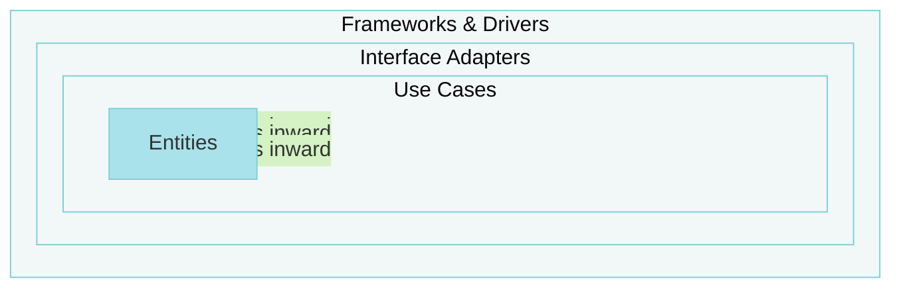

# @stricture/clean

Uncle Bob's Clean Architecture preset for Stricture. Enforces the Dependency Rule: dependencies point inward toward entities.

## What is Clean Architecture?

Clean Architecture organizes code in concentric circles:



**Dependencies point INWARD only →**

## The Dependency Rule

**Source code dependencies must point only inward, toward higher-level policies.**

## Installation

```bash
npm install -D @stricture/clean @stricture/eslint-plugin
npx stricture init --preset @stricture/clean
```

## Directory Structure

```
src/
├── entities/              # Enterprise business rules
├── use-cases/             # Application business rules
├── interface-adapters/    # Controllers, presenters, gateways
└── frameworks-drivers/    # UI, DB, web frameworks
```

## Rules

- **Entities** → Nothing (innermost, zero dependencies)
- **Use Cases** → Entities only
- **Interface Adapters** → Use Cases, Entities
- **Frameworks & Drivers** → Any inner layer

## Examples

```typescript
// entities/user.ts (innermost - no dependencies)
export class User {
  constructor(public readonly email: string) {}

  isValid(): boolean {
    return this.email.includes('@')
  }
}

// use-cases/create-user.ts (depends on entities only)
import { User } from '../entities/user'
export class CreateUser {
  execute(email: string): User {
    return new User(email)
  }
}

// interface-adapters/user-controller.ts
import { CreateUser } from '../use-cases/create-user'
export class UserController {
  constructor(private createUser: CreateUser) {}
}
```

## License

MIT
