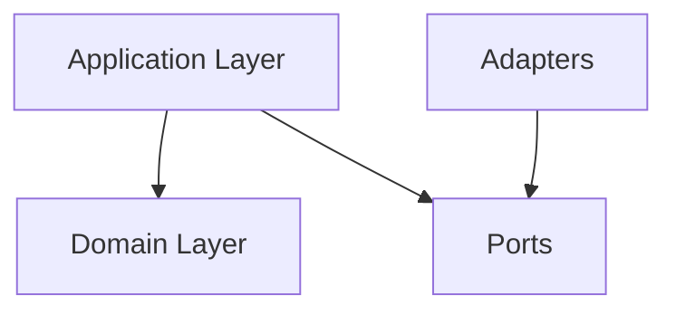

# @stricture/cli

Interactive command-line interface for initializing and managing Stricture architecture enforcement in your projects.

## Installation

### Global Installation

```bash
npm install -g @stricture/cli
```

### Local Installation (Recommended)

```bash
npm install -D @stricture/cli
```

### Usage without Installation

```bash
npx @stricture/cli init
```

## Commands

### `stricture init`

Interactive wizard to initialize Stricture in your project.

```bash
npx stricture init
```

**What it does**:
1. Analyzes your project structure
2. Asks you to choose an architecture preset
3. Configures boundaries based on your project
4. Creates `.stricture/config.json`
5. Updates `.eslintrc.js` to use the plugin
6. Optionally installs required dependencies

**Example interaction**:

```
? Which architecture preset do you want to use?
  Hexagonal (Ports & Adapters)
❯ Clean Architecture
  Layered Architecture
  Modular Architecture

? Where is your source code located? src/

? Does this look correct?
  Boundaries:
    - domain: src/domain/**
    - use-cases: src/use-cases/**
    - adapters: src/adapters/**
  (Y/n)

✓ Created .stricture/config.json
✓ Updated .eslintrc.js
✓ Architecture boundaries configured!

Next steps:
  1. Run: npm install -D @stricture/eslint-plugin
  2. Run: npm run lint
```

---

### `stricture check`

Validate that your architecture configuration is correct and all imports comply with the rules.

```bash
npx stricture check
```

**What it does**:
- Validates `.stricture/config.json` syntax and schema
- Checks all files against boundary rules
- Reports violations
- Exits with code 1 if violations found

**Output**:

```
Checking architecture boundaries...

✓ Configuration valid
✓ Found 4 boundaries
✓ Loaded 12 rules

Checking 156 files...

✗ 3 violations found:

  src/domain/user.ts:5
    Import from 'adapters' not allowed in 'domain'
    Rule: Domain Isolation

  src/domain/order.ts:12
    Import from '../../infrastructure/db' not allowed
    Rule: Domain Isolation

  src/application/user-service.ts:8
    Import from '../adapters/api' not allowed
    Rule: Application must use ports

3 violations found. Fix these to maintain clean architecture.
```

---

### `stricture fix`

Automatically fix violations where possible (currently limited to auto-fixable cases).

```bash
npx stricture fix
```

**What it does**:
- Scans for fixable violations
- Suggests refactorings
- Optionally applies fixes

**Note**: v1 may have limited auto-fix capabilities. Future versions will expand this.

---

### `stricture validate`

Validate your `.stricture/config.json` without checking files.

```bash
npx stricture validate
```

**What it does**:
- Checks JSON syntax
- Validates against schema
- Checks boundary patterns are valid globs
- Verifies rule references

**Output**:

```
✓ Configuration is valid

Preset: @stricture/hexagonal
Boundaries: 4
Rules: 8
```

**Options**:

- `--structure` - Check if project structure matches preset expectations

**Example with structure checking**:

```bash
npx stricture validate --structure
```

**Output**:

```
Validating configuration...
✓ Configuration is valid

Checking project structure...

Preset: @stricture/hexagonal
Expected boundaries:
  ✓ src/core/domain/ (domain)
  ✓ src/core/ports/ (ports)
  ✗ src/adapters/driving/ (driving-adapters)
  ✗ src/adapters/driven/ (driven-adapters)

⚠ Warning: 2 expected directories are missing.

ℹ Suggestion: Run 'stricture scaffold' to create the expected structure.
```

---

### `stricture diagram`

Generate a visual diagram of your architecture.

```bash
npx stricture diagram
```

**What it does**:
- Generates a Mermaid diagram
- Shows boundaries and allowed dependencies
- Outputs to stdout or file

**Options**:
- `--output <file>` - Save to file
- `--format <format>` - Format: mermaid (default), svg, ascii

**Example output** (Mermaid):



---

### `stricture scaffold`

Generate directory structure based on your preset.

```bash
npx stricture scaffold
```

**What it does**:
- Creates directories for each boundary
- Generates example files
- Creates README files explaining each boundary

**Example**:

```bash
npx stricture scaffold

Creating directory structure...

✓ Created src/core/domain/
✓ Created src/core/ports/
✓ Created src/core/application/
✓ Created src/adapters/

Created 4 directories with example files.
```

---

## Configuration

### `.stricture/config.json`

The CLI creates and manages this file. Example:

```json
{
  "version": "1",
  "preset": "@stricture/hexagonal",
  "boundaries": [
    {
      "name": "domain",
      "pattern": "src/core/domain/**",
      "mode": "file",
      "tags": ["core", "domain"]
    },
    {
      "name": "ports",
      "pattern": "src/core/ports/**",
      "mode": "file",
      "tags": ["core", "ports"]
    },
    {
      "name": "application",
      "pattern": "src/core/application/**",
      "mode": "file",
      "tags": ["core", "application"]
    },
    {
      "name": "adapters",
      "pattern": "src/adapters/**",
      "mode": "file",
      "tags": ["adapters"]
    }
  ],
  "rules": [
    {
      "id": "domain-isolation",
      "name": "Domain Isolation",
      "description": "Domain cannot import anything external",
      "severity": "error",
      "from": { "tag": "domain" },
      "to": { "pattern": "**" },
      "allowed": false,
      "message": "Domain layer must remain pure"
    }
  ]
}
```

### ESLint Integration

The CLI automatically configures ESLint:

```javascript
// .eslintrc.js
module.exports = {
  plugins: ['@stricture'],
  rules: {
    '@stricture/enforce-boundaries': 'error'
  }
}
```

## Options

### Global Options

All commands support:

- `--config <path>` - Path to config file (default: `.stricture/config.json`)
- `--verbose` - Verbose output
- `--quiet` - Minimal output
- `--no-color` - Disable colored output
- `--help` - Show help
- `--version` - Show version

### Command-Specific Options

**`init`**:
- `--preset <name>` - Skip preset selection
- `--yes` - Accept all defaults
- `--no-install` - Don't install dependencies

**`check`**:
- `--fix` - Auto-fix where possible
- `--format <format>` - Output format: text, json, checkstyle

**`validate`**:
- `--structure` - Check if project structure matches preset

**`diagram`**:
- `--output <file>` - Output file
- `--format <format>` - Format: mermaid, svg, ascii

## Examples

### Initialize with preset

```bash
npx stricture init --preset @stricture/hexagonal
```

### Check and auto-fix

```bash
npx stricture check --fix
```

### Generate SVG diagram

```bash
npx stricture diagram --format svg --output architecture.svg
```

### Validate config with verbose output

```bash
npx stricture validate --verbose
```

## Project Detection

The CLI automatically detects:

- **Framework**: Next.js, NestJS, React, Vue, etc.
- **Build tool**: Vite, Webpack, Turbopack, etc.
- **Package manager**: npm, yarn, pnpm
- **TypeScript**: tsconfig.json presence
- **Existing structure**: Analyzes directory layout

This helps suggest the most appropriate preset.

## Preset Selection Guide

The CLI will guide you:

```
We detected:
  ✓ Next.js project (App Router)
  ✓ TypeScript enabled
  ✓ Existing src/ directory structure

Recommended presets:
  1. @stricture/nextjs + @stricture/hexagonal
     Best for: Domain-driven Next.js apps

  2. @stricture/nextjs + @stricture/layered
     Best for: Traditional Next.js apps with clear layers

  3. @stricture/modular
     Best for: Feature-based organization

? Choose a preset: (1)
```

## CI/CD Integration

### GitHub Actions

```yaml
name: Architecture Check

on: [push, pull_request]

jobs:
  check-architecture:
    runs-on: ubuntu-latest
    steps:
      - uses: actions/checkout@v3
      - uses: actions/setup-node@v3
        with:
          node-version: 18
      - run: npm install
      - run: npx stricture check
```

### Pre-commit Hook

```bash
# .husky/pre-commit
#!/bin/sh
npx stricture check
```

## Troubleshooting

### "Configuration not found"

Run `npx stricture init` to create configuration.

### "ESLint not configured"

The CLI should have updated `.eslintrc.js`. If not, manually add:

```javascript
module.exports = {
  plugins: ['@stricture'],
  rules: {
    '@stricture/enforce-boundaries': 'error'
  }
}
```

### "Boundary patterns not matching files"

Use `--verbose` to see which files are matched:

```bash
npx stricture check --verbose
```

## API Usage

You can also use the CLI programmatically:

```typescript
import { init, check, validate } from '@stricture/cli'

// Initialize
await init({
  preset: '@stricture/hexagonal',
  projectRoot: process.cwd()
})

// Check violations
const result = await check({
  configPath: '.stricture/config.json'
})

console.log(`Found ${result.violations.length} violations`)
```

## License

MIT
