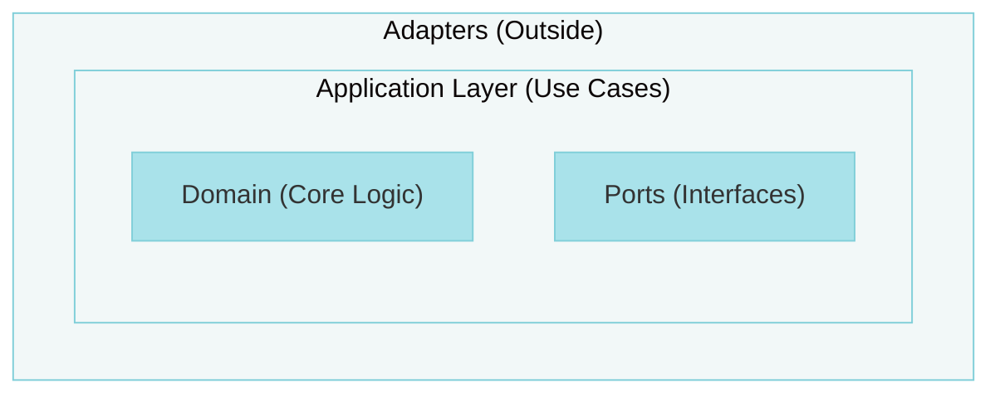
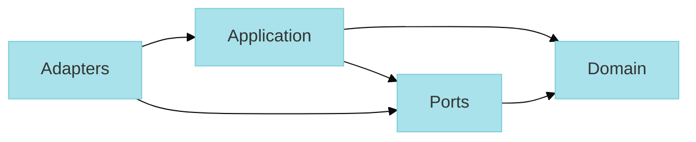

# @stricture/hexagonal

Hexagonal Architecture (Ports & Adapters) preset for Stricture. Enforces clean separation between business logic, ports (interfaces), and adapters (implementations).

## What is Hexagonal Architecture?

Hexagonal Architecture, also known as Ports and Adapters, is a pattern that:

- **Isolates business logic** in the domain layer (the "hexagon")
- **Defines ports** as interfaces for external interactions
- **Implements adapters** that connect ports to external systems
- **Inverts dependencies** so domain doesn't depend on infrastructure

## Architecture Layers



## Installation

```bash
npm install -D @stricture/hexagonal @stricture/eslint-plugin
```

> Note: @stricture/core is automatically installed as a dependency of this preset.

Or use the CLI:

```bash
npx stricture init --preset @stricture/hexagonal
```

## Directory Structure

The preset expects this structure:

```
src/
├── core/
│   ├── domain/           # Pure business logic (entities, value objects)
│   ├── ports/            # Interfaces for external interactions
│   └── application/      # Use cases (orchestrate domain + ports)
└── adapters/
    ├── driving/          # Primary adapters (entry points)
    │   ├── api/          # HTTP/REST controllers
    │   ├── cli/          # Command-line interfaces
    │   ├── graphql/      # GraphQL resolvers
    │   └── ...
    └── driven/           # Secondary adapters (implementations)
        ├── database/     # Database repositories
        ├── messaging/    # Message queue clients
        ├── external/     # External API clients
        └── ...
```

## Boundaries

The preset defines these boundaries:

| Boundary | Pattern | Description |
|----------|---------|-------------|
| **domain** | `src/core/domain/**` | Pure business entities and logic |
| **ports** | `src/core/ports/**` | Interface definitions |
| **application** | `src/core/application/**` | Use cases and workflows |
| **driving-adapters** | `src/adapters/driving/**` | Primary adapters (entry points) |
| **driven-adapters** | `src/adapters/driven/**` | Secondary adapters (implementations) |

## Rules

### 1. Domain Isolation

**Domain cannot import anything external.**

```typescript
// ❌ BAD - Domain importing infrastructure
// src/core/domain/user.ts
import { Database } from '../../adapters/database'

// ✅ GOOD - Domain is pure
// src/core/domain/user.ts
export class User {
  constructor(
    public readonly id: string,
    public readonly email: string
  ) {}

  isValid(): boolean {
    return this.email.includes('@')
  }
}
```

### 2. Application Layer Rules

**Application can import domain and ports, but not adapters.**

```typescript
// ❌ BAD - Application importing adapter directly
// src/core/application/create-user.ts
import { PostgresUserRepository } from '../../adapters/database'

// ✅ GOOD - Application depends on port interface
// src/core/application/create-user.ts
import { User } from '../domain/user'
import { UserRepository } from '../ports/user-repository'

export class CreateUserUseCase {
  constructor(private userRepo: UserRepository) {}

  async execute(email: string): Promise<User> {
    const user = new User(generateId(), email)
    await this.userRepo.save(user)
    return user
  }
}
```

### 3. Ports Define Contracts

**Ports are interfaces that adapters implement.**

```typescript
// ✅ GOOD - Port defines contract
// src/core/ports/user-repository.ts
import { User } from '../domain/user'

export interface UserRepository {
  save(user: User): Promise<void>
  findById(id: string): Promise<User | null>
  findByEmail(email: string): Promise<User | null>
}
```

### 4. Adapters Implement Ports

**Adapters implement port interfaces, not the other way around.**

```typescript
// ✅ GOOD - Adapter implements port
// src/adapters/database/postgres-user-repository.ts
import { UserRepository } from '../../core/ports/user-repository'
import { User } from '../../core/domain/user'

export class PostgresUserRepository implements UserRepository {
  async save(user: User): Promise<void> {
    await this.db.query('INSERT INTO users ...', [user.id, user.email])
  }

  async findById(id: string): Promise<User | null> {
    const row = await this.db.query('SELECT * FROM users WHERE id = $1', [id])
    return row ? new User(row.id, row.email) : null
  }

  async findByEmail(email: string): Promise<User | null> {
    // ...
  }
}
```

### 5. Driven Adapters Can Import Domain Types

**Important distinction**: Driven adapters (repositories) CAN import domain types because they implement ports that use those types. Driving adapters (CLI, HTTP) should NOT import domain.

```typescript
// ✅ GOOD - Driven adapter importing domain type
// src/adapters/driven/database/postgres-user-repository.ts
import { User } from '../../../core/domain/user'  // ✅ Necessary!
import { UserRepository } from '../../../core/ports/user-repository'

export class PostgresUserRepository implements UserRepository {
  async save(user: User): Promise<void> {
    // Must know about User type to implement port interface
    await this.db.query('INSERT INTO users...', [user.id, user.email])
  }

  async findById(id: string): Promise<User | null> {
    const row = await this.db.query('SELECT * FROM users WHERE id = $1', [id])
    return row ? new User(row.id, row.email) : null
  }
}

// ❌ BAD - Driving adapter importing domain
// src/adapters/driving/api/user-controller.ts
import { User } from '../../../core/domain/user'  // ❌ Don't do this!

// ✅ GOOD - Driving adapter uses application layer
// src/adapters/driving/api/user-controller.ts
import { CreateUserUseCase } from '../../../core/application/create-user'

export class UserController {
  constructor(private createUser: CreateUserUseCase) {}

  async handleCreateUser(req: Request, res: Response) {
    const user = await this.createUser.execute(req.body.email)
    res.json(user)
  }
}
```

**Why this makes sense**:
- **Ports use domain types** in their signatures: `save(user: User)`
- **Driven adapters implement ports**, so they MUST import those domain types
- **Driving adapters call use cases**, so they don't need direct domain access
- This is standard practice in real hexagonal architectures (Java Spring, .NET, etc.)

## Adapter Types

Hexagonal architecture distinguishes between two types of adapters:

### Driving Adapters (Primary/Active)
**Location**: `src/adapters/driving/**`

**Purpose**: Entry points that receive input from the outside world and call the application.

**Examples**: CLI, HTTP controllers, GraphQL resolvers, message consumers, scheduled jobs

**Dependency direction**: `Driving Adapter → Application Layer`

**Rules**:
- ✅ Can import from application (to call use cases)
- ✅ Can import from ports (for dependency injection)
- ❌ Cannot import from driven adapters
- ❌ Cannot import from domain directly

**Example**:
```typescript
// src/adapters/driving/api/user-controller.ts
import { CreateUserUseCase } from '../../../core/application/create-user'

export class UserController {
  constructor(private createUserUseCase: CreateUserUseCase) {}

  async createUser(req: Request, res: Response) {
    // Driving adapter CALLS the application
    const user = await this.createUserUseCase.execute(req.body.email)
    res.json(user)
  }
}
```

### Driven Adapters (Secondary/Passive)
**Location**: `src/adapters/driven/**`

**Purpose**: Implementations of port interfaces that the application calls to interact with external systems.

**Examples**: Database repositories, file storage, external API clients, email services

**Dependency direction**: `Application Layer → Port Interface ← Driven Adapter implements`

**Rules**:
- ✅ Can import from ports (implements interfaces)
- ✅ Can import from domain (needed to implement ports that use domain types)
- ❌ Cannot import from application (passive, doesn't call use cases)
- ❌ Cannot import from driving adapters

**Example**:
```typescript
// src/adapters/driven/database/postgres-user-repository.ts
import { User } from '../../../core/domain/user'
import { UserRepository } from '../../../core/ports/user-repository'

export class PostgresUserRepository implements UserRepository {
  // Driven adapter WAITS to be called by application through port
  async save(user: User): Promise<void> {
    await this.db.query('INSERT INTO users...', [user.id, user.email])
  }

  async findById(id: string): Promise<User | null> {
    const row = await this.db.query('SELECT * FROM users WHERE id = $1', [id])
    return row ? new User(row.id, row.email) : null
  }
}
```

### The Key Difference

Think of it this way:
- **Driving**: "Hey application, I got a user request!" → initiates action
- **Driven**: "Here's the data you requested" → responds to application calls

This separation is crucial for:
- ✅ Maintaining dependency inversion principle
- ✅ Making the application framework-agnostic
- ✅ Enabling easy testing (mock driven adapters)
- ✅ Enabling easy replacement (swap HTTP for GraphQL, swap PostgreSQL for MongoDB)

### Adapter Independence

**Critical principle**: Adapters at the same level should be completely independent.

#### Driving Adapters Don't Share Code
```typescript
// ❌ BAD - CLI importing HTTP
// src/adapters/driving/cli.ts
import { HTTPController } from './http-controller'  // Violation!

// ✅ GOOD - Each adapter is independent
// src/adapters/driving/cli.ts
import { CreateUserUseCase } from '../../core/application/create-user'

// src/adapters/driving/http-controller.ts
import { CreateUserUseCase } from '../../core/application/create-user'
```

Both driving adapters can call the same use case, but they don't know about each other.

#### Driven Adapters Don't Share Code
```typescript
// ❌ BAD - Repository importing another repository
// src/adapters/driven/mongo-repository.ts
import { PostgresRepository } from './postgres-repository'  // Violation!

// ✅ GOOD - Both implement the same port independently
// src/adapters/driven/postgres-repository.ts
import type { UserRepository } from '../../core/ports/user-repository'
export class PostgresRepository implements UserRepository { ... }

// src/adapters/driven/mongo-repository.ts
import type { UserRepository } from '../../core/ports/user-repository'
export class MongoRepository implements UserRepository { ... }
```

**If adapters need shared logic**:
- Create a helper function in a shared utilities folder
- Create a new port if it's a domain concern
- Extract to a separate adapter that both can use via dependency injection

**Why this matters**:
- ✅ Easier to swap implementations
- ✅ Clearer boundaries
- ✅ Better testability
- ✅ Prevents coupling between infrastructure components

## Configuration

The preset provides this configuration:

```json
{
  "preset": "@stricture/hexagonal",
  "boundaries": [
    {
      "name": "domain",
      "pattern": "src/core/domain/**",
      "mode": "file",
      "tags": ["core", "domain"]
    },
    {
      "name": "ports",
      "pattern": "src/core/ports/**",
      "mode": "file",
      "tags": ["core", "ports"]
    },
    {
      "name": "application",
      "pattern": "src/core/application/**",
      "mode": "file",
      "tags": ["core", "application"]
    },
    {
      "name": "driving-adapters",
      "pattern": "src/adapters/driving/**",
      "mode": "file",
      "tags": ["adapters", "driving"],
      "metadata": {
        "description": "Primary adapters - entry points that call the application (CLI, HTTP, GraphQL)"
      }
    },
    {
      "name": "driven-adapters",
      "pattern": "src/adapters/driven/**",
      "mode": "file",
      "tags": ["adapters", "driven"],
      "metadata": {
        "description": "Secondary adapters - implementations called by application (Repositories, APIs)"
      }
    }
  ],
  "rules": [
    {
      "id": "domain-self-imports",
      "name": "Domain Can Import Itself",
      "severity": "error",
      "from": { "tag": "domain" },
      "to": { "tag": "domain" },
      "allowed": true
    },
    {
      "id": "domain-isolation",
      "name": "Domain Isolation",
      "severity": "error",
      "from": { "tag": "domain" },
      "to": { "tag": "*" },
      "allowed": false,
      "message": "Domain layer must remain pure - no dependencies on other layers or external libraries"
    },
    {
      "id": "application-not-adapters",
      "name": "Application Isolated from Adapters",
      "severity": "error",
      "from": { "tag": "application" },
      "to": { "tag": "adapters" },
      "allowed": false,
      "message": "Application layer can only depend on domain and ports, not adapters"
    },
    {
      "id": "driving-to-application",
      "name": "Driving Adapters Call Use Cases",
      "severity": "error",
      "from": { "tag": "driving" },
      "to": { "tag": "application" },
      "allowed": true,
      "message": "Driving adapters (CLI, HTTP controllers) should call use cases from application layer"
    },
    {
      "id": "driven-implements-ports",
      "name": "Driven Adapters Implement Ports",
      "severity": "error",
      "from": { "tag": "driven" },
      "to": { "tag": "ports" },
      "allowed": true,
      "message": "Driven adapters should implement interfaces defined in ports"
    },
    {
      "id": "driving-not-driven",
      "name": "Driving Adapters Independent",
      "severity": "error",
      "from": { "tag": "driving" },
      "to": { "tag": "driven" },
      "allowed": false,
      "message": "Driving adapters should not directly import driven adapters - use dependency injection"
    }
  ]
}
```

**Note**: The preset automatically provides separate boundaries for driving and driven adapters, enforcing the distinction between primary (driving) and secondary (driven) ports as described by Alistair Cockburn's original hexagonal architecture pattern. The `"adapters"` parent tag is available on both boundaries for rules that apply to all adapters.

## Dependency Flow



**Allowed**:
- Domain → Domain (self-imports only)
- Ports → Domain
- Application → Domain, Ports
- Driving Adapters → Application, Ports
- Driven Adapters → Ports, Domain

**Forbidden**:
- Domain → Anything else (must remain pure)
- Application → Adapters
- Driving Adapters → Domain (must use application layer)
- Driven Adapters → Application (passive adapters don't call use cases)

## External Dependencies

The domain isolation rule (`domain-isolation` with `domain-self-imports`) ensures that:

- ✅ **Domain files CAN import other domain files** (same boundary)
- ❌ **Domain files CANNOT import from other layers** (ports, application, adapters)
- ❌ **Domain files CANNOT import external libraries** (node_modules)

This keeps your business logic pure and framework-independent.

### Why This Matters

```typescript
// ❌ BAD - Domain importing external library
// src/core/domain/user.ts
import { z } from 'zod'
import axios from 'axios'

export class User {
  validate() {
    return z.object({ email: z.string() }).parse(this)
  }
}

// ✅ GOOD - Domain is pure
// src/core/domain/user.ts
export class User {
  constructor(public readonly email: string) {}

  isValid(): boolean {
    return this.email.includes('@') && this.email.length > 3
  }
}
```

### Domain Can Import Itself

The `domain-self-imports` rule explicitly allows imports within the domain boundary:

```typescript
// ✅ GOOD - Domain importing other domain files
// src/core/domain/order.ts
import { Money } from './value-objects/money'
import { User } from './user'
import { OrderItem } from './order-item'

export class Order {
  constructor(
    public readonly user: User,
    public readonly items: OrderItem[],
    public readonly total: Money
  ) {}
}
```

## Examples

### E-commerce Domain

```typescript
// src/core/domain/order.ts
export class Order {
  constructor(
    public readonly id: string,
    public readonly items: OrderItem[],
    public readonly total: Money
  ) {}

  addItem(item: OrderItem): Order {
    return new Order(
      this.id,
      [...this.items, item],
      this.total.add(item.price)
    )
  }
}

// src/core/ports/order-repository.ts
export interface OrderRepository {
  save(order: Order): Promise<void>
  findById(id: string): Promise<Order | null>
}

// src/core/application/create-order.ts
export class CreateOrderUseCase {
  constructor(private orderRepo: OrderRepository) {}

  async execute(items: OrderItem[]): Promise<Order> {
    const order = new Order(generateId(), items, calculateTotal(items))
    await this.orderRepo.save(order)
    return order
  }
}

// src/adapters/database/mongo-order-repository.ts
export class MongoOrderRepository implements OrderRepository {
  async save(order: Order): Promise<void> {
    await this.collection.insertOne({
      _id: order.id,
      items: order.items,
      total: order.total
    })
  }

  async findById(id: string): Promise<Order | null> {
    const doc = await this.collection.findOne({ _id: id })
    return doc ? new Order(doc._id, doc.items, doc.total) : null
  }
}
```

## Customization

You can extend the preset in your `.stricture/config.json`:

```json
{
  "preset": "@stricture/hexagonal",
  "boundaries": [
    {
      "name": "shared",
      "pattern": "src/shared/**",
      "mode": "file"
    }
  ],
  "rules": [
    {
      "id": "allow-shared-everywhere",
      "from": { "pattern": "**" },
      "to": { "tag": "shared" },
      "allowed": true,
      "severity": "error"
    }
  ]
}
```

## Benefits

✅ **Testable** - Domain logic is pure and easy to test
✅ **Flexible** - Swap adapters without changing domain
✅ **Maintainable** - Clear boundaries prevent coupling
✅ **Framework-independent** - Domain doesn't depend on frameworks

## Learn More

- [Hexagonal Architecture explained](https://alistair.cockburn.us/hexagonal-architecture/)
- [Example project](https://github.com/stricture-dev/stricture/tree/main/examples/nextjs-hexagonal)
- [Video tutorial](https://stricture.dev/tutorials/hexagonal)

## License

MIT
