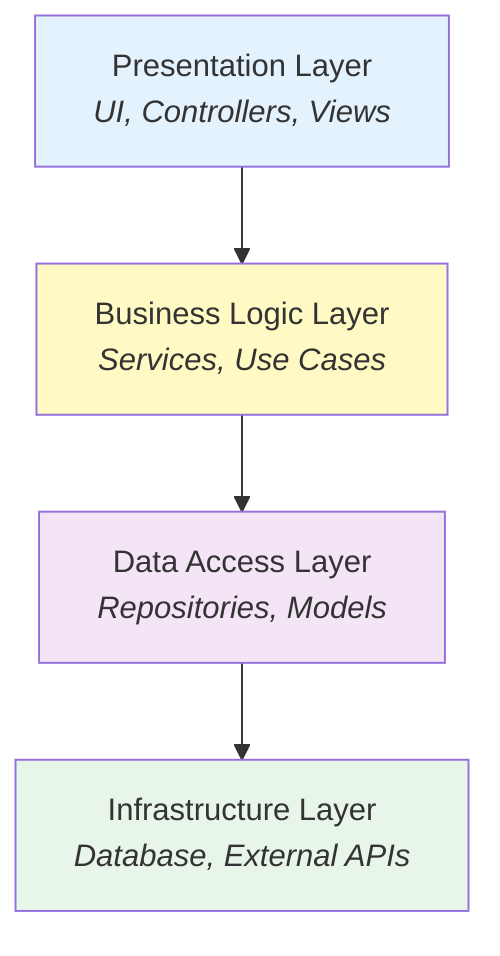

# @stricture/layered

Classic 3-tier layered architecture preset for Stricture. Enforces unidirectional dependencies between presentation, business logic, and data access layers.

## What is Layered Architecture?

Layered architecture organizes code into horizontal layers where:

- **Upper layers can depend on lower layers**
- **Lower layers CANNOT depend on upper layers**
- **No layer skipping** (presentation can't skip business to access data directly)

## Architecture Layers



**Dependency flow:** Top → Bottom only

## Installation

```bash
npm install -D @stricture/layered @stricture/eslint-plugin
```

Or use the CLI:

```bash
npx stricture init --preset @stricture/layered
```

## Directory Structure

```
src/
├── presentation/         # UI components, controllers, views
│   ├── components/
│   ├── pages/
│   └── controllers/
├── business/             # Business logic and use cases
│   ├── services/
│   └── use-cases/
├── data/                 # Data access and repositories
│   ├── repositories/
│   └── models/
└── infrastructure/       # External integrations
    ├── database/
    ├── api-clients/
    └── config/
```

## Rules

### 1. No Lower-to-Upper Dependencies

Lower layers cannot import from upper layers.

```typescript
// ❌ BAD - Data layer importing from business layer
// src/data/user-repository.ts
import { UserService } from '../business/user-service'

// ✅ GOOD - Business imports from data
// src/business/user-service.ts
import { UserRepository } from '../data/user-repository'
```

### 2. No Layer Skipping

Each layer should only depend on the layer immediately below.

```typescript
// ❌ BAD - Presentation skipping business to access data
// src/presentation/user-controller.ts
import { UserRepository } from '../data/user-repository'

// ✅ GOOD - Presentation uses business layer
// src/presentation/user-controller.ts
import { UserService } from '../business/user-service'
```

### 3. Infrastructure at Bottom

Infrastructure is the lowest layer, accessed through data layer.

```typescript
// ❌ BAD - Business accessing infrastructure directly
// src/business/user-service.ts
import { database } from '../infrastructure/database'

// ✅ GOOD - Business uses data layer abstraction
// src/business/user-service.ts
import { UserRepository } from '../data/user-repository'
```

## Configuration

```json
{
  "preset": "@stricture/layered",
  "boundaries": [
    {
      "name": "presentation",
      "pattern": "src/presentation/**",
      "mode": "file",
      "metadata": { "layer": 3 }
    },
    {
      "name": "business",
      "pattern": "src/business/**",
      "mode": "file",
      "metadata": { "layer": 2 }
    },
    {
      "name": "data",
      "pattern": "src/data/**",
      "mode": "file",
      "metadata": { "layer": 1 }
    },
    {
      "name": "infrastructure",
      "pattern": "src/infrastructure/**",
      "mode": "file",
      "metadata": { "layer": 0 }
    }
  ],
  "rules": [
    {
      "id": "no-upward-dependencies",
      "name": "No Upward Dependencies",
      "severity": "error",
      "message": "Lower layers cannot depend on upper layers"
    }
  ]
}
```

## Examples

### E-commerce Application

```typescript
// Presentation Layer
// src/presentation/controllers/product-controller.ts
import { ProductService } from '../../business/product-service'

export class ProductController {
  constructor(private productService: ProductService) {}

  async getProducts(req: Request, res: Response) {
    const products = await this.productService.getAllProducts()
    res.json(products)
  }
}

// Business Layer
// src/business/product-service.ts
import { ProductRepository } from '../data/product-repository'
import { Product } from '../data/models/product'

export class ProductService {
  constructor(private productRepo: ProductRepository) {}

  async getAllProducts(): Promise<Product[]> {
    return this.productRepo.findAll()
  }

  async applyDiscount(productId: string, percent: number): Promise<Product> {
    const product = await this.productRepo.findById(productId)
    product.price = product.price * (1 - percent / 100)
    return this.productRepo.save(product)
  }
}

// Data Layer
// src/data/product-repository.ts
import { Database } from '../infrastructure/database'
import { Product } from './models/product'

export class ProductRepository {
  constructor(private db: Database) {}

  async findAll(): Promise<Product[]> {
    return this.db.query('SELECT * FROM products')
  }

  async findById(id: string): Promise<Product> {
    return this.db.query('SELECT * FROM products WHERE id = ?', [id])
  }

  async save(product: Product): Promise<Product> {
    return this.db.query('UPDATE products SET ... WHERE id = ?', [product])
  }
}
```

## Benefits

✅ **Simple to understand** - Clear layer hierarchy
✅ **Easy to implement** - Natural organization
✅ **Separation of concerns** - Each layer has specific responsibilities
✅ **Testable** - Mock lower layers for testing upper layers

## When to Use

- **Traditional web applications**
- **CRUD-heavy applications**
- **Teams familiar with MVC/3-tier**
- **Rapid prototyping**

## License

MIT
