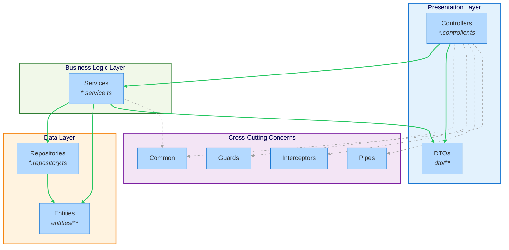

# @stricture/nestjs

NestJS best practices preset for Stricture. Enforces proper layering, DTO/Entity separation, and module encapsulation.

## What is This?

This preset enforces NestJS architectural best practices:

- **DTO/Entity Separation** - Keep API contracts separate from database models
- **Layered Architecture** - Controllers → Services → Repositories → Entities
- **No Entity Exposure** - Controllers use DTOs, not entities
- **Proper Dependency Flow** - Controllers call services, not repositories
- **Module Independence** - Controllers don't import other controllers
- **Cross-Cutting Concerns** - Guards, interceptors, pipes available everywhere

## Installation

```bash
npm install -D @stricture/nestjs @stricture/eslint-plugin
```

Or use the CLI:

```bash
npx stricture init --preset @stricture/nestjs
```

## Directory Structure

The preset expects this structure:

```
src/
├── modules/
│   ├── users/
│   │   ├── users.controller.ts    # HTTP layer
│   │   ├── users.service.ts       # Business logic
│   │   ├── users.repository.ts    # Data access (optional)
│   │   ├── users.module.ts        # Module definition
│   │   ├── dto/
│   │   │   ├── create-user.dto.ts # Input DTOs
│   │   │   └── user.dto.ts        # Output DTOs
│   │   └── entities/
│   │       └── user.entity.ts     # Database entity
│   └── posts/
│       ├── posts.controller.ts
│       ├── posts.service.ts
│       └── ...
├── common/                         # Shared utilities
│   ├── guards/                    # Auth guards
│   ├── interceptors/              # Request/response transformers
│   ├── pipes/                     # Validation pipes
│   └── decorators/                # Custom decorators
└── config/                        # Configuration
    └── database.config.ts
```

## Architecture Diagram



## Boundaries

The preset defines these boundaries:

| Boundary | Pattern | Description |
|----------|---------|-------------|
| **controllers** | `src/**/*.controller.ts` | HTTP request handlers |
| **services** | `src/**/*.service.ts` | Business logic providers |
| **dtos** | `src/**/dto/**` | API contracts (input/output) |
| **entities** | `src/**/entities/**` | Database models |
| **repositories** | `src/**/*.repository.ts` | Data access layer |
| **guards** | `src/**/guards/**` | Auth/authorization |
| **interceptors** | `src/**/interceptors/**` | Request/response transformation |
| **pipes** | `src/**/pipes/**` | Validation |
| **decorators** | `src/**/decorators/**` | Custom decorators |
| **common** | `src/common/**` | Shared utilities |
| **config** | `src/config/**` | Configuration |

## Rules

### 1. DTOs Cannot Import Entities

**Why**: DTOs define your API contract. Entities define your database schema. These should evolve independently.

```typescript
// ❌ BAD - DTO importing entity
// src/users/dto/create-user.dto.ts
import { User } from '../entities/user.entity'

export class CreateUserDto extends User {  // Tightly coupled!
  // ...
}

// ✅ GOOD - DTO is independent
// src/users/dto/create-user.dto.ts
export class CreateUserDto {
  @IsEmail()
  email: string

  @IsString()
  @MinLength(3)
  name: string
}
```

### 2. Controllers Cannot Import Entities

**Why**: Controllers are your API layer. They should use DTOs to avoid exposing internal database structure.

```typescript
// ❌ BAD - Controller exposing entity
// src/users/users.controller.ts
import { User } from './entities/user.entity'

@Controller('users')
export class UsersController {
  @Get()
  findAll(): Promise<User[]> {  // Exposes database structure!
    return this.usersService.findAll()
  }
}

// ✅ GOOD - Controller uses DTO
// src/users/users.controller.ts
import { UserDto } from './dto/user.dto'

@Controller('users')
export class UsersController {
  @Get()
  findAll(): Promise<UserDto[]> {  // API contract, not entity
    return this.usersService.findAll()
  }
}
```

### 3. Controllers Call Services, Not Repositories

**Why**: Services contain business logic. Controllers should be thin HTTP handlers.

```typescript
// ❌ BAD - Controller calling repository directly
// src/users/users.controller.ts
import { UsersRepository } from './users.repository'

@Controller('users')
export class UsersController {
  constructor(private usersRepo: UsersRepository) {}  // Violation!

  @Get()
  findAll() {
    return this.usersRepo.findAll()  // No business logic layer
  }
}

// ✅ GOOD - Controller calling service
// src/users/users.controller.ts
import { UsersService } from './users.service'

@Controller('users')
export class UsersController {
  constructor(private usersService: UsersService) {}  // Correct!

  @Get()
  findAll() {
    return this.usersService.findAll()  // Service handles logic
  }
}
```

### 4. Controllers Are Independent

**Why**: Controllers are entry points. They shouldn't depend on each other.

```typescript
// ❌ BAD - Controller importing another controller
// src/posts/posts.controller.ts
import { UsersController } from '../users/users.controller'

@Controller('posts')
export class PostsController {
  constructor(private usersCtrl: UsersController) {}  // Violation!
}

// ✅ GOOD - Both controllers use shared service
// src/posts/posts.controller.ts
import { UsersService } from '../users/users.service'

@Controller('posts')
export class PostsController {
  constructor(private usersService: UsersService) {}  // Correct!
}
```

### 5. Services Can Import Entities

**Why**: Services work with entities to implement business logic.

```typescript
// ✅ GOOD - Service using entity
// src/users/users.service.ts
import { User } from './entities/user.entity'
import { CreateUserDto } from './dto/create-user.dto'

@Injectable()
export class UsersService {
  async create(dto: CreateUserDto): Promise<User> {
    const user = new User()
    user.email = dto.email
    user.name = dto.name
    return this.usersRepo.save(user)
  }
}
```

### 6. Repositories Work With Entities

**Why**: Repositories persist and retrieve entities.

```typescript
// ✅ GOOD - Repository using entity
// src/users/users.repository.ts
import { User } from './entities/user.entity'

@Injectable()
export class UsersRepository {
  async findAll(): Promise<User[]> {
    return this.entityManager.find(User)
  }
}
```

## Configuration

The preset provides this configuration:

```json
{
  "preset": "@stricture/nestjs",
  "boundaries": [
    {
      "name": "controllers",
      "pattern": "src/**/*.controller.ts",
      "mode": "file",
      "tags": ["nestjs", "controllers", "presentation"]
    },
    {
      "name": "services",
      "pattern": "src/**/*.service.ts",
      "mode": "file",
      "tags": ["nestjs", "services", "business-logic"]
    },
    {
      "name": "dtos",
      "pattern": "src/**/dto/**",
      "mode": "file",
      "tags": ["nestjs", "dtos", "contracts"]
    },
    {
      "name": "entities",
      "pattern": "src/**/entities/**",
      "mode": "file",
      "tags": ["nestjs", "entities", "data"]
    },
    {
      "name": "repositories",
      "pattern": "src/**/*.repository.ts",
      "mode": "file",
      "tags": ["nestjs", "repositories", "data"]
    }
  ],
  "rules": [
    {
      "id": "dtos-not-entities",
      "from": { "tag": "dtos" },
      "to": { "tag": "entities" },
      "allowed": false
    },
    {
      "id": "controllers-not-entities",
      "from": { "tag": "controllers" },
      "to": { "tag": "entities" },
      "allowed": false
    },
    {
      "id": "controllers-not-repositories",
      "from": { "tag": "controllers" },
      "to": { "tag": "repositories" },
      "allowed": false
    }
  ]
}
```

## Dependency Flow

**Allowed**:
- Controllers → Services ✅
- Controllers → DTOs ✅
- Services → Entities ✅
- Services → Repositories ✅
- Services → DTOs ✅ (for mapping)
- Services → Services ✅ (via DI)
- Repositories → Entities ✅
- Anything → Common ✅
- Anything → Guards/Interceptors/Pipes ✅

**Forbidden**:
- DTOs → Entities ❌
- Controllers → Entities ❌
- Controllers → Repositories ❌
- Controllers → Controllers ❌
- Repositories → DTOs ❌
- Repositories → Controllers ❌

## Complete Example

### Module Structure

```typescript
// src/users/entities/user.entity.ts
import { Entity, Column, PrimaryGeneratedColumn } from 'typeorm'

@Entity()
export class User {
  @PrimaryGeneratedColumn()
  id: number

  @Column()
  email: string

  @Column()
  name: string

  @Column()
  passwordHash: string  // Internal detail, not in DTO!
}

// src/users/dto/create-user.dto.ts
import { IsEmail, IsString, MinLength } from 'class-validator'

export class CreateUserDto {
  @IsEmail()
  email: string

  @IsString()
  @MinLength(3)
  name: string

  @IsString()
  @MinLength(8)
  password: string
}

// src/users/dto/user.dto.ts
export class UserDto {
  id: number
  email: string
  name: string
  // Note: passwordHash is NOT exposed!
}

// src/users/users.repository.ts
import { Injectable } from '@nestjs/common'
import { InjectRepository } from '@nestjs/typeorm'
import { Repository } from 'typeorm'
import { User } from './entities/user.entity'

@Injectable()
export class UsersRepository {
  constructor(
    @InjectRepository(User)
    private repo: Repository<User>,
  ) {}

  async findAll(): Promise<User[]> {
    return this.repo.find()
  }

  async save(user: User): Promise<User> {
    return this.repo.save(user)
  }
}

// src/users/users.service.ts
import { Injectable } from '@nestjs/common'
import { User } from './entities/user.entity'
import { CreateUserDto } from './dto/create-user.dto'
import { UserDto } from './dto/user.dto'
import { UsersRepository } from './users.repository'
import * as bcrypt from 'bcrypt'

@Injectable()
export class UsersService {
  constructor(private usersRepo: UsersRepository) {}

  async create(dto: CreateUserDto): Promise<UserDto> {
    const user = new User()
    user.email = dto.email
    user.name = dto.name
    user.passwordHash = await bcrypt.hash(dto.password, 10)

    const saved = await this.usersRepo.save(user)
    return this.toDto(saved)
  }

  async findAll(): Promise<UserDto[]> {
    const users = await this.usersRepo.findAll()
    return users.map(u => this.toDto(u))
  }

  private toDto(user: User): UserDto {
    return {
      id: user.id,
      email: user.email,
      name: user.name,
      // passwordHash not included in DTO!
    }
  }
}

// src/users/users.controller.ts
import { Controller, Get, Post, Body } from '@nestjs/common'
import { UsersService } from './users.service'
import { CreateUserDto } from './dto/create-user.dto'
import { UserDto } from './dto/user.dto'

@Controller('users')
export class UsersController {
  constructor(private usersService: UsersService) {}

  @Post()
  create(@Body() dto: CreateUserDto): Promise<UserDto> {
    return this.usersService.create(dto)
  }

  @Get()
  findAll(): Promise<UserDto[]> {
    return this.usersService.findAll()
  }
}

// src/users/users.module.ts
import { Module } from '@nestjs/common'
import { TypeOrmModule } from '@nestjs/typeorm'
import { UsersController } from './users.controller'
import { UsersService } from './users.service'
import { UsersRepository } from './users.repository'
import { User } from './entities/user.entity'

@Module({
  imports: [TypeOrmModule.forFeature([User])],
  controllers: [UsersController],
  providers: [UsersService, UsersRepository],
  exports: [UsersService],  // Allow other modules to use UsersService
})
export class UsersModule {}
```

## Benefits

✅ **API Evolution** - Change database schema without breaking API
✅ **Security** - Never accidentally expose sensitive entity fields
✅ **Testability** - Clear layers make testing easier
✅ **Maintainability** - Changes are localized to specific layers
✅ **Type Safety** - DTOs provide compile-time validation

## Common Questions

### Should services return DTOs or entities?

Services can return either, but:
- **Internal use** (service → service): Entities are fine
- **API responses** (service → controller): Return DTOs

Our preset allows both. The controller is what enforces DTO usage for API responses.

### Can I use the same DTO for input and output?

You can, but it's better to have separate DTOs:
- `CreateUserDto` - Input (has password field)
- `UpdateUserDto` - Input (partial fields)
- `UserDto` - Output (no password, includes ID)

### What about GraphQL resolvers?

GraphQL resolvers are similar to controllers. They should:
- Use DTOs (or GraphQL types) for responses
- Not expose entities directly
- Call services for business logic

You can extend the preset to include resolver boundaries:

```json
{
  "preset": "@stricture/nestjs",
  "boundaries": [
    {
      "name": "resolvers",
      "pattern": "src/**/*.resolver.ts",
      "mode": "file",
      "tags": ["nestjs", "resolvers", "presentation"]
    }
  ],
  "rules": [
    {
      "id": "resolvers-not-entities",
      "from": { "tag": "resolvers" },
      "to": { "tag": "entities" },
      "allowed": false
    }
  ]
}
```

## Composability

This preset works well with other architectural patterns:

### With Hexagonal Architecture

```json
{
  "presets": ["@stricture/nestjs", "@stricture/hexagonal"]
}
```

This enforces both NestJS patterns AND hexagonal architecture (domain isolation, ports & adapters).

### With Layered Architecture

```json
{
  "presets": ["@stricture/nestjs", "@stricture/layered"]
}
```

This enforces both NestJS patterns AND strict layering.

## Examples

See the [example NestJS application](https://github.com/stricture-dev/stricture/tree/main/examples/nestjs-basic) for a complete working example.

## License

MIT
