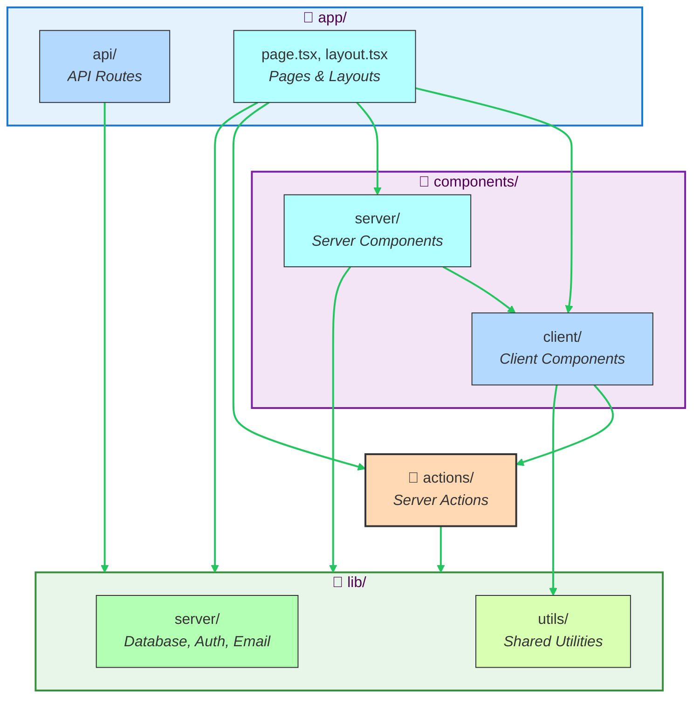

# @stricture/nextjs

Next.js-specific architecture preset for Stricture with App Router and Server/Client Component boundaries.

## Features

- **Server/Client Component Boundaries** - Prevent client-only code in Server Components
- **App Router Support** - Enforce route organization and boundaries
- **API Route Isolation** - API routes can't import UI components
- **Server-Only Utils** - Protect server-only code from client imports
- **Server Actions** - Proper boundaries for server-side actions
- **Composable** - Combine with hexagonal, layered, or modular presets

## Installation

```bash
npm install -D @stricture/eslint-plugin
```

Or use the CLI:

```bash
npx stricture init --preset @stricture/nextjs
```

## Quick Start

### 1. Initialize Configuration

```bash
npx stricture init --preset @stricture/nextjs
```

This creates `.stricture/config.json`:

```json
{
  "preset": "@stricture/nextjs"
}
```

### 2. Configure ESLint

Add to your `.eslintrc.json`:

```json
{
  "extends": ["plugin:@stricture/recommended"],
  "plugins": ["@stricture"]
}
```

### 3. Organize Your Code

```
app/
├── (marketing)/          # Route group
├── (dashboard)/          # Route group
└── api/                  # API routes

components/
├── client/               # 'use client' components
└── server/               # Server Components (default)

actions/                  # Server Actions
lib/
├── server/               # Server-only utilities
└── utils/                # Shared utilities
```

## Directory Structure

### Recommended Layout

```
my-nextjs-app/
├── app/                  # App Router
│   ├── page.tsx          # Home page (Server Component)
│   ├── layout.tsx        # Root layout
│   ├── api/              # API routes
│   │   └── users/
│   │       └── route.ts  # GET/POST /api/users
│   └── dashboard/
│       └── page.tsx
│
├── components/
│   ├── server/           # Server Components
│   │   ├── user-list.tsx
│   │   └── product-grid.tsx
│   └── client/           # Client Components
│       ├── search-bar.tsx
│       └── interactive-chart.tsx
│
├── actions/              # Server Actions
│   ├── users.ts
│   └── products.ts
│
└── lib/
    ├── server/           # Server-only code
    │   ├── database.ts
    │   ├── auth.ts
    │   └── email.ts
    └── utils/            # Shared utilities
        ├── format.ts
        └── validators.ts
```

## Rules & Examples

### ✅ Allowed Patterns

#### Server Components Can Import Server Code

```typescript
// components/server/user-list.tsx
import { db } from '@/lib/server/database'
import { SearchBar } from '@/components/client/search-bar'

export async function UserList() {
  const users = await db.user.findMany() // ✅ Server code in Server Component
  return (
    <div>
      <SearchBar /> {/* ✅ Server Component using Client Component */}
      {users.map(user => <div key={user.id}>{user.name}</div>)}
    </div>
  )
}
```

#### Client Components Can Call Server Actions

```typescript
// components/client/create-user-form.tsx
'use client'
import { createUser } from '@/actions/users'

export function CreateUserForm() {
  const handleSubmit = async (formData: FormData) => {
    await createUser(formData) // ✅ Client calling Server Action
  }
  
  return <form action={handleSubmit}>...</form>
}
```

#### API Routes Can Use Server Utilities

```typescript
// app/api/users/route.ts
import { db } from '@/lib/server/database'
import { auth } from '@/lib/server/auth'

export async function GET() {
  const session = await auth() // ✅ API using server utils
  const users = await db.user.findMany()
  return Response.json(users)
}
```

### ❌ Forbidden Patterns

#### Client Components Cannot Import Server-Only Code

```typescript
// components/client/user-profile.tsx
'use client'
import { db } from '@/lib/server/database' // ❌ FORBIDDEN!

// Error: Client Components cannot import server-only code
// Use Server Actions or API routes instead
```

**Fix: Use Server Actions**

```typescript
// actions/users.ts
'use server'
import { db } from '@/lib/server/database'

export async function getUser(id: string) {
  return db.user.findUnique({ where: { id } })
}

// components/client/user-profile.tsx
'use client'
import { getUser } from '@/actions/users' // ✅ Client using Server Action
```

#### API Routes Cannot Import UI Components

```typescript
// app/api/users/route.ts
import { UserCard } from '@/components/server/user-card' // ❌ FORBIDDEN!

// Error: API routes should contain business logic only, not UI components
```

**Fix: Separate Concerns**

```typescript
// app/api/users/route.ts
import { getUserService } from '@/lib/server/user-service' // ✅ Business logic only

export async function GET() {
  const users = await getUserService().getAll()
  return Response.json(users)
}
```

#### Client Components Cannot Import API Routes

```typescript
// components/client/user-list.tsx
'use client'
import { GET } from '@/app/api/users/route' // ❌ FORBIDDEN!

// Error: Client Components should fetch from API routes, not import them
```

**Fix: Use Fetch**

```typescript
// components/client/user-list.tsx
'use client'

export function UserList() {
  const [users, setUsers] = useState([])
  
  useEffect(() => {
    fetch('/api/users') // ✅ Calling API via HTTP
      .then(res => res.json())
      .then(setUsers)
  }, [])
  
  return <div>{/* Render users */}</div>
}
```

## Combining with Other Presets

You can layer Next.js boundaries with other architectural patterns:

### With Hexagonal Architecture

```json
{
  "preset": "@stricture/nextjs",
  "extends": ["@stricture/hexagonal"],
  "boundaries": [
    // Next.js boundaries (components, api, actions)
    // + Hexagonal boundaries (domain, ports, application, adapters)
  ],
  "rules": [
    // Combined rules from both presets
  ]
}
```

This allows you to enforce both:
- Next.js Server/Client separation
- Hexagonal architecture layers

### With Modular Architecture

```json
{
  "preset": "@stricture/nextjs",
  "extends": ["@stricture/modular"],
  "boundaries": [
    // Next.js boundaries
    // + Feature module boundaries
  ]
}
```

## Configuration

### Custom Patterns

Override boundary patterns to match your project structure:

```json
{
  "preset": "@stricture/nextjs",
  "boundaries": [
    {
      "name": "server-components",
      "pattern": "src/components/server/**",  // Custom path
      "mode": "file",
      "tags": ["components", "server"]
    }
  ]
}
```

### Disable Specific Rules

```json
{
  "preset": "@stricture/nextjs",
  "rules": [
    {
      "id": "client-no-server-utils",
      "enabled": false  // Disable this rule
    }
  ]
}
```

## Best Practices

### 1. Explicit Organization

Organize components into `server/` and `client/` subdirectories:

```
components/
├── server/     # Server Components
└── client/     # Client Components
```

This makes the server/client boundary explicit and easy to enforce.

### 2. Server-Only Utilities

Keep server-only code in `lib/server/`:

```
lib/
├── server/     # Database, auth, emails, etc.
└── utils/      # Shared utilities (validation, formatting)
```

### 3. Use Server Actions for Mutations

Prefer Server Actions over API routes for form submissions:

```typescript
// actions/users.ts
'use server'
export async function createUser(formData: FormData) {
  // Server-only logic with type safety
}

// components/client/form.tsx
'use client'
import { createUser } from '@/actions/users'

<form action={createUser}>...</form>
```

### 4. Keep API Routes for External Calls

Use API routes when you need:
- External API access (mobile app, third-party)
- Webhooks
- REST endpoints

### 5. Shared Utilities Stay Pure

Utilities in `lib/utils/` should work on both server and client:

```typescript
// lib/utils/format.ts - Safe for both server and client
export function formatCurrency(amount: number) {
  return new Intl.NumberFormat('en-US', {
    style: 'currency',
    currency: 'USD'
  }).format(amount)
}
```

## Architecture Diagram



## Troubleshooting

### Error: "Client Components cannot import server-only code"

**Problem**: You're importing server-only utilities in a client component.

**Solution**: Use Server Actions or API routes:

```typescript
// ❌ Bad
'use client'
import { db } from '@/lib/server/database'

// ✅ Good
'use client'
import { getUsers } from '@/actions/users'
```

### Error: "API routes should not import UI components"

**Problem**: You're importing React components in an API route.

**Solution**: Keep API routes focused on business logic:

```typescript
// ❌ Bad
import { UserCard } from '@/components/user-card'

// ✅ Good
import { getUserService } from '@/lib/server/services'
```

## Migration Guide

### From Pages Router

If you're migrating from the Pages Router:

1. Move pages to `app/` directory
2. Split components into `server/` and `client/` based on interactivity
3. Move API routes to `app/api/`
4. Convert `getServerSideProps` to Server Components or Server Actions
5. Add 'use client' to components with hooks or event handlers

## TypeScript Support

The preset includes TypeScript types for better IDE support:

```typescript
import type { NextjsPreset } from '@stricture/nextjs'

// Types for components, actions, etc.
```

## License

MIT

## Contributing

See [CONTRIBUTING.md](../../CONTRIBUTING.md)

## Learn More

- [Next.js App Router Docs](https://nextjs.org/docs/app)
- [Server Components](https://nextjs.org/docs/app/building-your-application/rendering/server-components)
- [Server Actions](https://nextjs.org/docs/app/building-your-application/data-fetching/server-actions-and-mutations)
- [Stricture Documentation](https://stricture.dev)
